# Cloudera Enterprise HDFS 数据平衡

## 作者

**@author: `anxu@centrin.com.cn` || `axu.home@gmail.com`**

## HDFS 数据平衡原理

> 该部分转自：[HDFS 数据平衡规则及实验介绍](https://www.ibm.com/developerworks/cn/data/library/bd-1506-hdfsdatabalance/index.html)。

Hadoop 分布式文件系统（Hadoop Distributed File System），简称 HDFS，被设计成适合运行在通用硬件上的分布式文件系统。它和现有的分布式文件系统有很多的共同点。HDFS 是一个高容错性的文件系统，提供高吞吐量的数据访问，非常适合大规模数据集上的应用。HDFS 是 Apache Hadoop Core 项目一部分。

### 数据平衡期望满足的需求

当集群内新增、删除节点，或者某个节点机器内硬盘存储达到饱和值时，我们需要对 Hadoop 底层负责存储数据的 HDFS 进行数据的负载均衡调整，也可以说是各节点机器上数据的存储分布调整。当数据不平衡时，由于 Map 任务可能会被分配给没有存储数据的机器，这会最终导致网络带宽的消耗。另一方面，当一些数据节点数据完全满载时，新的数据块只会被存放在有空余数据的节点机器上，造成了并行读取的可能性。

我们所希望的方式必须满足先决条件：

1. 数据平衡不会导致数据块减少，数据块备份丢失；
2. 管理员可以中止数据平衡进程；
3. 每次数据块移动的大小应该是可控的，这样可以放置阻塞网络；
4. namenode 不会因为数据平衡服务而导致过于繁忙。

Hadoop 提供的自带工具可以来完成这个任务，并且该工具可以做到热插拔，即无须重启计算机和 Hadoop 服务。$Hadoop_Home/bin 目录下的 start-balancer.sh 脚本就是该任务的启动脚本。

### Hadoop HDFS 数据自动平衡原理

数据平衡过程由于平衡算法的原因造成它是一个迭代的、周而复始的过程。每一次迭代的最终目的是让高负载的机器能够降低数据负载，所以数据平衡会最大程度上地使用网络带宽。下图 1 数据平衡流程交互图显示了数据平衡服务内部的交互情况，包括 NameNode 和 DataNode。

图1. 数据平衡流程交互图

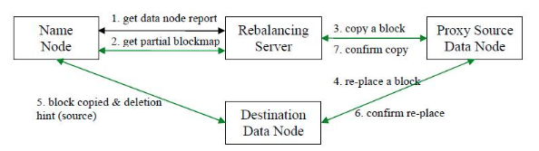

1. 数据平衡服务首先要求 NameNode 生成 DataNode 数据分布分析报告。
2. 选择所有的 DataNode 机器后，要求 NameNode 汇总数据分布的具体情况。
3. 确定具体数据块迁移路线图，保证网络内最短路径，并且确保原始数据块被删除。
4. 实际开始数据块迁移任务。
5. 数据迁移任务完成后，通过 NameNode 可以删除原始数据块。
6. NameNode 在确保满足数据块最低副本条件下选择一块数据块删除。
7. NameNode 通知数据平衡服务任务全部完成。

HDFS 数据在各个数据节点间可能保存的格式不一致。当存放新的数据块 (一个文件包含多个数据块) 时,NameNode 在选择数据节点作为其存储地点前需要考虑以下几点因素：

1. 当数据节点正在写入一个数据块时，会自动在本节点内保存一个副本。
2. 跨节点备份数据块。
3. 相同节点内的备份数据块可以节约网络消耗。
4. HDFS 数据均匀分布在整个集群的数据节点上。

## 测试使用 Cloudera Enterprise 执行数据平衡

### 测试目标

1. 测试使用 `Cloudera Enterprise` 执行 `HDFS` 数据平衡是否可以成功。
2. 测试使用 `Cloudera Enterprise` 执行 `HDFS` 数据平衡是否可以手动停止。
3. 测试使用 `Cloudera Enterprise` 执行 `HDFS` 数据平衡在停止状态下是否可以启动继续执行。
4. 测试 `HDFS` 数据平衡 命令参数 `重新平衡阈值（-threshold）` 是否启作用。
5. 测试 `HDFS` 数据平衡 配置（`hdfs-site.xml`）参数 `网络流量限制（dfs.balance.bandwidthPerSec）` 是否启作用。
6. 测试 `HDFS` 数据平衡 命令参数 `网络流量限制（-setBalancerBandwidth）` 是否启作用。

### 测试环境


#### 集群服务器信息

> **注意：dn10 为要新添加到集群中的 DataNode 节点。**


#### HDFS服务器信息


#### 现有 HDFS 存储数据信息

```bash
> sudo -u hdfs hdfs dfsadmin -report
Configured Capacity: 4070064734208 (3.70 TB)
Present Capacity: 2016217071616 (1.83 TB)
DFS Remaining: 1086129315840 (1011.54 GB)
DFS Used: 930087755776 (866.21 GB)
DFS Used%: 46.13%
Under replicated blocks: 0
Blocks with corrupt replicas: 0
Missing blocks: 0

-------------------------------------------------
Datanodes available: 3 (4 total, 1 dead)

Live datanodes:
Name: 10.0.3.102:50010 (dn01)
Hostname: dn01
Rack: /default
Decommission Status : Normal
Configured Capacity: 1356688244736 (1.23 TB)
DFS Used: 310029168640 (288.74 GB)
Non DFS Used: 683912880128 (636.94 GB)
DFS Remaining: 362746195968 (337.83 GB)
DFS Used%: 22.85%
DFS Remaining%: 26.74%
Last contact: Thu Oct 26 11:23:49 CST 2017


Name: 10.0.3.103:50010 (dn02)
Hostname: dn02
Rack: /default
Decommission Status : Normal
Configured Capacity: 1356688244736 (1.23 TB)
DFS Used: 310029414400 (288.74 GB)
Non DFS Used: 685333975040 (638.27 GB)
DFS Remaining: 361324855296 (336.51 GB)
DFS Used%: 22.85%
DFS Remaining%: 26.63%
Last contact: Thu Oct 26 11:23:50 CST 2017


Name: 10.0.3.104:50010 (dn03)
Hostname: dn03
Rack: /default
Decommission Status : Normal
Configured Capacity: 1356688244736 (1.23 TB)
DFS Used: 310029172736 (288.74 GB)
Non DFS Used: 684600807424 (637.58 GB)
DFS Remaining: 362058264576 (337.19 GB)
DFS Used%: 22.85%
DFS Remaining%: 26.69%
Last contact: Thu Oct 26 11:23:48 CST 2017
```

### 测试步骤

#### 将新的节点添加到 HDFS 集群

> 在本次测试前已经完成将新服务器添加到 `Cloudera Enterpr` 中，只是还未将其添加到 `HDFS` 集群中。


```bash
# 使用命令查看，这里发现新的 DataNode（dn10）节点
# 这里可以看到新的 DataNode（dn10）节点的 DFS Used% 为 0.00%，表示现在节点上没有数据。
> sudo -u hdfs hdfs dfsadmin -report

[...]

Name: 10.0.3.70:50010 (dn10)
Hostname: dn10
Rack: /default
Decommission Status : Normal
Configured Capacity: 947863429120 (882.77 GB)
DFS Used: 24576 (24 KB)
Non DFS Used: 44545314816 (41.49 GB)
DFS Remaining: 903318089728 (841.28 GB)
DFS Used%: 0.00%
DFS Remaining%: 95.30%
Last contact: Thu Oct 26 11:47:06 CST 2017

[...]

```

#### 添加 Balancer 服务


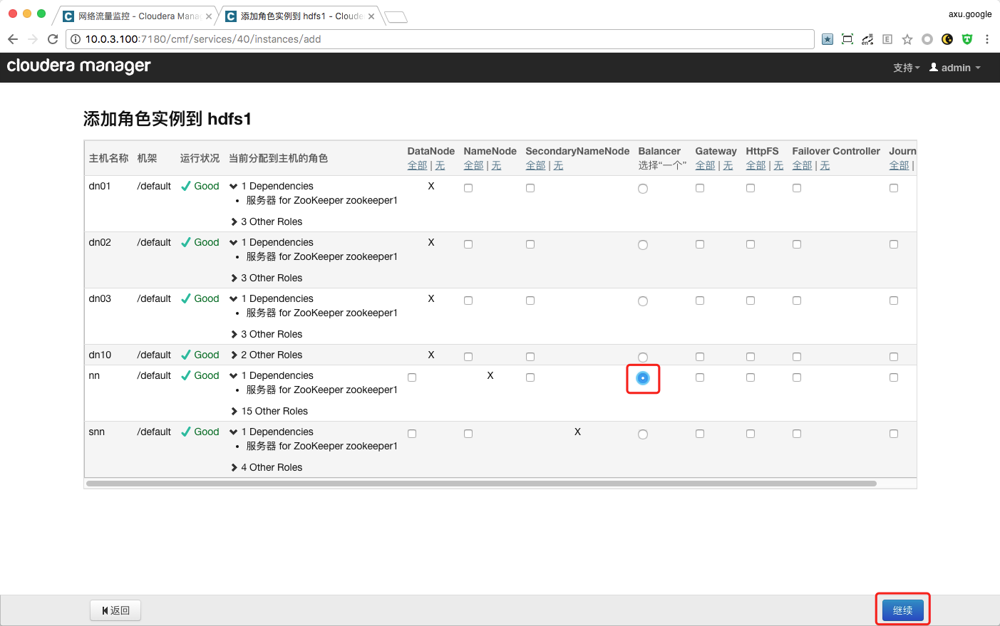

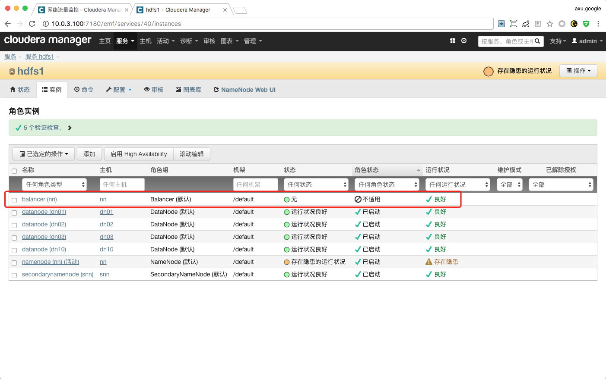

#### 配置 Balancer 服务

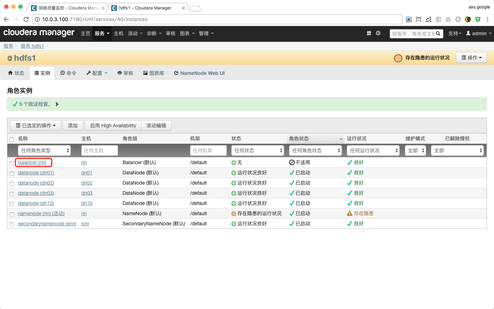

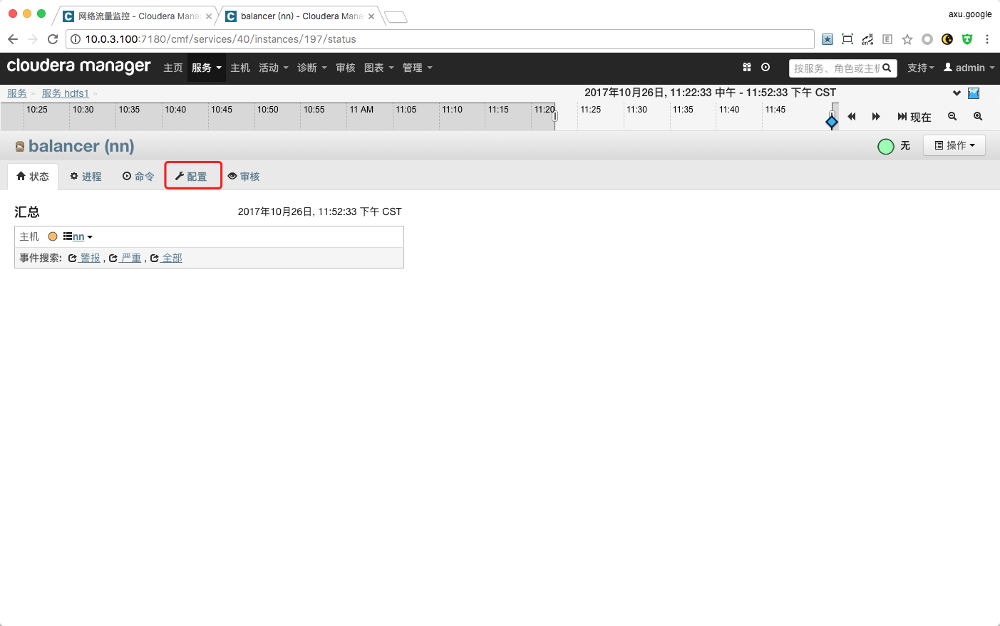

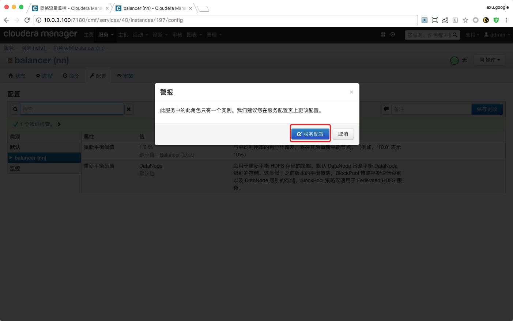

> 我们这里为了更容易可以看到数据平衡的效果，将该值修改为 `1%`，默认值为 `10%`。

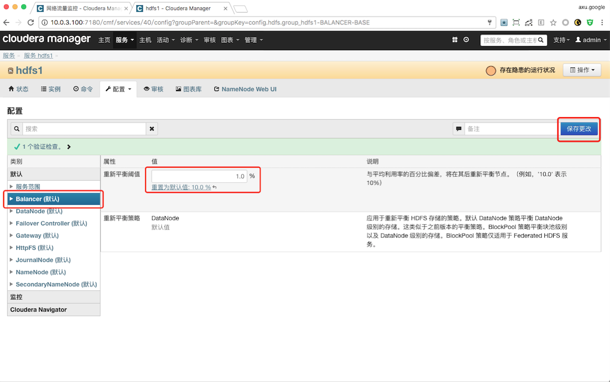

#### 启动数据平衡任务

> 在 `Cloudera Manager 4.8.0` 版本中，默认数据平衡带宽为 `10MB/s`。


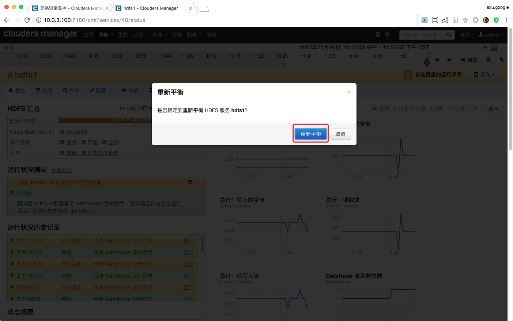

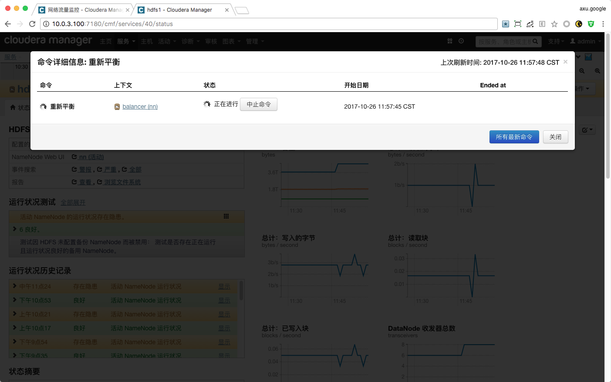

> 这里可以点击 `"关闭"` 按钮，不会影响数据平衡任务执行。

```bash
# 这里可以再次使用命令查看新的 DataNode（dn10）的 DFS Used% 参数，检查是否已经开始同步。
> sudo -u hdfs hdfs dfsadmin -report

[...]

Name: 10.0.3.70:50010 (dn10)
Hostname: dn10
Rack: /default
Decommission Status : Normal
Configured Capacity: 947863429120 (882.77 GB)
DFS Used: 2084555710 (1.94 GB)
Non DFS Used: 45109011522 (42.01 GB)
DFS Remaining: 900669861888 (838.81 GB)
DFS Used%: 0.22%
DFS Remaining%: 95.02%
Last contact: Thu Oct 26 12:01:57 CST 2017

[...]

```

#### 终止数据平衡任务

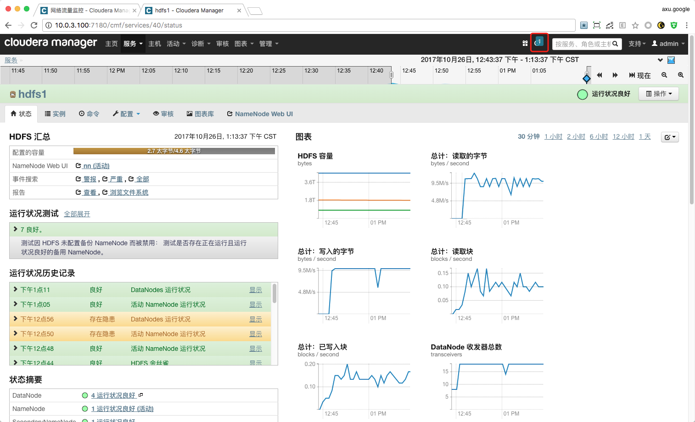

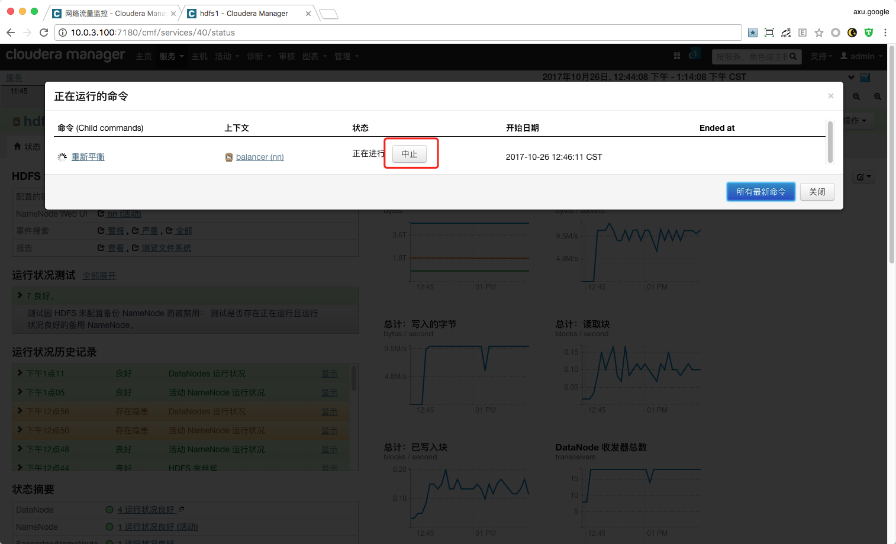

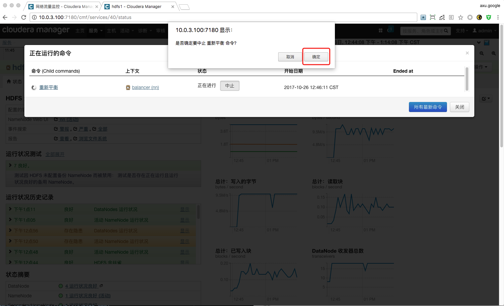


#### 限制数据平衡数据传输带宽

```bash
# 查看帮助信息
> sudo -u hdfs hdfs dfsadmin -help
[...]
-setBalancerBandwidth <bandwidth>:
        Changes the network bandwidth used by each datanode during
        HDFS block balancing.

                <bandwidth> is the maximum number of bytes per second
                that will be used by each datanode. This value overrides
                the dfs.balance.bandwidthPerSec parameter.

                --- NOTE: The new value is not persistent on the DataNode.---
[...]

# 执行限制数据平衡传数据输宽带命令
# 单位是 bytes，下文是 5MB/s
> sudo -u hdfs hdfs dfsadmin -setBalancerBandwidth 5242880
```

#### 再次启动数据平衡任务

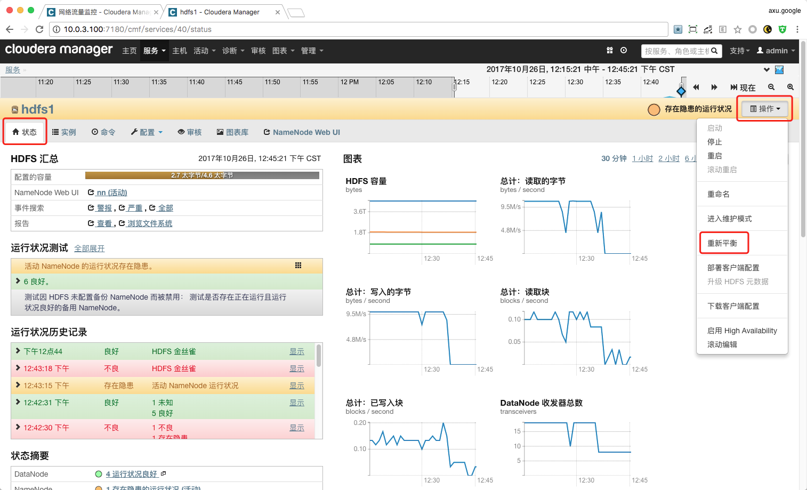

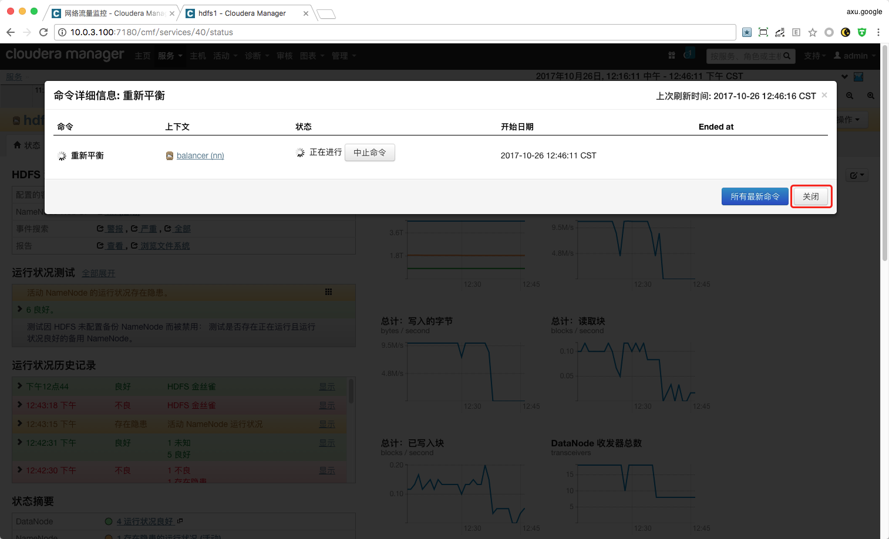


#### 执行任务完成

> 可以通过执行以下步骤，查看执行命令 `是否成功` 以及 `执行时长`。

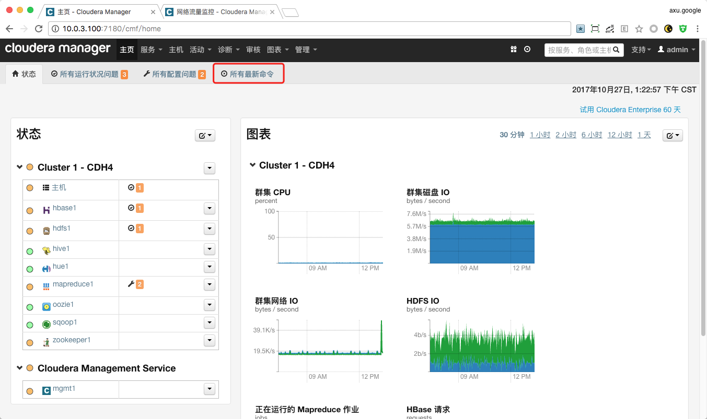

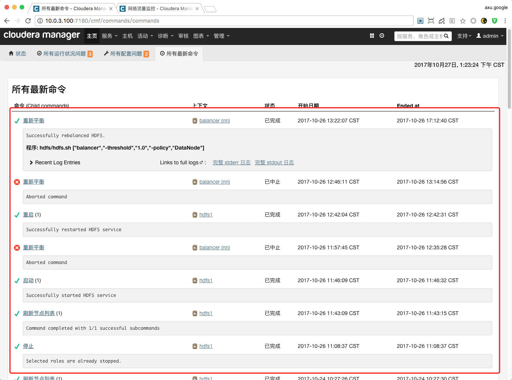

### 测试结果

#### 数据最终平衡情况

```bash
# 查看全部报告
> sudo -u hdfs hdfs dfsadmin -report
Configured Capacity: 5017928163328 (4.56 TB)
Present Capacity: 3257481367552 (2.96 TB)
DFS Remaining: 2327392804864 (2.12 TB)
DFS Used: 930088562688 (866.21 GB)
DFS Used%: 28.55%
Under replicated blocks: 0
Blocks with corrupt replicas: 0
Missing blocks: 0

-------------------------------------------------
Datanodes available: 4 (4 total, 0 dead)

Live datanodes:
Name: 10.0.3.102:50010 (dn01)
Hostname: dn01
Rack: /default
Decommission Status : Normal
Configured Capacity: 1356688244736 (1.23 TB)
DFS Used: 255424847872 (237.88 GB)
Non DFS Used: 575541334016 (536.01 GB)
DFS Remaining: 525722062848 (489.62 GB)
DFS Used%: 18.83%
DFS Remaining%: 38.75%
Last contact: Fri Oct 27 13:26:25 CST 2017


Name: 10.0.3.70:50010 (dn10)
Hostname: dn10
Rack: /default
Decommission Status : Normal
Configured Capacity: 947863429120 (882.77 GB)
DFS Used: 170030972928 (158.35 GB)
Non DFS Used: 44550672384 (41.49 GB)
DFS Remaining: 733281783808 (682.92 GB)
DFS Used%: 17.94%
DFS Remaining%: 77.36%
Last contact: Fri Oct 27 13:26:26 CST 2017


Name: 10.0.3.103:50010 (dn02)
Hostname: dn02
Rack: /default
Decommission Status : Normal
Configured Capacity: 1356688244736 (1.23 TB)
DFS Used: 253261131776 (235.87 GB)
Non DFS Used: 572634652672 (533.31 GB)
DFS Remaining: 530792460288 (494.34 GB)
DFS Used%: 18.67%
DFS Remaining%: 39.12%
Last contact: Fri Oct 27 13:26:26 CST 2017


Name: 10.0.3.104:50010 (dn03)
Hostname: dn03
Rack: /default
Decommission Status : Normal
Configured Capacity: 1356688244736 (1.23 TB)
DFS Used: 251371610112 (234.11 GB)
Non DFS Used: 567720136704 (528.73 GB)
DFS Remaining: 537596497920 (500.68 GB)
DFS Used%: 18.53%
DFS Remaining%: 39.63%
Last contact: Fri Oct 27 13:26:26 CST 2017

# 查看各个节点 HDFS 使用率
> sudo -u hdfs hdfs dfsadmin -report | grep -E "Name|DFS Used" | grep -v "Non"
DFS Used: 930088562688 (866.21 GB)
DFS Used%: 28.55%
Name: 10.0.3.102:50010 (dn01)
DFS Used: 255424847872 (237.88 GB)
DFS Used%: 18.83%
Name: 10.0.3.70:50010 (dn10)
DFS Used: 170030972928 (158.35 GB)
DFS Used%: 17.94%
Name: 10.0.3.103:50010 (dn02)
DFS Used: 253261131776 (235.87 GB)
DFS Used%: 18.67%
Name: 10.0.3.104:50010 (dn03)
DFS Used: 251371610112 (234.11 GB)
DFS Used%: 18.53%
```

#### 流量监控

> 我们在这里分别监控了所有服务器以及整体集群的 `网络接收` `网络发送` `使用磁盘量` `磁盘度` `磁盘写`。

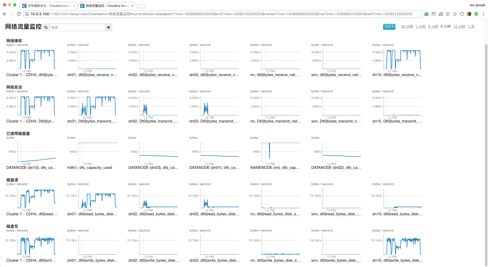

### 结论

 1. **通过 `数据最终平衡情况` 结果可以看出 HDFS 已经完成数据平衡到我们设置的阈值（1%）内。**

## 参考文档

- [Cloudera Enterprise 官方文档，HDFS Balancers。](https://www.cloudera.com/documentation/enterprise/latest/topics/admin_hdfs_balancer.html)
- [IBM developerWorks，HDFS 数据平衡规则及实验介绍。](https://www.ibm.com/developerworks/cn/data/library/bd-1506-hdfsdatabalance/index.html)
