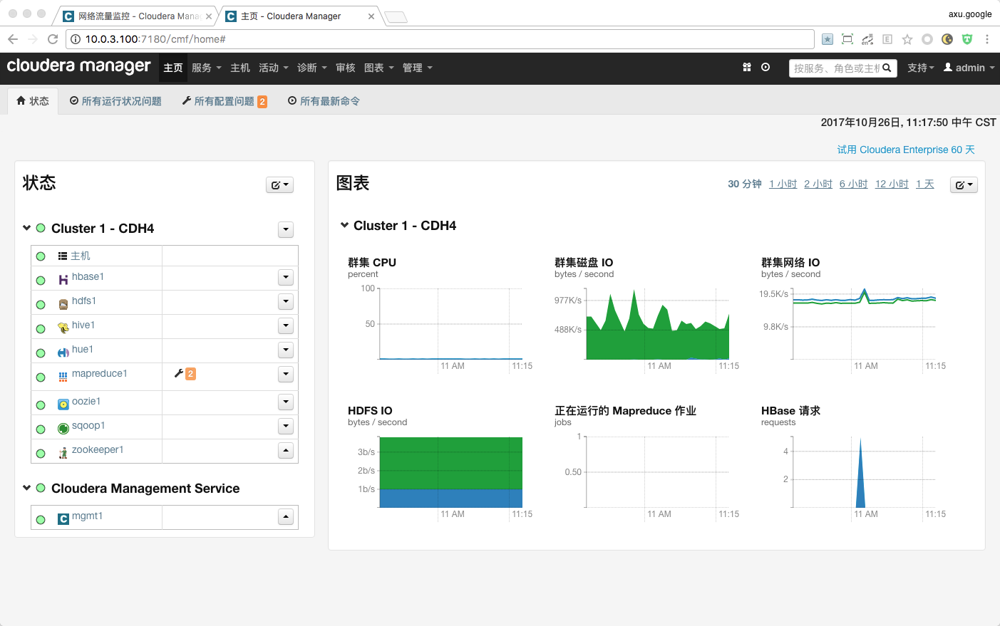
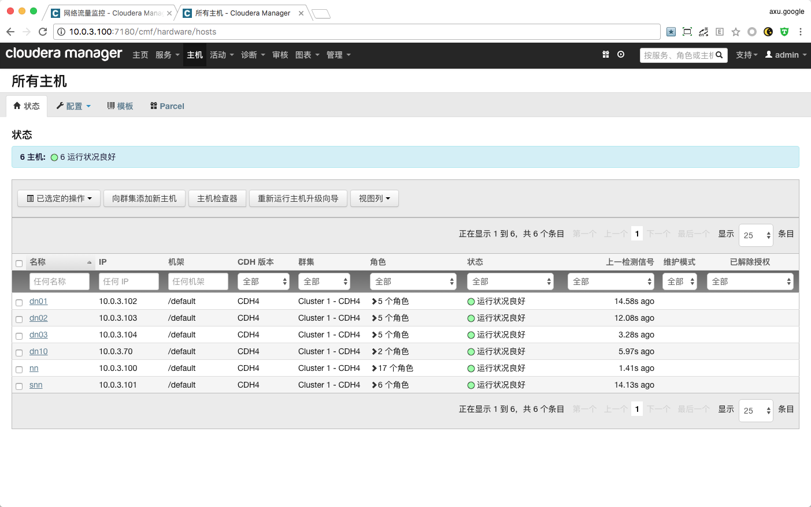
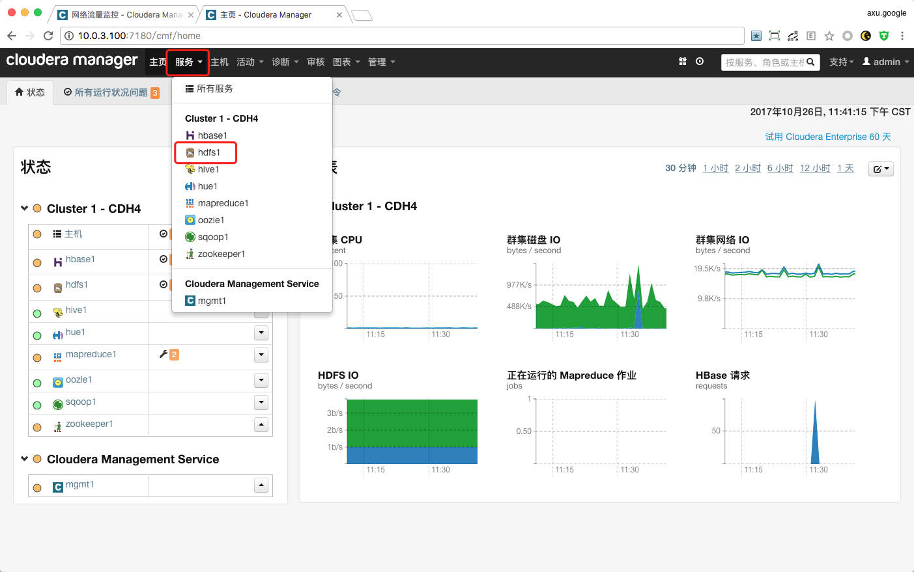
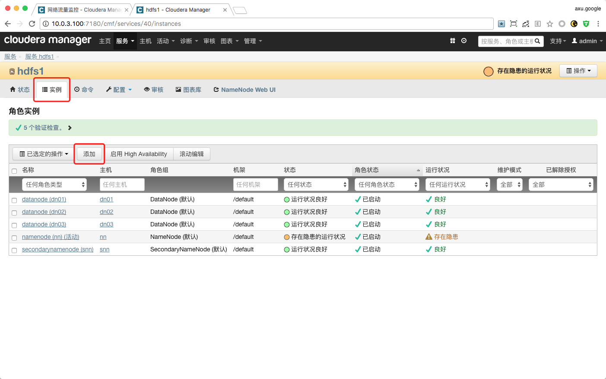
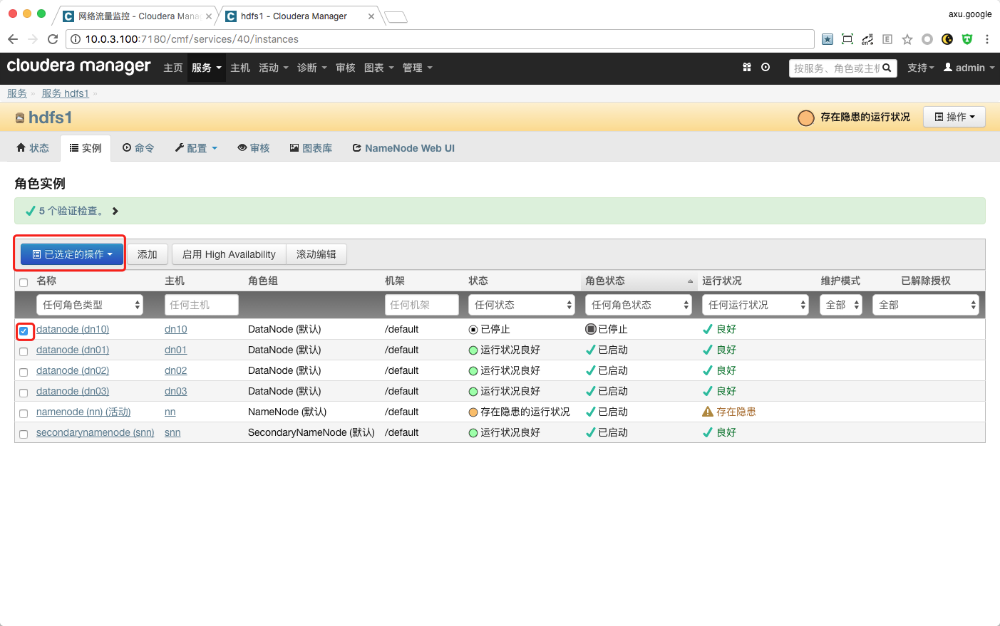
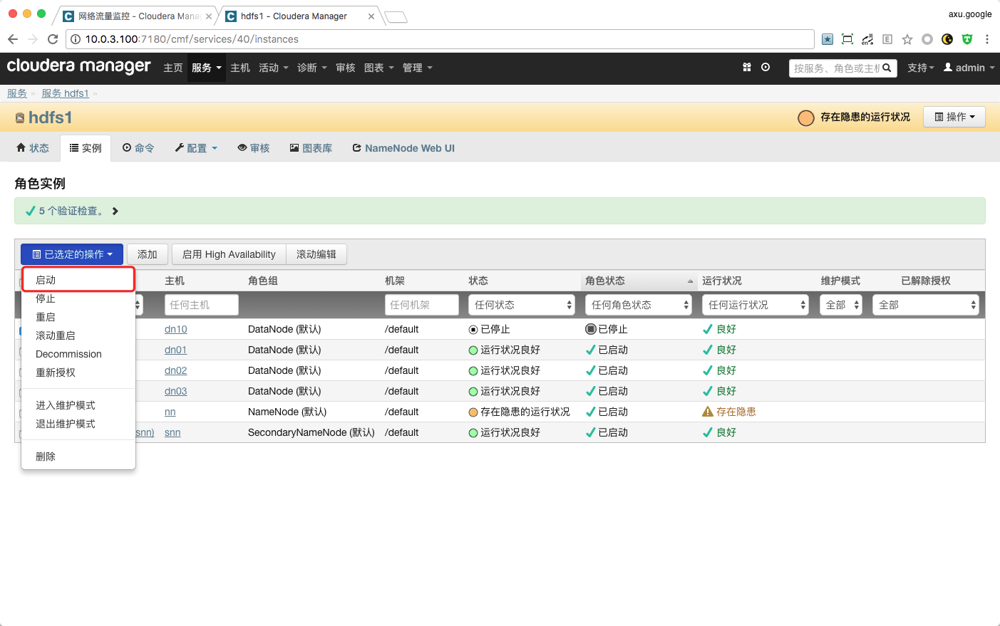
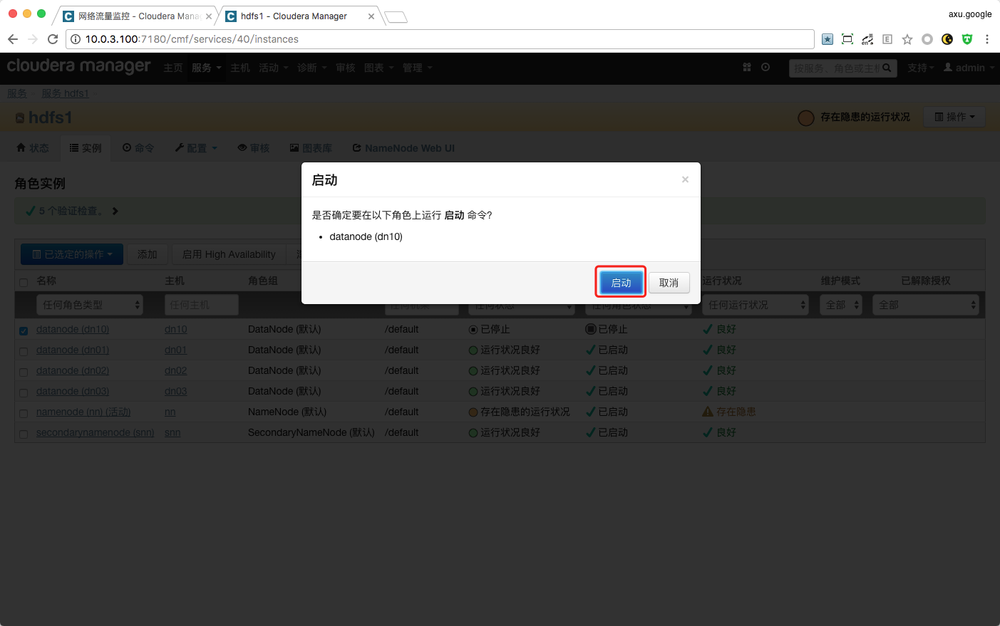
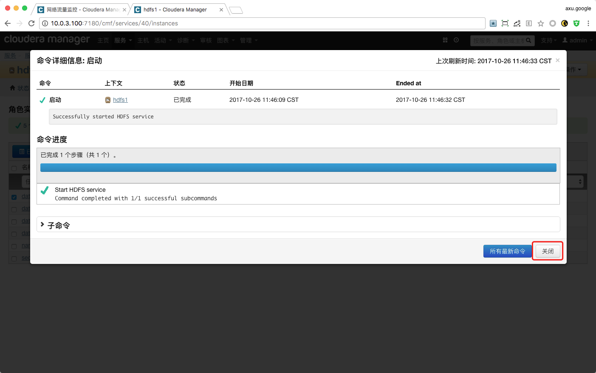
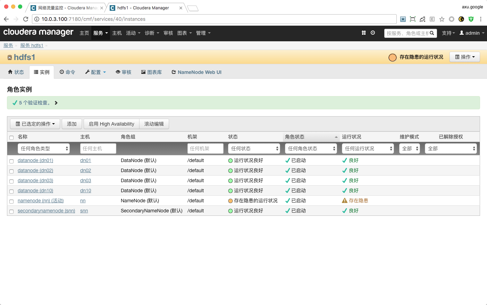

# Cloudera Enterprise HDFS 数据平衡

## HDFS 数据平衡原理

## 测试使用 HDFS 官方脚本执行数据平衡（未测试）

## 测试使用 Cloudera Enterprise 执行数据平衡

### 测试目标

1. 测试使用 `Cloudera Enterprise` 执行 `HDFS` 数据平衡是否可以成功。
2. 测试使用 `Cloudera Enterprise` 执行 `HDFS` 数据平衡是否可以手动停止。
3. 测试使用 `Cloudera Enterprise` 执行 `HDFS` 数据平衡在停止状态下是否可以启动继续执行。
4. 测试 `HDFS` 数据平衡 命令参数 `重新平衡阈值（threshold）` 是否启作用。
5. 测试 `HDFS` 数据平衡 配置（`hdfs-site.xml`）参数 `网络流量限制（dfs.balance.bandwidthPerSec）` 是否启作用。

### 测试环境



#### 集群服务器信息

> **注意：dn10 为要新添加到集群中的 DataNode 节点。**



#### HDFS服务器信息


#### 现有 HDFS 存储数据信息

```bash
> sudo -u hdfs hdfs dfsadmin -report
Configured Capacity: 4070064734208 (3.70 TB)
Present Capacity: 2016217071616 (1.83 TB)
DFS Remaining: 1086129315840 (1011.54 GB)
DFS Used: 930087755776 (866.21 GB)
DFS Used%: 46.13%
Under replicated blocks: 0
Blocks with corrupt replicas: 0
Missing blocks: 0

-------------------------------------------------
Datanodes available: 3 (4 total, 1 dead)

Live datanodes:
Name: 10.0.3.102:50010 (dn01)
Hostname: dn01
Rack: /default
Decommission Status : Normal
Configured Capacity: 1356688244736 (1.23 TB)
DFS Used: 310029168640 (288.74 GB)
Non DFS Used: 683912880128 (636.94 GB)
DFS Remaining: 362746195968 (337.83 GB)
DFS Used%: 22.85%
DFS Remaining%: 26.74%
Last contact: Thu Oct 26 11:23:49 CST 2017


Name: 10.0.3.103:50010 (dn02)
Hostname: dn02
Rack: /default
Decommission Status : Normal
Configured Capacity: 1356688244736 (1.23 TB)
DFS Used: 310029414400 (288.74 GB)
Non DFS Used: 685333975040 (638.27 GB)
DFS Remaining: 361324855296 (336.51 GB)
DFS Used%: 22.85%
DFS Remaining%: 26.63%
Last contact: Thu Oct 26 11:23:50 CST 2017


Name: 10.0.3.104:50010 (dn03)
Hostname: dn03
Rack: /default
Decommission Status : Normal
Configured Capacity: 1356688244736 (1.23 TB)
DFS Used: 310029172736 (288.74 GB)
Non DFS Used: 684600807424 (637.58 GB)
DFS Remaining: 362058264576 (337.19 GB)
DFS Used%: 22.85%
DFS Remaining%: 26.69%
Last contact: Thu Oct 26 11:23:48 CST 2017
```

### 测试步骤

#### 将新的节点添加到 HDFS 集群

> 在本次测试前已经完成将新服务器添加到 `Cloudera Enterpr` 中，只是还未将其添加到 `HDFS` 集群中。
















```bash
# 使用命令查看，这里发现新的 DataNode（dn10）节点
# 这里可以看到新的 DataNode（dn10）节点的 DFS Used% 为 0.00%，表示现在节点上没有数据。
> sudo -u hdfs hdfs dfsadmin -report

[...]

Name: 10.0.3.70:50010 (dn10)
Hostname: dn10
Rack: /default
Decommission Status : Normal
Configured Capacity: 947863429120 (882.77 GB)
DFS Used: 24576 (24 KB)
Non DFS Used: 44545314816 (41.49 GB)
DFS Remaining: 903318089728 (841.28 GB)
DFS Used%: 0.00%
DFS Remaining%: 95.30%
Last contact: Thu Oct 26 11:47:06 CST 2017

[...]

```
