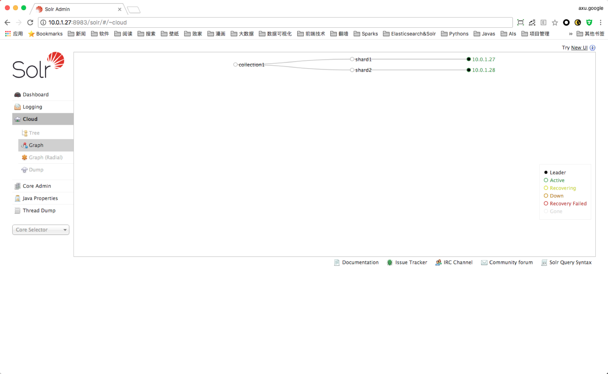
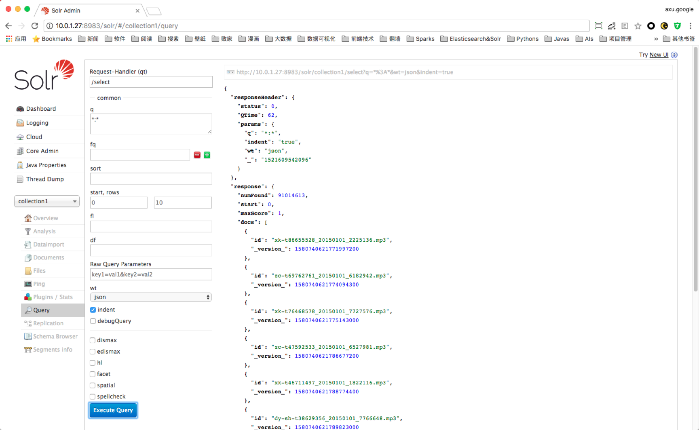
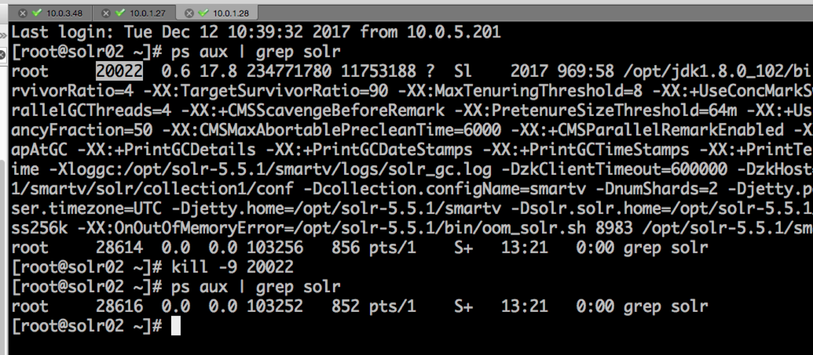
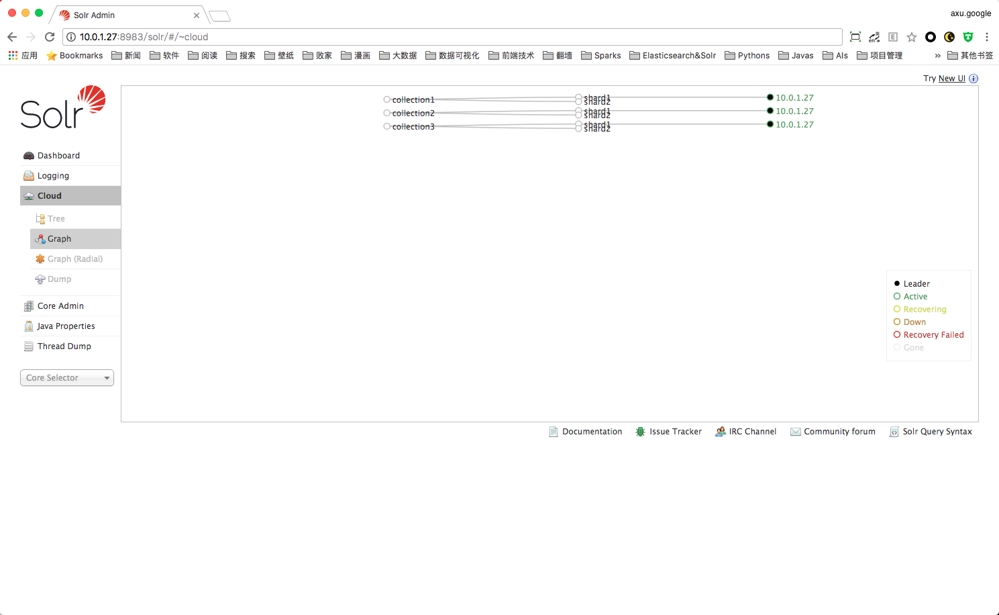
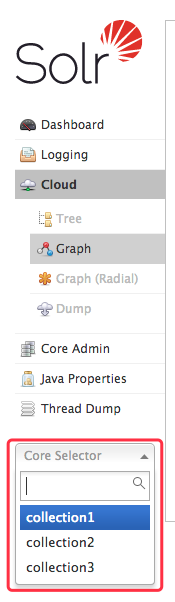
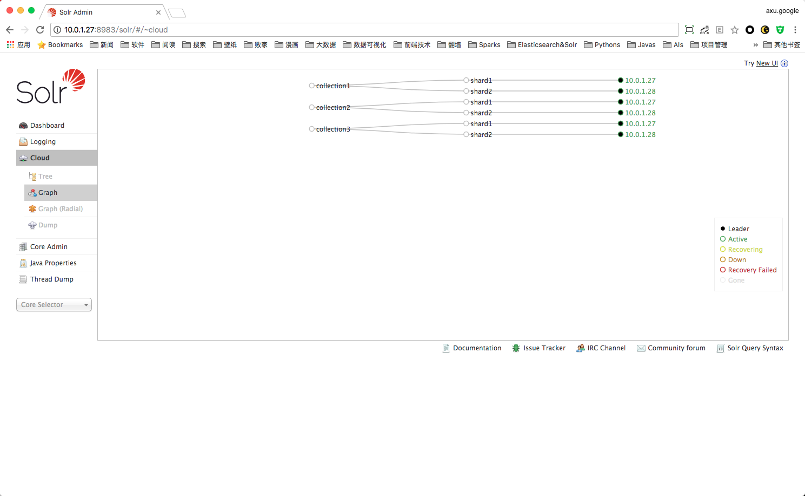

# SolrCloud 增加 collections

## 1. 查看现有环境情况

### 1.1 查看Cloud页面



### 1.2 查看collection已有索引量

> **重要：** 需要记录当前索引量，以便最后验证增加完成后是否索引有遗失。



## 2. 停止所有节点的Solr服务





## 3. 备份

> **注意：** 这里一定要将配置文件备份到非`/opt/solr-5.5.1/`目录。

```bash
# 登陆 master 服务器
# 执行备份
> cp -r /opt/solr-5.5.1/smartv /opt/solr_smartv_20180321_backup

# 检查
> ll /opt/solr_smartv_20180321_backup/
total 148
drwxr-xr-x 2 root root   4096 Mar 21 13:13 contexts
drwxr-xr-x 2 root root   4096 Mar 21 13:13 etc
drwxr-xr-x 3 root root   4096 Mar 21 13:13 lib
drwxr-xr-x 2 root root   4096 Mar 21 13:13 logs
drwxr-xr-x 2 root root   4096 Mar 21 13:13 modules
-rw-r--r-- 1 root root   3826 Mar 21 13:13 README.txt
drwxr-xr-x 2 root root   4096 Mar 21 13:13 resources
drwxr-xr-x 4 root root   4096 Mar 21 13:13 scripts
drwxr-xr-x 4 root root   4096 Mar 21 13:13 solr
drwxr-xr-x 3 root root   4096 Mar 21 13:13 solr-webapp
-rw-r--r-- 1 root root 109440 Mar 21 13:13 start.jar
```

## 4. 修改配置(master)

### 4.1 添加configurations目录

```bash
# 登陆 master 服务器
> mv /opt/solr-5.5.1/smartv/solr/collection1/conf /opt/solr-5.5.1/smartv/solr/configurations
> ll /opt/solr-5.5.1/smartv/solr/configurations
total 324
-rw-r--r--. 1 root root  1068 Jun 15  2016 admin-extra.html
-rw-r--r--. 1 root root   928 Jun 15  2016 admin-extra.menu-bottom.html
-rw-r--r--. 1 root root   926 Jun 15  2016 admin-extra.menu-top.html
-rw-r--r--. 1 root root  3974 Jun 15  2016 currency.xml
-rw-r--r--. 1 root root  1348 Jun 15  2016 elevate.xml
drwxr-xr-x. 2 root root  4096 Jun 15  2016 lang
-rw-r--r--. 1 root root 78514 Jun 15  2016 mapping-FoldToASCII.txt
-rw-r--r--. 1 root root  2868 Jun 15  2016 mapping-ISOLatin1Accent.txt
-rw-r--r--. 1 root root   873 Jun 15  2016 protwords.txt
-rw-r--r--  1 root root 19506 Nov  8 17:00 schema.xml
-rw-r--r--  1 root root 16099 Nov  6 17:08 schema.xml.raw
-rw-r--r--. 1 root root   921 Jun 15  2016 scripts.conf
drwxr-xr-x. 2 root root  4096 Jan 15 15:25 smartv_dic
-rw-r--r--  1 root root 72248 Nov 29 11:17 solrconfig.xml
-rw-r--r--  1 root root 71835 Oct 13 14:43 solrconfig.xml.raw
-rw-r--r--. 1 root root    13 Jun 15  2016 spellings.txt
-rw-r--r--. 1 root root   781 Jun 15  2016 stopwords.txt
-rw-r--r--. 1 root root  1119 Jun 15  2016 synonyms.txt
-rw-r--r--. 1 root root  1416 Jun 15  2016 update-script.js
drwxr-xr-x. 2 root root  4096 Jun 15  2016 velocity
drwxr-xr-x. 2 root root  4096 Jun 15  2016 xslt

> mkdir /opt/solr-5.5.1/smartv/solr/configurations/collection1
> ll -d /opt/solr-5.5.1/smartv/solr/configurations/collection1
drwxr-xr-x 2 root root 4096 Mar 21 13:34 /opt/solr-5.5.1/smartv/solr/configurations/collection1

> cd /opt/solr-5.5.1/smartv/solr/configurations/; mv schema.xml* solrconfig.xml* collection1/; cd -
> ll /opt/solr-5.5.1/smartv/solr/configurations/collection1
total 180
-rw-r--r-- 1 root root 19506 Nov  8 17:00 schema.xml
-rw-r--r-- 1 root root 16099 Nov  6 17:08 schema.xml.raw
-rw-r--r-- 1 root root 72248 Nov 29 11:17 solrconfig.xml
-rw-r--r-- 1 root root 71835 Oct 13 14:43 solrconfig.xml.raw

# 这个目录下现在应该没有 schema.xml* solrconfig.xml* 的文件
> ll /opt/solr-5.5.1/smartv/solr/configurations/ | grep -E "schema|solrconfig"
>
```

### 4.2 修改 core.properties 配置

```bash
# 解压已有配置
> cd ~; unzip ~/collections.zip
Archive:  /root/collections.zip
   creating: collections/
   creating: collections/collections_core/
   creating: collections/collections_core/collection3/
  inflating: collections/collections_core/collection3/core.properties  
  inflating: collections/collections_core/collection3/README.txt  
   creating: collections/collections_core/collection2/
  inflating: collections/collections_core/collection2/core.properties  
  inflating: collections/collections_core/collection2/README.txt  
   creating: collections/collections_core/collection1/
  inflating: collections/collections_core/collection1/core.properties  
  inflating: collections/collections_core/collection1/README.txt  
   creating: collections/collection23_schema/
   creating: collections/collection23_schema/collection3/
  inflating: collections/collection23_schema/collection3/solrconfig.xml  
  inflating: collections/collection23_schema/collection3/schema.xml  
   creating: collections/collection23_schema/collection2/
  inflating: collections/collection23_schema/collection2/solrconfig.xml  
  inflating: collections/collection23_schema/collection2/schema.xml

# 更新 collection core 配置（注意要覆盖原有配置）
> cp -r ~/collections/collections_core/collection* /opt/solr-5.5.1/smartv/solr/
cp: overwrite /opt/solr-5.5.1/smartv/solr/collection1/core.properties? y
cp: overwrite /opt/solr-5.5.1/smartv/solr/collection1/README.txt? y

# 检查
> ll /opt/solr-5.5.1/smartv/solr/collection*
/opt/solr-5.5.1/smartv/solr/collection1:
total 8
-rw-r--r--. 1 root root  126 Mar 21 13:43 core.properties
-rw-r--r--. 1 root root 2146 Mar 21 13:44 README.txt

/opt/solr-5.5.1/smartv/solr/collection2:
total 8
-rw-r--r-- 1 root root  126 Mar 21 13:44 core.properties
-rw-r--r-- 1 root root 2146 Mar 21 13:44 README.txt

/opt/solr-5.5.1/smartv/solr/collection3:
total 8
-rw-r--r-- 1 root root  126 Mar 21 13:44 core.properties
-rw-r--r-- 1 root root 2146 Mar 21 13:44 README.txt

# 检查 collection1 core 配置
# 需要检查 dataDir 是否是原有存储索引目录
# 需要检查 shard 是否是原有 shard
> cat /opt/solr-5.5.1/smartv/solr/collection1/core.properties
name=collection1
config=collection1/solrconfig.xml
schema=collection1/schema.xml
dataDir=/data/solr/collection1/
shard=shard1

# 检查 collection2 core 配置
# 需要检查 dataDir 是否是原有存储索引目录
# 需要检查 shard 是否是原有 shard
> cat /opt/solr-5.5.1/smartv/solr/collection2/core.properties
name=collection2
config=collection2/solrconfig.xml
schema=collection2/schema.xml
dataDir=/data/solr/collection2/
shard=shard1

# 检查 collection3 core 配置
# 需要检查 dataDir 是否是原有存储索引目录
# 需要检查 shard 是否是原有 shard
> cat /opt/solr-5.5.1/smartv/solr/collection3/core.properties
name=collection3
config=collection3/solrconfig.xml
schema=collection3/schema.xml
dataDir=/data/solr/collection3/
shard=shard1
```

> **注意：** 这里需要再次确认 3个collection 的 core.properties 配置中的 dataDir 和 shard 配置。

### 4.3 增加 collection2,3 schema,solrconfig 配置

```bash
# 检查解压文件
> ll ~/collections/collection23_schema/
total 8
drwxr-xr-x 2 root root 4096 Mar 21 13:35 collection2
drwxr-xr-x 2 root root 4096 Mar 21 13:35 collection3

# 增加 collection2 schema, solrconfig 配置
> cp -r ~/collections/collection23_schema/collection2 /opt/solr-5.5.1/smartv/solr/configurations/
> ll /opt/solr-5.5.1/smartv/solr/configurations/collection2
total 144
-rw-r--r-- 1 root root 71471 Mar 21 13:55 schema.xml
-rw-r--r-- 1 root root 72316 Mar 21 13:55 solrconfig.xml

# 增加 collection3 schema, solrconfig 配置
> cp -r ~/collections/collection23_schema/collection3 /opt/solr-5.5.1/smartv/solr/configurations/
> ll /opt/solr-5.5.1/smartv/solr/configurations/collection3
total 120
-rw-r--r-- 1 root root 48069 Mar 21 13:56 schema.xml
-rw-r--r-- 1 root root 72091 Mar 21 13:56 solrconfig.xml

# 检查
# collection1 使用的是原来的 schema, solrconfig
> ll /opt/solr-5.5.1/smartv/solr/configurations/collection*
/opt/solr-5.5.1/smartv/solr/configurations/collection1:
total 180
-rw-r--r-- 1 root root 19506 Nov  8 17:00 schema.xml
-rw-r--r-- 1 root root 16099 Nov  6 17:08 schema.xml.raw
-rw-r--r-- 1 root root 72248 Nov 29 11:17 solrconfig.xml
-rw-r--r-- 1 root root 71835 Oct 13 14:43 solrconfig.xml.raw

/opt/solr-5.5.1/smartv/solr/configurations/collection2:
total 144
-rw-r--r-- 1 root root 71471 Mar 21 13:55 schema.xml
-rw-r--r-- 1 root root 72316 Mar 21 13:55 solrconfig.xml

/opt/solr-5.5.1/smartv/solr/configurations/collection3:
total 120
-rw-r--r-- 1 root root 48069 Mar 21 13:56 schema.xml
-rw-r--r-- 1 root root 72091 Mar 21 13:56 solrconfig.xml
```

### 4.4 修改 schema.xml, solrconfig.xml 词库目录位置

```bash
# 重要！！！
# 注意：这里修改 schema.xml 词库位置，指定到预定的词库位置（3个collection的配置都需要该）
> cat /opt/solr-5.5.1/smartv/solr/configurations/collection*/schema.xml | grep dicPath
        <tokenizer class="com.chenlb.mmseg4j.solr.MMSegTokenizerFactory" mode="complex" dicPath="/opt/solr-5.5.1/smartv/solr/collection1/conf/smartv_dic/"/>
        <tokenizer class="com.chenlb.mmseg4j.solr.MMSegTokenizerFactory" mode="max-word" dicPath="/opt/solr-5.5.1/smartv/solr/collection1/conf/smartv_dic" />
        <tokenizer class="com.chenlb.mmseg4j.solr.MMSegTokenizerFactory" mode="simple" dicPath="/opt/solr-5.5.1/smartv/solr/collection1/conf/smartv_dic/" />
        <tokenizer class="com.chenlb.mmseg4j.solr.MMSegTokenizerFactory" mode="complex" dicPath="/opt/solr-5.5.1/smartv/solr/configurations/smartv_dic/"/>           
        <tokenizer class="com.chenlb.mmseg4j.solr.MMSegTokenizerFactory" mode="max-word" dicPath="/opt/solr-5.5.1/smartv/solr/configurations/smartv_dic" />
        <tokenizer class="com.chenlb.mmseg4j.solr.MMSegTokenizerFactory" mode="simple" dicPath="/opt/solr-5.5.1/smartv/solr/configurations/smartv_dic/" />
        <tokenizer class="com.chenlb.mmseg4j.solr.MMSegTokenizerFactory" dicPath="/opt/solr-5.5.1/smartv/solr/configurations/smartv_dic/" mode="complex"/>
        <tokenizer class="com.chenlb.mmseg4j.solr.MMSegTokenizerFactory" dicPath="/opt/solr-5.5.1/smartv/solr/configurations/smartv_dic" mode="max-word"/>
        <tokenizer class="com.chenlb.mmseg4j.solr.MMSegTokenizerFactory" dicPath="/opt/solr-5.5.1/smartv/solr/configurations/smartv_dic/" mode="simple"/>

# 重要！！！
# 注意：这里修改 solrconfig.xml 词库位置，指定到预定的词库位置（3个collection的配置都需要该）
> cat /opt/solr-5.5.1/smartv/solr/configurations/collection*/solrconfig.xml | grep dicPath       
      <str name="dicPath">/opt/solr-5.5.1/smartv/solr/collection1/conf/smartv_dic/</str>
      <str name="dicPath">/ccicall/opt/solr-5.5.1/smartv/solr/collection1/conf/smartv_dic/</str>
      <str name="dicPath">/opt/solr-5.5.1/smartv/solr/collection1/conf/smartv_dic/</str>
```

### 4.5 修改 solr.in.sh 配置

```bash
# 查看原有配置
> cat /opt/solr-5.5.1/bin/solr.in.sh | grep BOOTSTARP_CONF_DIR
BOOTSTARP_CONF_DIR="/opt/solr-5.5.1/smartv/solr/collection1/conf"

# 需要修改 BOOTSTARP_CONF_DIR 为 /opt/solr-5.5.1/smartv/solr/configurations
> vim /opt/solr-5.5.1/bin/solr.in.sh

# 查看修改后配置
> cat /opt/solr-5.5.1/bin/solr.in.sh | grep BOOTSTARP_CONF_DIR
BOOTSTARP_CONF_DIR="/opt/solr-5.5.1/smartv/solr/configurations"
```

### 4.6 清除 zookeeper 配置

```bash
> ll /opt/solr-5.5.1/smartv/solr/zoo_data/
total 4
drwxr-xr-x 2 root root 4096 Mar 21 14:12 version-2

> rm -rf /opt/solr-5.5.1/smartv/solr/zoo_data/*
> ll /opt/solr-5.5.1/smartv/solr/zoo_data/      
total 0
```

### 4.7 启动 master 节点

#### 4.7.1 启动命令

```bash
> cd /opt/solr-5.5.1; bin/solr restart -c -m 8g -d smartv/; cd -
[...]
```

#### 4.7.2 查看 Cloud 页面



#### 4.7.3 查看 collection



## 5. 修改配置(slaves)

### 5.1 打包 master

```bash
> cd /opt/; zip -r solr-5.5.1-master.zip solr-5.5.1/
[...]

> ll /opt/solr-5.5.1-master.zip
-rw-r--r-- 1 root root 192652101 Mar 21 14:20 /opt/solr-5.5.1-master.zip
```

### 5.2 拷贝到所有 slaves

```bash
> scp -r /opt/solr-5.5.1-master.zip root@10.0.1.28:/opt/
root@10.0.1.28 s password:
solr-5.5.1-master.zip                                                                                100%  184MB 183.7MB/s   00:01    
```

### 5.3 备份 slave 配置

```bash
# 登陆到 slave 服务器
> ll -d /opt/solr-5.5.1*
drwxr-xr-x. 10 root root      4096 Oct 13 16:49 /opt/solr-5.5.1
-rw-r--r--   1 root root 192652101 Mar 21 14:22 /opt/solr-5.5.1-master.zip

# 备份
> mv /opt/solr-5.5.1 /opt/solr-5.5.1-20180321-backup
> ll -d /opt/solr-5.5.1*                            
drwxr-xr-x. 10 root root      4096 Oct 13 16:49 /opt/solr-5.5.1-20180321-backup
-rw-r--r--   1 root root 192652101 Mar 21 14:22 /opt/solr-5.5.1-master.zip

# 解压
> cd /opt/; unzip solr-5.5.1-master.zip; cd -
[...]

> ll /opt/solr-5.5.1
total 1244
drwxr-xr-x  3 root root   4096 Mar 21 14:11 bin
-rw-r--r--  1 root root 555321 May  1  2016 CHANGES.txt
drwxr-xr-x 13 root root   4096 May  1  2016 contrib
drwxr-xr-x  4 root root   4096 Jun 12  2016 dist
drwxr-xr-x 19 root root   4096 Jun 12  2016 docs
drwxr-xr-x  8 root root   4096 Jun 12  2016 example
drwxr-xr-x  2 root root  40960 Jun 12  2016 licenses
-rw-r--r--  1 root root  12646 Feb  1  2016 LICENSE.txt
-rw-r--r--  1 root root 590277 May  1  2016 LUCENE_CHANGES.txt
-rw-r--r--  1 root root  26529 Feb  1  2016 NOTICE.txt
-rw-r--r--  1 root root   7162 May  1  2016 README.txt
drwxr-xr-x 11 root root   4096 Jun 12  2016 server
drwxr-xr-x 11 root root   4096 Sep 15  2017 smartv
```

### 5.4 修改 slave solr.in.sh 配置

```bash
# 需要将 ZK IP 设置为 Master 的 IP
> cat /opt/solr-5.5.1/bin/solr.in.sh | grep ZK_HOST
#ZK_HOST=""

# 将 #ZK_HOST="" 修改为 ZK_HOST="10.0.1.27:9983"
> vim /opt/solr-5.5.1/bin/solr.in.sh

> cat /opt/solr-5.5.1/bin/solr.in.sh | grep ZK_HOST
ZK_HOST="10.0.1.27:9983"
```

### 5.5 修改 slave collection core.properties 配置

> **重要：** 需要知道当前 slave 原来是在哪个 shard

```bash
# 查看现在 shard 配置
> cat /opt/solr-5.5.1/smartv/solr/collection*/core.properties | grep shard
shard=shard1
shard=shard1
shard=shard1

# 当前的 slave 应该是 shard2 所以所有 collection 的 core.properties 的 shard 都需要改成2

# 修改 collection1 core.properties shard 配置
# 将 shard=shard1 修改为 shard=shard2
> vim /opt/solr-5.5.1/smartv/solr/collection1/core.properties

# 修改 collection2 core.properties shard 配置
# 将 shard=shard1 修改为 shard=shard2
> vim /opt/solr-5.5.1/smartv/solr/collection2/core.properties

# 修改 collection3 core.properties shard 配置
# 将 shard=shard1 修改为 shard=shard2
> vim /opt/solr-5.5.1/smartv/solr/collection3/core.properties

# 检查
> cat /opt/solr-5.5.1/smartv/solr/collection*/core.properties | grep shard
shard=shard2
shard=shard2
shard=shard2
```

### 5.6 启动 slave

#### 5.6.1 启动命令

```bash
> cd /opt/solr-5.5.1; bin/solr restart -c -m 8g -d smartv/; cd -
[...]
```

#### 5.6.2 查看 Cloud 页面



#### 5.6.3 查询


> **其他slave修改方式一致**

`-EOF-`
