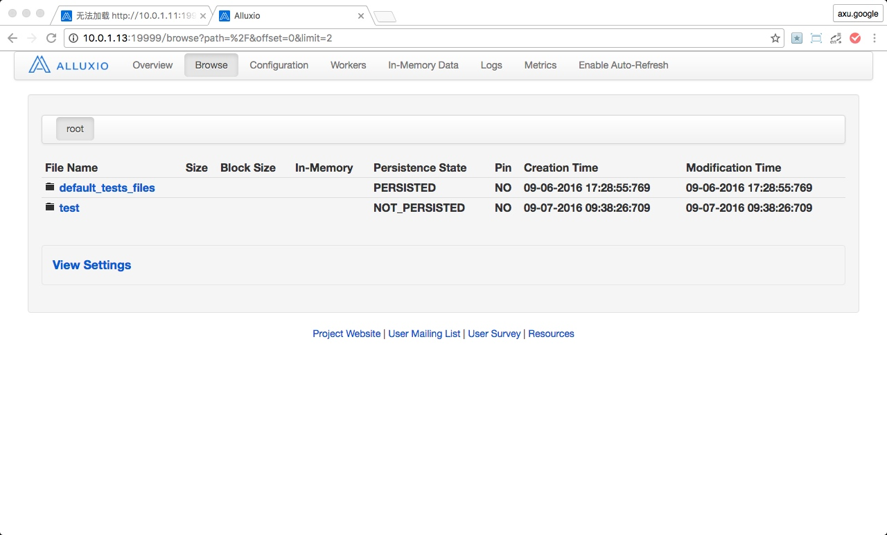
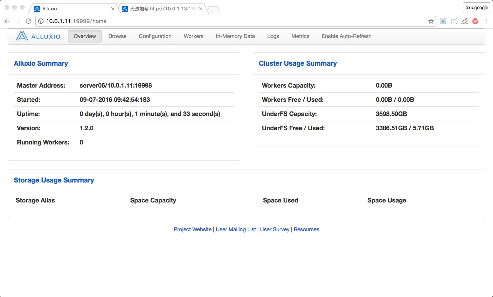
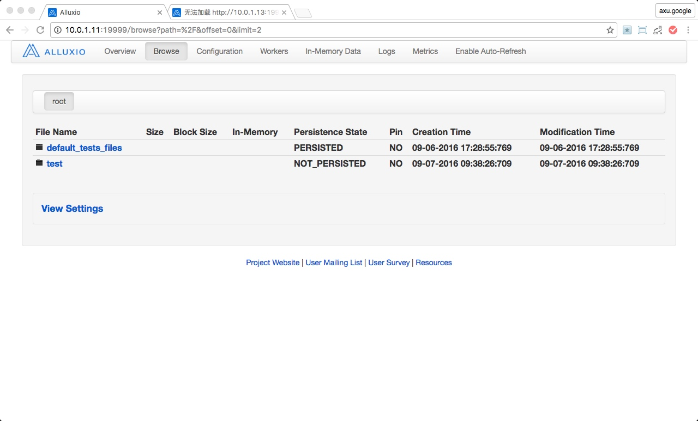
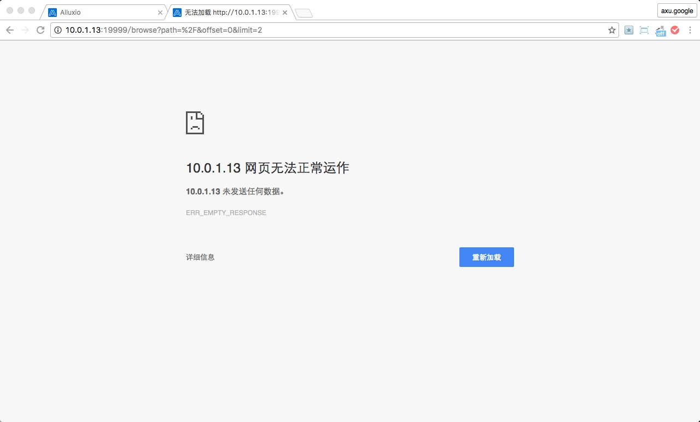

# ALLUXIO 容错模式

## 目录

[TOC]

## Alluxio 容错模式部署

> **注意:** 本文默认用户已经完成 **单机模式部署** 和 **集群模式部署**；若没有完成，请阅读 **ALLUXIO 单机模式** 和 **ALLUXIO 集群模式**。

### 部署环境说明

#### 服务器信息说明

角色|`IP`地址|主机名(`HOSTNAME`)
---|---|---
`ALLUXIO_MASTER`(`"主"`)|10.0.1.13|server08
`ALLUXIO_MASTER`(`"从"`)|10.0.1.11|server06
`ALLUXIO_WORKER`|10.0.1.11|server06
`ALLUXIO_WORKER`|10.0.1.12|server07
`ALLUXIO_WORKER`|10.0.1.13|server08
`HDFS_NAMENODE`|10.0.1.8|server03
`ZOOKEEPER` |10.0.1.8|server03
`ZOOKEEPER` |10.0.1.9|server04
`ZOOKEEPER` |10.0.1.10|server05

#### 版本信息说明

名称|版本
---|---
`CentOS`|`6.4`
`CDH`|`5.6.0`
`HADOOP`|`2.6.0`
`ZOOKEEPER`|`3.4.5`
`ALLUXIO`|`1.2.0`

<!-- more -->

### 部署步骤

> **注意:** 若没有完成 **集群模式部署** ，请先参照 **ALLUXIO 集群模式** 文档完成 **集群模式部署**。
> 若已完成 **集群模式部署** 请登陆到`"主"` `ALLUXIO_MASTER`服务器（`server08`），执行如下命令，停止**ALLUXIO**服务。

```bash
cd /opt/alluxio-1.2.0
bin/alluxio-stop.sh all
```

查看执行结果

```bash
> bin/alluxio-stop.sh all
Killed 1 processes on server08
Killed 1 processes on server08
Waiting for WORKERS tasks to finish...
All WORKERS tasks finished, please analyze the log at /opt/alluxio-1.2.0/logs/task.log.
```
 
#### 扩展主机名

> **注意:** 因为**容错模式**涉及到`ZOOKEEPER`，所以需要将`ZOOKEEPER`的主机名配置到`/etc/hosts`文件中。
 
登陆到`"主"` `ALLUXIO_MASTER` 服务器（`server08`）
 
##### 查看扩展前`/etc/hosts`文件信息

```bash
> cat /etc/hosts
[...]
10.0.1.13 server08
10.0.1.8 server03
10.0.1.11 server06
10.0.1.12 server07
```

##### 执行扩展命令

```bash
echo "10.0.1.9 server04" >> /etc/hosts
echo "10.0.1.10 server05" >> /etc/hosts
```

##### 查看扩展后`/etc/hosts`文件信息

```bash
cat /etc/hosts
[...]
10.0.1.13 server08
10.0.1.8 server03
10.0.1.11 server06
10.0.1.12 server07
10.0.1.9 server04
10.0.1.10 server05
```

##### 同步`/etc/hosts`文件到所有`ALLUXIO`节点上

> **注意:** 若你的`ALLUXIO`服务器不是新的服务器，服务器的`/etc/hosts`文件中，已存在设置过的主机名，则你不要按照下文命令同步，因为会完全覆盖原来的`/etc/hosts`文件（你之前已经你设置的那些主机名就没有了）。你需要手动将上面的内容添加至你的`ALLUXIO`服务器的`/etc/hosts`文件中。
 
```bash
scp /etc/hosts root@server06:/etc/
scp /etc/hosts root@server07:/etc/
```

#### 建立信任关系

登陆到 `"从"` `ALLUXIO_MASTER`服务器（`server06`）

> **注意:** 需要登陆到`server06`服务器上执行。
> `server06`服务器是本次，新要设置成为`ALLUXIO_MASTER`的服务器（`"从"服务器`）。
> 具体如何使用`pushssh.sh`脚本创建信任关系，请详见 **ALLUXIO 集群模式** 的 **建立信任关系** 章节。
> 本文就直接省略获取`pushssh.sh`等细节，直接执行`pushssh.sh`脚本创建信任关系。
> 
> **再次提醒:** 该服务器应是登陆 `server06`（`"从"` `ALLUXIO_MASTER`）而不是 "`主`" `ALLUXIO_MASTER` 服务器 `server08`（因为`"主"` `ALLUXIO_MASTER` 服务器（`server08`）在 **ALLUXIO 集群模式** 已将信任关系建立完成，所以本节不用重复建立）

```bash
/opt/scripts/pushssh.sh root@server06
/opt/scripts/pushssh.sh root@server07
/opt/scripts/pushssh.sh root@server08
```

#### 修改配置文件

##### 修改 `"主"` `ALLUXIO_MASTER`配置文件

> **注意:** **登陆到 `"主"` `ALLUXIO_MASTER`服务器（`server08`）修改配置文件`/opt/alluxio-1.2.0/conf/alluxio-env.sh`**

**备份原始配置文件**

```bash
cd /opt/alluxio-1.2.0/conf
cp alluxio-env.sh alluxio-env.sh.raw
```

**修改配置文件**

```bash
vim alluxio-env.sh
```

- 添加 `ALLUXIO_JAVA_OPTS="-Dalluxio.zookeeper.enabled=true -Dalluxio.zookeeper.address=server03:2181,server04:2181,server05:2181 -Dalluxio.master.journal.folder=hdfs://server03:8020/alluxio/journal"` 到 `/opt/alluxio-1.2.0/conf/alluxio-env.sh` 最后一行

**配置说明**

配置项|说明
---|---
`ALLUXIO_JAVA_OPTS`|Alluxio jvm 配置
`-Dalluxio.zookeeper.enabled`|如果设置为true，master会使用Zookeeper进行容错。
`-Dalluxio.zookeeper.address`|Zookeeper运行时所在的主机名和端口。多个地址以逗号分割。
`-Dalluxio.master.journal.folder`|Alluxio使用共享文件系统存放日志。所有master必须能够从共享文件系统进行读写。只有leader master可以在任何时间写入日志，但所有master可以读取共享日志来重播Alluxio的系统状态。

**修改后和未修改文件对比**

```bash
> cd /opt/alluxio-1.2.0/conf
> git diff alluxio-env.sh alluxio-env.sh.raw
diff --git a/alluxio-env.sh b/alluxio-env.sh.raw
index 0c4595a..4dbd343 100644
--- a/alluxio-env.sh
+++ b/alluxio-env.sh.raw
@@ -17,4 +17,3 @@ ALLUXIO_MASTER_HOSTNAME=${ALLUXIO_MASTER_HOSTNAME:-"server08"}
 ALLUXIO_WORKER_MEMORY_SIZE=${ALLUXIO_WORKER_MEMORY_SIZE:-"42933MB"}
 ALLUXIO_RAM_FOLDER=${ALLUXIO_RAM_FOLDER:-"/mnt/ramdisk"}
 ALLUXIO_UNDERFS_ADDRESS=${ALLUXIO_UNDERFS_ADDRESS:-"hdfs://server03:8020/alluxio_another/"}
-ALLUXIO_JAVA_OPTS="-Dalluxio.zookeeper.enabled=true -Dalluxio.zookeeper.address=server03:2181,server04:2181,server05:2181 -Dalluxio.master.journal.folder=hdfs://server03:8020/alluxio/journal"
```

> **注意:** 如果执行`git diff`出现显示不全的情况是，是因为该行太长。使用`->`或者`<-`键可以翻页。

##### 修改 `"从"` `ALLUXIO_MASTER`配置文件

> **注意:** **登陆到 `"从"` `ALLUXIO_MASTER`服务器（`server06`）修改配置文件`/opt/alluxio-1.2.0/conf/alluxio-env.sh`**

**备份原始配置文件**

```bash
cd /opt/alluxio-1.2.0/conf
cp alluxio-env.sh alluxio-env.sh.raw
```

**修改配置文件**

```bash
vim alluxio-env.sh
```

- 将`ALLUXIO_MASTER_HOSTNAME`中的`server08`替换为`server06`
- 添加 `ALLUXIO_JAVA_OPTS="-Dalluxio.zookeeper.enabled=true -Dalluxio.zookeeper.address=server03:2181,server04:2181,server05:2181 -Dalluxio.master.journal.folder=hdfs://server03:8020/alluxio/journal"` 到 `/opt/alluxio-1.2.0/conf/alluxio-env.sh` 最后一行

**修改后和未修改文件对比**

```bash
> cd /opt/alluxio-1.2.0/conf
> git diff alluxio-env.sh alluxio-env.sh.raw
diff --git a/alluxio-env.sh b/alluxio-env.sh.raw
index 952b851..4dbd343 100644
--- a/alluxio-env.sh
+++ b/alluxio-env.sh.raw
@@ -13,8 +13,7 @@
 # This file is sourced to launch Alluxio servers or use Alluxio shell commands
 # This file was generated by command "bin/alluxio bootstrapConf server08 hdfs"
 # For a list of supported environment variables, see "conf/alluxio-env.sh.template"
-ALLUXIO_MASTER_HOSTNAME=${ALLUXIO_MASTER_HOSTNAME:-"server06"}
+ALLUXIO_MASTER_HOSTNAME=${ALLUXIO_MASTER_HOSTNAME:-"server08"}
 ALLUXIO_WORKER_MEMORY_SIZE=${ALLUXIO_WORKER_MEMORY_SIZE:-"42933MB"}
 ALLUXIO_RAM_FOLDER=${ALLUXIO_RAM_FOLDER:-"/mnt/ramdisk"}
 ALLUXIO_UNDERFS_ADDRESS=${ALLUXIO_UNDERFS_ADDRESS:-"hdfs://server03:8020/alluxio_another/"}
-ALLUXIO_JAVA_OPTS="-Dalluxio.zookeeper.enabled=true -Dalluxio.zookeeper.address=server03:2181,server04:2181,server05:2181 -Dalluxio.master.journal.folder=hdfs://server03:8020/alluxio/journal"
```

> **注意:** 如果执行`git diff`出现显示不全的情况是，是因为该行太长。使用`->`或者`<-`键可以翻页。
> 可以从对比结果看到，这里比 **修改 `"主"` `ALLUXIO_MASTER` 服务器（`server08`） 配置文件** 多修改一处。

#### 格式化`journal`目录

> **注意:** 因为**容错模式**在配置文件中(`/opt/alluxio-1.2.0/conf/alluxio-env.sh`)重新设置了`journal`目录（`-Dalluxio.master.journal.folder=hdfs://server03:8020/alluxio/journal`），所以需要重新格式化`journal`目录。
> 
> 在 `"主"` `ALLUXIO_MASTER`服务器(`server08`)上，执行如下命令

```bash
cd /opt/alluxio-1.2.0
bin/alluxio format
```

#### 启动服务

##### 在 `"主"` `ALLUXIO_MASTER`服务器(`server08`)，启动`ALLUXIO_MASTER`和所有`ALLUXIO_WORKER`服务

```bash
cd /opt/alluxio-1.2.0
bin/alluxio-start.sh all
```

##### 在 `"从"` `ALLUXIO_MASTER` 服务器(`server06`)，启动 `"从"` `ALLUXIO_MASTER`服务

```bash
cd /opt/alluxio-1.2.0
bin/alluxio-start.sh master
```

> **注意:** `"从"` `ALLUXIO_MASTER` 启动后，不会像 `"主"` `ALLUXIO_MASTER` 那样会有 `web-ui` 服务可以浏览。只有当 `"主"` `ALLUXIO_MASTER` 服务宕机时，`"从"` `ALLUXIO_MASTER` 服务器的 `web-ui` 服务才会启动。

#### 测试

##### 在 `"主"` `ALLUXIO_MASTER`（`server08`）上创建 `/test` 目录

登陆到`"主"` `ALLUXIO_MASTER` 服务器（`server08`）执行

```bash
cd /opt/alluxio-1.2.0
bin/alluxio fs mkdir /test
```

##### 在 `"主"` `ALLUXIO_MASTER`（`server08`）上查看 `/test` 目录是否创建成功

**通过 `alluxio-cli` 查看**

登陆到`"主"` `ALLUXIO_MASTER` 服务器（`server08`）执行

```bash
> /opt/alluxio-1.2.0
> bin/alluxio fs ls /
0.00B     09-06-2016 17:28:55:769  Directory      /default_tests_files
0.00B     09-07-2016 09:38:26:709  Directory      /test
```

**通过 `web-ui` 查看**



##### 停止 `"主"` `ALLUXIO_MASTER`（`server08`）服务

登陆到`"主"` `ALLUXIO_MASTER` 服务器（`server08`）执行

```bash
cd /opt/alluxio-1.2.0
bin/alluxio-stop.sh master
```

##### 查看 `"从"` `ALLUXIO_MASTER`（`server06`）是否启动

> **注意:** `"主"` `ALLUXIO_MASTER` 服务停止后，`"从"` `ALLUXIO_MASTER`的`web-ui`不是马上就会启动，我猜测这应该和 `ZOOKEEPER` "监控"、"选举"和"切换"时间有关，具体还没有证实。（通过这几次测试大概需要等待"几十秒"的时间，`"从"`服务器的 `web-ui` 就会自动启动）

**通过 `web-ui` 查看 `"从"` `ALLUXIO_MASTER` 服务启动情况**



> **注意:** 通过`IP地址`可以看出这个是`"从"` `ALLUXIO_MASTER`，同时我们可以看到下图 `"主"` `ALLUXIO_MASTER` 服务已经宕机。


##### 在 `"从"` `ALLUXIO_MASTER`（`server06`）上查看 `/test` 目录是否存在

**通过 `alluxio-cli` 查看**

登陆到`"从"` `ALLUXIO_MASTER` 服务器（`server06`）执行

```bash
> cd /opt/alluxio-1.2.0
> bin/alluxio fs ls /
0.00B     09-06-2016 17:28:55:769  Directory      /default_tests_files
0.00B     09-07-2016 09:38:26:709  Directory      /test
```

> **注意:** 可以从执行结果看出 `/test` 目录已经存在 

**通过 `web-ui` 查看**




##### 启动 `"主"` `ALLUXIO_MASTER`（`server08`）

登陆到`"主"` `ALLUXIO_MASTER` 服务器（`server08`）执行

```bash
cd /opt/alluxio-1.2.0
bin/alluxio-start.sh master
```

> **注意:** 
> 在 **容错模式** 中，因为使用了 `ZOOKEEPER` 导致是没有 `"主"` / `"从"` 的概念。我在上文中一直在强调 `"主"` / `"从"` 其实是为了更能方便的说明在哪个服务器上操作。 
> 在 **容错模式** 的架构中只有一个 `Leader` `ALLUXIO_MASTER` 节点，一般是先（第一个）启动的 `ALLUXIO_MASTER` 节点。像现在的这种情况，我们手动停止了`server08`的`ALLUXIO_MASTER`服务（原来的`Leader`，因为它在最初是第一个启动的），因为`server08`服务宕机，所以`ZOOKEEPER`就将`server06`（只有它还活着）设置成为新的`Leader`节点。
> 就算我们这次又将`server08`的`ALLUXIO_MASTER`服务启动起来，但是因为现在已经有`Leader`（`server06`）了。`server08`也不会被重新选举成为`Leader`。只有当`server06`的`ALLUXIO_MASTER`服务宕机或者提供不了服务的时候，`ZOOKEEPER`才会在"还活着"的`ALLUXIO_MASTER`节点中，再次选举出一个新的`Leader` `ALLUXIO_MASTER` 节点。
> 在 **容错模式** 中（1.2.0版本），只有 `Leader` `ALLUXIO_MASTER` 节点才会有 `web-ui` 服务，所以我们现在如果通过浏览器查看`server08`的`web-ui`也是访问不了的。



`- EOF -` 

