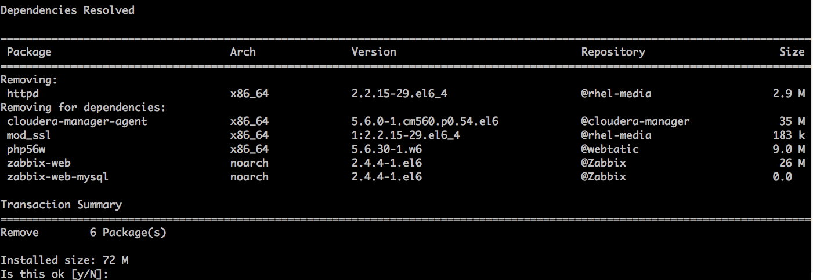
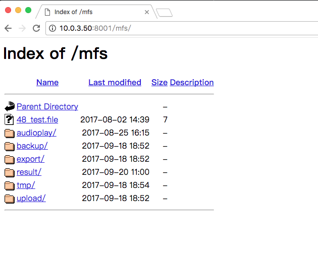

#  HTTPD 2.4 安装文档

## 作者

**@author: `anxu@centrin.com.cn` || `axu.home@gmail.com`**

## 安装步骤

### 背景说明

> 由于现在环境中已经存在 `httpd 2.2` 同时存在很多依赖比如 `PHP, Zabbix, Cloudera` 等，如果删除 `2.2` 那么这些组件全部都需要重装。所以本次安装 `httpd 2.4` 主要是将某些应用迁移至 `2.4` 最后完成 `2.2` 和 `2.4` 共存。



### 获取软件源

```bash
# 将 Httpd24.zip 放入 repo 服务器的根目录中，并解压
#!# 注：该操作是在软件服务器上执行
> ll /Archive/
total 14052
drwxr-xr-x  2 root root     4096 Apr 18 10:17 Ant
drwxr-xr-x  3 root root     4096 Jul 13 17:53 CentOS
drwxr-xr-x. 4 root root     4096 Nov 25  2016 Cloudera-Enterprise
drwxr-xr-x  2 root root     4096 Apr 19 17:26 Elasticsearch
drwxr-xr-x  3 root root     4096 Oct  9 15:14 Httpd24
-rw-r--r--  1 root root 14307514 Oct 10 14:58 Httpd24.zip
drwxr-xr-x  2 root root     4096 Apr 19 10:17 Java
drwxr-xr-x  2 root root     4096 Apr 18 13:48 Maven
drwxr-xr-x  2 root root     4096 Apr 18 09:20 MongoDB
drwxr-xr-x  3 root root     4096 Feb 15  2017 Moosefs
drwxr-xr-x. 4 root root     4096 Nov 23  2016 RedHat-Enterprise-Linux
drwxr-xr-x  2 root root     4096 Jun 12 16:51 Redis
drwxr-xr-x  2 root root     4096 Nov 25  2016 Resources
drwxr-xr-x  2 root root     4096 Nov 24  2016 Scripts
drwxr-xr-x  2 root root     4096 Apr 19 16:39 Solr
drwxr-xr-x  2 root root     4096 Apr 24 14:51 Thrift
drwxr-xr-x  2 root root     4096 Apr 18 13:40 Tomcat
drwxr-xr-x  3 root root     4096 Feb 24  2017 Webtatic-PHP
drwxr-xr-x  2 root root     4096 Apr 19 14:39 Wildfly
drwxr-xr-x  4 root root     4096 Mar 15  2017 Zabbix

# 检查解压结果
> ll /Archive/Httpd24
total 8
drwxr-xr-x 6 root root 4096 Oct  9 15:14 epel-6Server
-rw-r--r-- 1 root root  369 Oct  9 15:14 httpd24.repo

# 将 .repo 文件拷贝到需要安装 httpd 2.4 服务器的 /etc/yum.repo.d/ 目录中
#!# 注：该操作是在需要安装 httpd 2.4 的服务器上执行
# 切换目录
> cd /etc/yum.repos.d
> ll
total 16
-rw-r--r-- 1 root root 336 Nov 28  2016 cm5.repo
-rw-r--r-- 1 root root 227 Nov 28  2016 rhel-6.5-media.repo
-rw-r--r-- 1 root root 218 Feb 24  2017 webtatic-php.repo
-rw-r--r-- 1 root root 448 Feb 24  2017 zabbix.repo

# 下载 .repo 文件
> wget http://10.0.3.49/Httpd24/httpd24.repo
[...]

# 检查
> ll
total 20
[...]
-rw-r--r-- 1 root root 369 Oct  9 15:14 httpd24.repo
[...]

# 检查 httpd 2.4 软件源是否加载成功
> yum repolist
[...]
repo id                                       repo name                                                                  status
[...]
epel-httpd24                                  httpd-2.4 scl                                                                 24
[...]

# 再次检查
> yum list | grep httpd24
This system is not registered to Red Hat Subscription Management. You can use subscription-manager to register.
httpd24.x86_64                          1-6.el6                     epel-httpd24
httpd24-apr.x86_64                      1.4.8-2.el6                 epel-httpd24
httpd24-apr-debuginfo.x86_64            1.4.8-2.el6                 epel-httpd24
httpd24-apr-devel.x86_64                1.4.8-2.el6                 epel-httpd24
httpd24-apr-util.x86_64                 1.5.2-5.el6                 epel-httpd24
httpd24-apr-util-debuginfo.x86_64       1.5.2-5.el6                 epel-httpd24
httpd24-apr-util-devel.x86_64           1.5.2-5.el6                 epel-httpd24
httpd24-apr-util-ldap.x86_64            1.5.2-5.el6                 epel-httpd24
httpd24-apr-util-mysql.x86_64           1.5.2-5.el6                 epel-httpd24
httpd24-apr-util-nss.x86_64             1.5.2-5.el6                 epel-httpd24
httpd24-apr-util-odbc.x86_64            1.5.2-5.el6                 epel-httpd24
httpd24-apr-util-openssl.x86_64         1.5.2-5.el6                 epel-httpd24
httpd24-apr-util-pgsql.x86_64           1.5.2-5.el6                 epel-httpd24
httpd24-apr-util-sqlite.x86_64          1.5.2-5.el6                 epel-httpd24
httpd24-build.x86_64                    1-6.el6                     epel-httpd24
httpd24-httpd.x86_64                    2.4.6-5.el6                 epel-httpd24
httpd24-httpd-debuginfo.x86_64          2.4.6-5.el6                 epel-httpd24
httpd24-httpd-devel.x86_64              2.4.6-5.el6                 epel-httpd24
httpd24-httpd-tools.x86_64              2.4.6-5.el6                 epel-httpd24
httpd24-mod_ldap.x86_64                 2.4.6-5.el6                 epel-httpd24
httpd24-mod_proxy_html.x86_64           1:2.4.6-5.el6               epel-httpd24
httpd24-mod_session.x86_64              2.4.6-5.el6                 epel-httpd24
httpd24-mod_ssl.x86_64                  1:2.4.6-5.el6               epel-httpd24
httpd24-runtime.x86_64                  1-6.el6                     epel-httpd24
```

### 安装 HTTPD 2.4

```bash
# 执行安装命令
#!# 默认会安装在 /opt/rh/httpd24/ 文件夹中
> yum -y install httpd24
Loaded plugins: product-id, subscription-manager
This system is not registered to Red Hat Subscription Management. You can use subscription-manager to register.
Setting up Install Process
Resolving Dependencies
--> Running transaction check
---> Package httpd24.x86_64 0:1-6.el6 will be installed
--> Processing Dependency: httpd24-httpd for package: httpd24-1-6.el6.x86_64
--> Processing Dependency: httpd24-apr-util for package: httpd24-1-6.el6.x86_64
--> Processing Dependency: httpd24-apr for package: httpd24-1-6.el6.x86_64
--> Running transaction check
---> Package httpd24-apr.x86_64 0:1.4.8-2.el6 will be installed
--> Processing Dependency: httpd24-runtime for package: httpd24-apr-1.4.8-2.el6.x86_64
---> Package httpd24-apr-util.x86_64 0:1.5.2-5.el6 will be installed
---> Package httpd24-httpd.x86_64 0:2.4.6-5.el6 will be installed
--> Processing Dependency: httpd24-httpd-tools = 2.4.6-5.el6 for package: httpd24-httpd-2.4.6-5.el6.x86_64
--> Running transaction check
---> Package httpd24-httpd-tools.x86_64 0:2.4.6-5.el6 will be installed
---> Package httpd24-runtime.x86_64 0:1-6.el6 will be installed
--> Processing Dependency: scl-utils for package: httpd24-runtime-1-6.el6.x86_64
--> Running transaction check
---> Package scl-utils.x86_64 0:20120927-8.el6 will be installed
--> Finished Dependency Resolution

Dependencies Resolved

===============================================================================================================================
 Package                             Arch                   Version                         Repository                    Size
===============================================================================================================================
Installing:
 httpd24                             x86_64                 1-6.el6                         epel-httpd24                 2.2 k
Installing for dependencies:
 httpd24-apr                         x86_64                 1.4.8-2.el6                     epel-httpd24                  96 k
 httpd24-apr-util                    x86_64                 1.5.2-5.el6                     epel-httpd24                  87 k
 httpd24-httpd                       x86_64                 2.4.6-5.el6                     epel-httpd24                 1.1 M
 httpd24-httpd-tools                 x86_64                 2.4.6-5.el6                     epel-httpd24                  73 k
 httpd24-runtime                     x86_64                 1-6.el6                         epel-httpd24                 1.0 M
 scl-utils                           x86_64                 20120927-8.el6                  rhel-media                    15 k

Transaction Summary
===============================================================================================================================
Install       7 Package(s)

Total download size: 2.4 M
Installed size: 4.1 M
Downloading Packages:
(1/7): httpd24-1-6.el6.x86_64.rpm                                                                       | 2.2 kB     00:00     
(2/7): httpd24-apr-1.4.8-2.el6.x86_64.rpm                                                               |  96 kB     00:00     
(3/7): httpd24-apr-util-1.5.2-5.el6.x86_64.rpm                                                          |  87 kB     00:00     
(4/7): httpd24-httpd-2.4.6-5.el6.x86_64.rpm                                                             | 1.1 MB     00:00     
(5/7): httpd24-httpd-tools-2.4.6-5.el6.x86_64.rpm                                                       |  73 kB     00:00     
(6/7): httpd24-runtime-1-6.el6.x86_64.rpm                                                               | 1.0 MB     00:00     
(7/7): scl-utils-20120927-8.el6.x86_64.rpm                                                              |  15 kB     00:00     
-------------------------------------------------------------------------------------------------------------------------------
Total                                                                                           13 MB/s | 2.4 MB     00:00     
Running rpm_check_debug
Running Transaction Test
Transaction Test Succeeded
Running Transaction
  Installing : scl-utils-20120927-8.el6.x86_64                                                                             1/7
  Installing : httpd24-runtime-1-6.el6.x86_64                                                                              2/7
  Installing : httpd24-apr-1.4.8-2.el6.x86_64                                                                              3/7
  Installing : httpd24-apr-util-1.5.2-5.el6.x86_64                                                                         4/7
  Installing : httpd24-httpd-tools-2.4.6-5.el6.x86_64                                                                      5/7
  Installing : httpd24-httpd-2.4.6-5.el6.x86_64                                                                            6/7
  Installing : httpd24-1-6.el6.x86_64                                                                                      7/7
  Verifying  : httpd24-httpd-2.4.6-5.el6.x86_64                                                                            1/7
  Verifying  : scl-utils-20120927-8.el6.x86_64                                                                             2/7
  Verifying  : httpd24-httpd-tools-2.4.6-5.el6.x86_64                                                                      3/7
  Verifying  : httpd24-1-6.el6.x86_64                                                                                      4/7
  Verifying  : httpd24-runtime-1-6.el6.x86_64                                                                              5/7
  Verifying  : httpd24-apr-util-1.5.2-5.el6.x86_64                                                                         6/7
  Verifying  : httpd24-apr-1.4.8-2.el6.x86_64                                                                              7/7

Installed:
  httpd24.x86_64 0:1-6.el6                                                                                                     

Dependency Installed:
  httpd24-apr.x86_64 0:1.4.8-2.el6             httpd24-apr-util.x86_64 0:1.5.2-5.el6     httpd24-httpd.x86_64 0:2.4.6-5.el6    
  httpd24-httpd-tools.x86_64 0:2.4.6-5.el6     httpd24-runtime.x86_64 0:1-6.el6          scl-utils.x86_64 0:20120927-8.el6     

Complete!

# 检查
> /opt/rh/httpd24/root/usr/sbin/httpd -v
Server version: Apache/2.4.6 (Red Hat)
Server built:   Sep 25 2013 05:25:46
```

### 修改配置文件

> 在 **背景说明** 中已经说明需要和 `2.2` 共存，所以这里需要将 `2.4` 的 `80` 端口关闭，目的是为了不和 `2.2` 的端口冲突。

```bash
# 备份配置文件
> cd /opt/rh/httpd24/root/etc/httpd/conf
> ll
total 28
-rw-r--r-- 1 root root 11909 Sep 25  2013 httpd.conf
-rw-r--r-- 1 root root 13077 Sep 25  2013 magic

> cp httpd.conf httpd.conf.raw
> ll
total 40
-rw-r--r-- 1 root root 11909 Sep 25  2013 httpd.conf
-rw-r--r-- 1 root root 11909 Oct 10 15:07 httpd.conf.raw
-rw-r--r-- 1 root root 13077 Sep 25  2013 magic

# 注释第42行（Listen 80 -> #Listen 80）
> vim httpd.conf

# 查看修改内容
> diff httpd.conf.raw httpd.conf
diff --git a/httpd.conf.raw b/httpd.conf
index 247901e..b013564 100644
--- a/httpd.conf.raw
+++ b/httpd.conf
@@ -39,7 +39,7 @@ ServerRoot "/opt/rh/httpd24/root/etc/httpd"
 # prevent Apache from glomming onto all bound IP addresses.
 #
 #Listen 12.34.56.78:80
-Listen 80
+#Listen 80

 #
 # Dynamic Shared Object (DSO) Support
```

### 部署应用配置

```bash
# 移动配置文件到 httpd 2.4 配置目录中
> mv /etc/httpd/conf.d/file_server.conf /opt/rh/httpd24/root/etc/httpd/conf.d/
> cd /opt/rh/httpd24/root/etc/httpd/conf.d/

# 检查
> ll
total 20
-rw-r--r-- 1 root root 2933 Sep 25  2013 autoindex.conf
-rw-r--r-- 1 root root  416 Oct 10 15:35 file_server.conf
-rw-r--r-- 1 root root  366 Sep 25  2013 README
-rw-r--r-- 1 root root 1252 Sep 25  2013 userdir.conf
-rw-r--r-- 1 root root  556 Sep 25  2013 welcome.conf

# 配置应用配置文件
> cp file_server.conf file_server.conf.raw

# 检查
> ll
total 24
-rw-r--r-- 1 root root 2933 Sep 25  2013 autoindex.conf
-rw-r--r-- 1 root root  416 Oct 10 15:35 file_server.conf
-rw-r--r-- 1 root root  416 Oct 10 15:37 file_server.conf.raw
-rw-r--r-- 1 root root  366 Sep 25  2013 README
-rw-r--r-- 1 root root 1252 Sep 25  2013 userdir.conf
-rw-r--r-- 1 root root  556 Sep 25  2013 welcome.conf

# 修改应用配置文件
#!# 为了不和 httpd 2.2 的 80 端口冲突，所以将文件服务器端口修改为 8001
# 第1行添加 Listen *:8001
# 第4行修改为 <VirtualHost *:8001>
# 注释第12行
# 注释第13行
# 第14行添加 Require all granted
> vim file_server.conf

# 对比原文件
> git diff file_server.conf.raw file_server.conf
diff --git a/file_server.conf.raw b/file_server.conf
index 214fb22..7526e1d 100644
--- a/file_server.conf.raw
+++ b/file_server.conf
@@ -1,7 +1,7 @@
-
+Listen *:8001
 # NameVirtualHost *:80
 # do not allow override of this value for the UI's Vhost as it should always be off when generating non-html content such as d
-<VirtualHost *:80>
+<VirtualHost *:8001>
        DocumentRoot "/mnt"
        ServerName archive.centrin.com.cn
        ErrorLog /var/log/httpd/centrin_archive_error.log
@@ -9,7 +9,8 @@
        <Directory "/mnt">
                Options +Indexes
                AllowOverride All
-               Order deny,allow
-               Allow from All
+               # Order deny,allow
+               # Allow from All
+               Require all granted
        </Directory>
 </VirtualHost>

# 检查最终应用配置文件
> cat file_server.conf
Listen *:8001
# NameVirtualHost *:80
# do not allow override of this value for the UI's Vhost as it should always be off when generating non-html content such as dynamic images
<VirtualHost *:8001>
        DocumentRoot "/mnt"
        ServerName archive.centrin.com.cn
        ErrorLog /var/log/httpd/centrin_archive_error.log

        <Directory "/mnt">
                Options +Indexes
                AllowOverride All
                # Order deny,allow
                # Allow from All
                Require all granted
        </Directory>
</VirtualHost>
```

### 启动 HTTPD 2.4 服务

> 启动服务之前，请确保 `防火墙` 和 `SELINUX` 已经关闭。

```bash
# 重启 httpd 2.4
> service httpd24-httpd restart
Stopping httpd:                                            [FAILED]
Starting httpd: AH00558: httpd: Could not reliably determine the servers fully qualified domain name, using 10.0.3.50. Set the 'ServerName' directive globally to suppress this message
                                                           [  OK  ]
# 重启 httpd 2.2 保证 2.2 正常
> service httpd restart
Stopping httpd:                                            [  OK  ]
Starting httpd: httpd: Could not reliably determine the servers fully qualified domain name, using 10.0.3.50 for ServerName
                                                           [  OK  ]                                                     
```

### 检查

> 浏览器输入 `http://${ip}:8001/mfs/` 可以显示文件目录。
>
> **注意：若未显示出来内容，请先确保该服务器的 `防火墙` 和 `SELIUNX` 已经关闭。**


