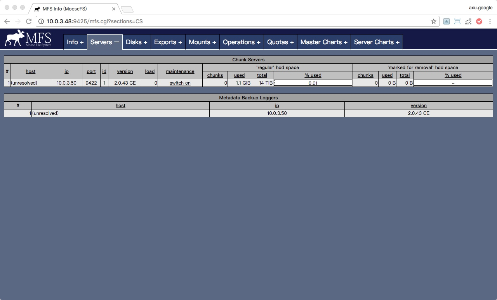

## `MFS`安装文档

### 作者

**@author: `anxu@centrin.com.cn` || `axu.home@gmail.com`**

### 目录

[TOC]

### 部署环境说明

名称|版本|缩写|默认安装软件组
---|---|---|---
`RedHat-Enterprise-Linux`|`6.5`|`RHEL-6.5`|`Minimal`

#### 服务器信息

角色|`IP`地址|主机名（`HOSTNAME`）|操作系统|配置
---|---|---|---|---
`主节点服务器（Master Server）`|`10.0.3.48`|`server348`|`RHEL-6.5`|`10c,64G`
`MetaLogger节点服务器（MetaLogger Server）`|`10.0.3.50`|`server350`|`RHEL-6.5`|`10c,64G`
`页面服务器（CGI Server）`|`10.0.3.48`|`server348`|`RHEL-6.5`|`10c,64G`
`数据节点服务器（Chunk Server）`|`10.0.3.50`|`server350`|`RHEL-6.5`|`10c,64G`
`客户端节点服务器（Client Server）`|`10.0.3.48`|`server348`|`RHEL-6.5`|`10c,64G`
`客户端节点服务器（Client Server）`|`10.0.3.50`|`server350`|`RHEL-6.5`|`10c,64G`
`软件服务器`|`10.0.3.45`|`server345`|`RHEL-6.5`|`10c,64G`

#### 需要额外资源信息

资源|作用|说明
---|---|---
操作系统`ISO`文件|部署软件服务器使用|

### 准备

#### 软件服务器

> 部署`软件服务器`，请详见`软件服务器（Repository Server）部署文档`。

#### 安装必要组件

> **注意：**必要组件一般使用`yum`安装，所以这里依赖`软件服务器（Repository Server）`，若没有搭建请详见`软件服务器（Repository Server）部署文档`。

##### 组件列表

名称|作用
---|---
`openssh-clients`|`传输工具（scp）`
`vim`|`编辑工具`
`git`|`版本管理工具`
`wget`|`下载工具`

##### 安装方法

###### 一般组件安装（使用`yum`）

```bash
# 切换成为`root`用户
> su - 
Password: 

> yum -y install openssh-clients vim git wget
[...]
```

### 安装流程

> **！！特别注意：在安装之前要保证所有使用的服务器`防火墙`和`SELINUX`已经全部关闭！否则会有问题！**

#### 配置`MooseFS`的`软件源（repo）`

> **注意：**需要登陆到`软件服务器`

```bash
# 再次注意下文操作需要等于到`软件服务器`上操作
# 确保是`软件服务器`的`IP`地址
> /sbin/ifconfig 
eth1      Link encap:Ethernet  HWaddr A0:36:9F:8C:28:DD  
          inet addr:10.0.3.45  Bcast:10.0.3.255  Mask:255.255.255.0
          inet6 addr: fe80::a236:9fff:fe8c:28dd/64 Scope:Link
          UP BROADCAST RUNNING MULTICAST  MTU:1500  Metric:1
          RX packets:27549899 errors:0 dropped:0 overruns:0 frame:0
          TX packets:28523157 errors:0 dropped:0 overruns:0 carrier:0
          collisions:0 txqueuelen:1000 
          RX bytes:16519105496 (15.3 GiB)  TX bytes:23818763460 (22.1 GiB)
          Memory:c7400000-c7500000 

lo        Link encap:Local Loopback  
          inet addr:127.0.0.1  Mask:255.0.0.0
          inet6 addr: ::1/128 Scope:Host
          UP LOOPBACK RUNNING  MTU:16436  Metric:1
          RX packets:10444625 errors:0 dropped:0 overruns:0 frame:0
          TX packets:10444625 errors:0 dropped:0 overruns:0 carrier:0
          collisions:0 txqueuelen:0 
          RX bytes:20858165404 (19.4 GiB)  TX bytes:20858165404 (19.4 GiB)

# 切换用户
> su - 

# 切换目录
> cd /Archive
> pwd 
/Archive

# 将`Moosfs.zip`软件包拷贝到`repo`目录下
# 若没有`Moosfs.zip`软件包，请找项目经理或者相关人员
> scp root@10.0.3.45:/Archive/Project_Dadi/02.sources/Moosefs.zip ./
Moosefs.zip                                                              100% 4949KB   4.8MB/s   00:00    

> ll Moosefs.zip
-rw-r--r-- 1 root root 5068159 Feb 15 14:07 Moosefs.zip

# 解压
> unzip Moosefs.zip 
[...]

# 检查
> ll Moosefs
total 8
drwxr-xr-x 3 root root 4096 Feb 15 13:58 2.0.43
-rwxrwxrwx 1 root root  171 Feb 15 13:57 MooseFS.repo

# 拷贝`repo`文件到`/etc/yum.repos.d/`目录中
> cp Moosefs/MooseFS.repo /etc/yum.repos.d/

# 检查
> ll /etc/yum.repos.d/MooseFS.repo 
-rwxr-xr-x 1 root root 171 Feb 15 14:09 /etc/yum.repos.d/MooseFS.repo

# 清除缓存
> yum clean all
Loaded plugins: product-id, subscription-manager
This system is not registered to Red Hat Subscription Management. You can use subscription-manager to register.
Cleaning repos: MooseFS cloudera-manager cloudera-manager-5.6.0 rhel-media
Cleaning up Everything

# 检查是否加载成功
# 在这里的执行结果可以看出`MooseFS`一共加载了`32`个软件
> yum repolist
[...]
repo id                                       repo name                                              status
MooseFS                                       MooseFS                                                   32
[...]

# 再次通过`yum list`验证
> yum list | grep moosefs
This system is not registered to Red Hat Subscription Management. You can use subscription-manager to register.
moosefs-ce-cgi.i686                    2.0.43-1.rhsysv               MooseFS    
moosefs-ce-cgi.x86_64                  2.0.43-1.rhsysv               MooseFS    
moosefs-ce-cgiserv.i686                2.0.43-1.rhsysv               MooseFS    
moosefs-ce-cgiserv.x86_64              2.0.43-1.rhsysv               MooseFS    
moosefs-ce-chunkserver.i686            2.0.43-1.rhsysv               MooseFS    
moosefs-ce-chunkserver.x86_64          2.0.43-1.rhsysv               MooseFS    
moosefs-ce-cli.i686                    2.0.43-1.rhsysv               MooseFS    
moosefs-ce-cli.x86_64                  2.0.43-1.rhsysv               MooseFS    
moosefs-ce-client.i686                 2.0.43-1.rhsysv               MooseFS    
moosefs-ce-client.x86_64               2.0.43-1.rhsysv               MooseFS    
moosefs-ce-debuginfo.i686              2.0.43-1.rhsysv               MooseFS    
moosefs-ce-debuginfo.x86_64            2.0.43-1.rhsysv               MooseFS    
moosefs-ce-master.i686                 2.0.43-1.rhsysv               MooseFS    
moosefs-ce-master.x86_64               2.0.43-1.rhsysv               MooseFS    
moosefs-ce-metalogger.i686             2.0.43-1.rhsysv               MooseFS    
moosefs-ce-metalogger.x86_64           2.0.43-1.rhsysv               MooseFS    
moosefs-pro-cgi.i686                   2.0.43-1.rhsysv               MooseFS    
moosefs-pro-cgi.x86_64                 2.0.43-1.rhsysv               MooseFS    
moosefs-pro-cgiserv.i686               2.0.43-1.rhsysv               MooseFS    
moosefs-pro-cgiserv.x86_64             2.0.43-1.rhsysv               MooseFS    
moosefs-pro-chunkserver.i686           2.0.43-1.rhsysv               MooseFS    
moosefs-pro-chunkserver.x86_64         2.0.43-1.rhsysv               MooseFS    
moosefs-pro-cli.i686                   2.0.43-1.rhsysv               MooseFS    
moosefs-pro-cli.x86_64                 2.0.43-1.rhsysv               MooseFS    
moosefs-pro-client.i686                2.0.43-1.rhsysv               MooseFS    
moosefs-pro-client.x86_64              2.0.43-1.rhsysv               MooseFS    
moosefs-pro-master.i686                2.0.43-1.rhsysv               MooseFS    
moosefs-pro-master.x86_64              2.0.43-1.rhsysv               MooseFS    
moosefs-pro-metalogger.i686            2.0.43-1.rhsysv               MooseFS    
moosefs-pro-metalogger.x86_64          2.0.43-1.rhsysv               MooseFS    
moosefs-pro-supervisor.i686            2.0.43-1.rhsysv               MooseFS    
moosefs-pro-supervisor.x86_64          2.0.43-1.rhsysv               MooseFS  

# 删除`Moosfs.zip`包
> rm -rf /Archive/Moosefs.zip
```

#### 安装主节点服务器（`MFS Master Server`）

> **注意：**需要登陆到`主节点服务器（Master Server）`

```bash
# 再次注意下文操作需要等于到`主节点服务器`上操作
# 确保是`主节点服务器`的`IP`地址
> /sbin/ifconfig 
eth1      Link encap:Ethernet  HWaddr A0:36:9F:8C:2A:EB  
          inet addr:10.0.3.48  Bcast:10.0.3.255  Mask:255.255.255.0
          inet6 addr: fe80::a236:9fff:fe8c:2aeb/64 Scope:Link
          UP BROADCAST RUNNING MULTICAST  MTU:1500  Metric:1
          RX packets:3956674 errors:0 dropped:0 overruns:0 frame:0
          TX packets:746396 errors:0 dropped:0 overruns:0 carrier:0
          collisions:0 txqueuelen:1000 
          RX bytes:5873782272 (5.4 GiB)  TX bytes:571365492 (544.8 MiB)
          Memory:c7400000-c7500000 

lo        Link encap:Local Loopback  
          inet addr:127.0.0.1  Mask:255.0.0.0
          inet6 addr: ::1/128 Scope:Host
          UP LOOPBACK RUNNING  MTU:16436  Metric:1
          RX packets:205 errors:0 dropped:0 overruns:0 frame:0
          TX packets:205 errors:0 dropped:0 overruns:0 carrier:0
          collisions:0 txqueuelen:0 
          RX bytes:211384 (206.4 KiB)  TX bytes:211384 (206.4 KiB)
 
# 切换用户
> su -

# 切换目录
> cd /etc/yum.repos.d/
> pwd
/etc/yum.repos.d

# 下载`MooseFS`的`repo`文件到``
> wget http://archive.centrin.com.cn/Moosefs/MooseFS.repo
--2017-02-15 14:35:54--  http://archive.centrin.com.cn/Moosefs/MooseFS.repo
Resolving archive.centrin.com.cn... 10.0.3.45
Connecting to archive.centrin.com.cn|10.0.3.45|:80... connected.
HTTP request sent, awaiting response... 200 OK
Length: 171 [text/plain]
Saving to: “MooseFS.repo”

100%[=================================================================>] 171         --.-K/s   in 0s      

2017-02-15 14:35:54 (32.2 MB/s) - “MooseFS.repo” saved [171/171]
 
# 检查
> ll /etc/yum.repos.d/MooseFS.repo
-rw-r--r-- 1 root root 171 Feb 15 13:57 /etc/yum.repos.d/MooseFS.repo

# 清楚缓存
> yum clean all
Loaded plugins: product-id, subscription-manager
This system is not registered to Red Hat Subscription Management. You can use subscription-manager to register.
Cleaning repos: MooseFS rhel-media
Cleaning up Everything

# 检查
> yum repolist
[...]
repo id                                  repo name                                                   status
MooseFS                                  MooseFS                                                        32
[...]

# 使用`yum list`查看`repo`        
> yum list | grep moosefs-ce-master
This system is not registered to Red Hat Subscription Management. You can use subscription-manager to register.
moosefs-ce-master.i686                 2.0.43-1.rhsysv               MooseFS    
moosefs-ce-master.x86_64               2.0.43-1.rhsysv               MooseFS 

# 设置`MFS Master Server`主机名到`/etc/hosts`文件中
#!# 特别注意该命令每个服务器只能执行一次，如果该服务器上已经设置过`MFS Master Server`主机就不需要再次执行了。
#!# 可以使用`cat /etc/hosts | grep mfsmaster`命令查看是否有结果来判定是否已经设置过`MFS Master Server`主机名了。
> echo "10.0.3.48 mfsmaster" >> /etc/hosts 

# 检查
#!# 再次保证每次执行`cat /etc/hosts | grep mfsmaster`命令时，只会出现一条结果，若有多条结果请删除或者联系相关人员确认
> cat /etc/hosts | grep mfsmaster
10.0.3.48 mfsmaster

# 安装
> yum -y install moosefs-ce-master
Loaded plugins: product-id, subscription-manager
This system is not registered to Red Hat Subscription Management. You can use subscription-manager to register.
Setting up Install Process
Resolving Dependencies
--> Running transaction check
---> Package moosefs-ce-master.x86_64 0:2.0.43-1.rhsysv will be installed
--> Processing Dependency: libpcap.so.1()(64bit) for package: moosefs-ce-master-2.0.43-1.rhsysv.x86_64
--> Running transaction check
---> Package libpcap.x86_64 14:1.4.0-1.20130826git2dbcaa1.el6 will be installed
--> Finished Dependency Resolution

[...]

Installed:
  moosefs-ce-master.x86_64 0:2.0.43-1.rhsysv                                                               

Dependency Installed:
  libpcap.x86_64 14:1.4.0-1.20130826git2dbcaa1.el6                                                         

Complete!

# 检查 
> mfsmaster -v
version: 2.0.43-1-ce

# 创建`metadata.mfs`
#!# 若不创建`metadata.mfs`文件，则启动`mfsmaster`时会报错。
> cp /var/lib/mfs/metadata.mfs.empty /var/lib/mfs/metadata.mfs
> ll /var/lib/mfs/metadata.mfs
-rwxr--r-- 1 root root 8 Feb 15 15:08 /var/lib/mfs/metadata.mfs

# 启动
#!# 注意若出现启动错误可以去`/var/log/messages`查看日志
> service mfsmaster start
Starting mfsmaster:                                        [  OK  ]
```

#### 安装`MetaLogger`节点服务器（`MFS MetaLogger Server`）

> **注意：**需要登陆到`MetaLogger节点服务器（MetaLogger Server）`

```bash
# 再次注意下文操作需要等于到`MetaLogger节点服务器`上操作
# 确保是`MetaLogger节点服务器`的`IP`地址
> /sbin/ifconfig 
eth1      Link encap:Ethernet  HWaddr A0:36:9F:8C:2C:43  
          inet addr:10.0.3.50  Bcast:10.0.3.255  Mask:255.255.255.0
          inet6 addr: fe80::a236:9fff:fe8c:2c43/64 Scope:Link
          UP BROADCAST RUNNING MULTICAST  MTU:1500  Metric:1
          RX packets:1354871 errors:0 dropped:0 overruns:0 frame:0
          TX packets:161185 errors:0 dropped:0 overruns:0 carrier:0
          collisions:0 txqueuelen:1000 
          RX bytes:1956146002 (1.8 GiB)  TX bytes:13255665 (12.6 MiB)
          Memory:c7400000-c7500000 

lo        Link encap:Local Loopback  
          inet addr:127.0.0.1  Mask:255.0.0.0
          inet6 addr: ::1/128 Scope:Host
          UP LOOPBACK RUNNING  MTU:16436  Metric:1
          RX packets:4265 errors:0 dropped:0 overruns:0 frame:0
          TX packets:4265 errors:0 dropped:0 overruns:0 carrier:0
          collisions:0 txqueuelen:0 
          RX bytes:808586 (789.6 KiB)  TX bytes:808586 (789.6 KiB)
 
# 切换用户
> su -

# 切换目录
> cd /etc/yum.repos.d/
> pwd
/etc/yum.repos.d

# 下载`MooseFS`的`repo`文件到``
> wget http://archive.centrin.com.cn/Moosefs/MooseFS.repo
--2017-02-15 14:35:54--  http://archive.centrin.com.cn/Moosefs/MooseFS.repo
Resolving archive.centrin.com.cn... 10.0.3.45
Connecting to archive.centrin.com.cn|10.0.3.45|:80... connected.
HTTP request sent, awaiting response... 200 OK
Length: 171 [text/plain]
Saving to: “MooseFS.repo”

100%[=================================================================>] 171         --.-K/s   in 0s      

2017-02-15 14:35:54 (32.2 MB/s) - “MooseFS.repo” saved [171/171]
 
# 检查
> ll /etc/yum.repos.d/MooseFS.repo
-rw-r--r-- 1 root root 171 Feb 15 13:57 /etc/yum.repos.d/MooseFS.repo

# 清楚缓存
> yum clean all
Loaded plugins: product-id, subscription-manager
This system is not registered to Red Hat Subscription Management. You can use subscription-manager to register.
Cleaning repos: MooseFS rhel-media
Cleaning up Everything

# 检查
> yum repolist
[...]
repo id                                  repo name                                                   status
MooseFS                                  MooseFS                                                        32
[...]

# 使用`yum list`查看`repo`        
> yum list | grep moosefs-ce-metalogger
This system is not registered to Red Hat Subscription Management. You can use subscription-manager to register.
moosefs-ce-metalogger.i686             2.0.43-1.rhsysv               MooseFS    
moosefs-ce-metalogger.x86_64           2.0.43-1.rhsysv               MooseFS  

# 设置`MFS Master Server`主机名到`/etc/hosts`文件中
#!# 特别注意该命令每个服务器只能执行一次，如果该服务器上已经设置过`MFS Master Server`主机就不需要再次执行了。
#!# 可以使用`cat /etc/hosts | grep mfsmaster`命令查看是否有结果来判定是否已经设置过`MFS Master Server`主机名了。
> echo "10.0.3.48 mfsmaster" >> /etc/hosts 

# 检查
#!# 再次保证每次执行`cat /etc/hosts | grep mfsmaster`命令时，只会出现一条结果，若有多条结果请删除或者联系相关人员确认
> cat /etc/hosts | grep mfsmaster
10.0.3.48 mfsmaster

# 安装
> yum -y install moosefs-ce-metalogger
Loaded plugins: product-id, subscription-manager
This system is not registered to Red Hat Subscription Management. You can use subscription-manager to register.
Setting up Install Process
Resolving Dependencies
--> Running transaction check
---> Package moosefs-ce-metalogger.x86_64 0:2.0.43-1.rhsysv will be installed
--> Processing Dependency: libpcap.so.1()(64bit) for package: moosefs-ce-metalogger-2.0.43-1.rhsysv.x86_64
--> Running transaction check
---> Package libpcap.x86_64 14:1.4.0-1.20130826git2dbcaa1.el6 will be installed
--> Finished Dependency Resolution

[...]

Installed:
  moosefs-ce-metalogger.x86_64 0:2.0.43-1.rhsysv                                                           

Dependency Installed:
  libpcap.x86_64 14:1.4.0-1.20130826git2dbcaa1.el6                                                         

Complete!

# 检查 
> mfsmetalogger -v
version: 2.0.43-1-ce

# 启动
#!# 注意若出现启动错误可以去`/var/log/messages`查看日志
> service mfsmetalogger start
Starting mfsmetalogger:                                    [  OK  ]
```

#### 安装页面服务器（`MFS CGI Server`）

> **注意：**需要登陆到`页面服务器（CGI Server）`

```bash
# 再次注意下文操作需要等于到`页面服务器`上操作
# 确保是`页面服务器`的`IP`地址
> /sbin/ifconfig 
eth1      Link encap:Ethernet  HWaddr A0:36:9F:8C:2A:EB  
          inet addr:10.0.3.48  Bcast:10.0.3.255  Mask:255.255.255.0
          inet6 addr: fe80::a236:9fff:fe8c:2aeb/64 Scope:Link
          UP BROADCAST RUNNING MULTICAST  MTU:1500  Metric:1
          RX packets:3962560 errors:0 dropped:0 overruns:0 frame:0
          TX packets:748712 errors:0 dropped:0 overruns:0 carrier:0
          collisions:0 txqueuelen:1000 
          RX bytes:5878352901 (5.4 GiB)  TX bytes:571655414 (545.1 MiB)
          Memory:c7400000-c7500000 

lo        Link encap:Local Loopback  
          inet addr:127.0.0.1  Mask:255.0.0.0
          inet6 addr: ::1/128 Scope:Host
          UP LOOPBACK RUNNING  MTU:16436  Metric:1
          RX packets:205 errors:0 dropped:0 overruns:0 frame:0
          TX packets:205 errors:0 dropped:0 overruns:0 carrier:0
          collisions:0 txqueuelen:0 
          RX bytes:211384 (206.4 KiB)  TX bytes:211384 (206.4 KiB)
 
# 切换用户
> su -

# 切换目录
> cd /etc/yum.repos.d/
> pwd
/etc/yum.repos.d

# 下载`MooseFS`的`repo`文件到``
> wget http://archive.centrin.com.cn/Moosefs/MooseFS.repo
--2017-02-15 14:35:54--  http://archive.centrin.com.cn/Moosefs/MooseFS.repo
Resolving archive.centrin.com.cn... 10.0.3.45
Connecting to archive.centrin.com.cn|10.0.3.45|:80... connected.
HTTP request sent, awaiting response... 200 OK
Length: 171 [text/plain]
Saving to: “MooseFS.repo”

100%[=================================================================>] 171         --.-K/s   in 0s      

2017-02-15 14:35:54 (32.2 MB/s) - “MooseFS.repo” saved [171/171]
 
# 检查
> ll /etc/yum.repos.d/MooseFS.repo
-rw-r--r-- 1 root root 171 Feb 15 13:57 /etc/yum.repos.d/MooseFS.repo

# 清楚缓存
> yum clean all
Loaded plugins: product-id, subscription-manager
This system is not registered to Red Hat Subscription Management. You can use subscription-manager to register.
Cleaning repos: MooseFS rhel-media
Cleaning up Everything

# 检查
> yum repolist
[...]
repo id                                  repo name                                                   status
MooseFS                                  MooseFS                                                        32
[...]

# 使用`yum list`查看`repo`        
> yum list | grep moosefs-ce-cgiserv
This system is not registered to Red Hat Subscription Management. You can use subscription-manager to register.
moosefs-ce-cgiserv.i686                2.0.43-1.rhsysv               MooseFS    
moosefs-ce-cgiserv.x86_64              2.0.43-1.rhsysv               MooseFS   

# 设置`MFS Master Server`主机名到`/etc/hosts`文件中
#!# 特别注意该命令每个服务器只能执行一次，如果该服务器上已经设置过`MFS Master Server`主机就不需要再次执行了。
#!# 可以使用`cat /etc/hosts | grep mfsmaster`命令查看是否有结果来判定是否已经设置过`MFS Master Server`主机名了。
> echo "10.0.3.48 mfsmaster" >> /etc/hosts 

# 检查
#!# 再次保证每次执行`cat /etc/hosts | grep mfsmaster`命令时，只会出现一条结果，若有多条结果请删除或者联系相关人员确认
> cat /etc/hosts | grep mfsmaster
10.0.3.48 mfsmaster

# 安装
> yum -y install moosefs-ce-cgiserv
Loaded plugins: product-id, subscription-manager
This system is not registered to Red Hat Subscription Management. You can use subscription-manager to register.
Setting up Install Process
Resolving Dependencies
--> Running transaction check
---> Package moosefs-ce-cgiserv.x86_64 0:2.0.43-1.rhsysv will be installed
--> Processing Dependency: moosefs-ce-cgi for package: moosefs-ce-cgiserv-2.0.43-1.rhsysv.x86_64
--> Running transaction check
---> Package moosefs-ce-cgi.x86_64 0:2.0.43-1.rhsysv will be installed
--> Finished Dependency Resolution

[...]

Installed:
  moosefs-ce-cgiserv.x86_64 0:2.0.43-1.rhsysv                                                              

Dependency Installed:
  moosefs-ce-cgi.x86_64 0:2.0.43-1.rhsysv                                                                  

Complete!

# 启动
#!# 注意若出现启动错误可以去`/var/log/messages`查看日志
> service mfscgiserv start
Starting mfscgiserv:                                       [  OK  ]
```

> 启动成功后，可以通过`WEB`页面查看`MFS`情况。
> 地址为: `http://10.0.3.48:9425/`（其中的`IP`地址应为`页面服务器`的`IP`地址。）


#### 安装数据节点服务器（`MFS Chunk Server`）

> **注意：**需要登陆到`数据节点服务器（Chunk Server）`

```bash
# 再次注意下文操作需要等于到`数据节点服务器`上操作
# 确保是`数据节点服务器`的`IP`地址
> /sbin/ifconfig 
eth1      Link encap:Ethernet  HWaddr A0:36:9F:8C:2C:43  
          inet addr:10.0.3.50  Bcast:10.0.3.255  Mask:255.255.255.0
          inet6 addr: fe80::a236:9fff:fe8c:2c43/64 Scope:Link
          UP BROADCAST RUNNING MULTICAST  MTU:1500  Metric:1
          RX packets:1358455 errors:0 dropped:0 overruns:0 frame:0
          TX packets:162251 errors:0 dropped:0 overruns:0 carrier:0
          collisions:0 txqueuelen:1000 
          RX bytes:1960316927 (1.8 GiB)  TX bytes:13366379 (12.7 MiB)
          Memory:c7400000-c7500000 

lo        Link encap:Local Loopback  
          inet addr:127.0.0.1  Mask:255.0.0.0
          inet6 addr: ::1/128 Scope:Host
          UP LOOPBACK RUNNING  MTU:16436  Metric:1
          RX packets:4265 errors:0 dropped:0 overruns:0 frame:0
          TX packets:4265 errors:0 dropped:0 overruns:0 carrier:0
          collisions:0 txqueuelen:0 
          RX bytes:808586 (789.6 KiB)  TX bytes:808586 (789.6 KiB)
 
# 切换用户
> su -

# 切换目录
> cd /etc/yum.repos.d/
> pwd
/etc/yum.repos.d

# 下载`MooseFS`的`repo`文件到``
> wget http://archive.centrin.com.cn/Moosefs/MooseFS.repo
--2017-02-15 14:35:54--  http://archive.centrin.com.cn/Moosefs/MooseFS.repo
Resolving archive.centrin.com.cn... 10.0.3.45
Connecting to archive.centrin.com.cn|10.0.3.45|:80... connected.
HTTP request sent, awaiting response... 200 OK
Length: 171 [text/plain]
Saving to: “MooseFS.repo”

100%[=================================================================>] 171         --.-K/s   in 0s      

2017-02-15 14:35:54 (32.2 MB/s) - “MooseFS.repo” saved [171/171]
 
# 检查
> ll /etc/yum.repos.d/MooseFS.repo
-rw-r--r-- 1 root root 171 Feb 15 13:57 /etc/yum.repos.d/MooseFS.repo

# 清楚缓存
> yum clean all
Loaded plugins: product-id, subscription-manager
This system is not registered to Red Hat Subscription Management. You can use subscription-manager to register.
Cleaning repos: MooseFS rhel-media
Cleaning up Everything

# 检查
> yum repolist
[...]
repo id                                  repo name                                                   status
MooseFS                                  MooseFS                                                        32
[...]

# 使用`yum list`查看`repo`        
> yum list | grep moosefs-ce-chunkserver
This system is not registered to Red Hat Subscription Management. You can use subscription-manager to register.
moosefs-ce-chunkserver.i686            2.0.43-1.rhsysv               MooseFS    
moosefs-ce-chunkserver.x86_64          2.0.43-1.rhsysv               MooseFS  

# 设置`MFS Master Server`主机名到`/etc/hosts`文件中
#!# 特别注意该命令每个服务器只能执行一次，如果该服务器上已经设置过`MFS Master Server`主机就不需要再次执行了。
#!# 可以使用`cat /etc/hosts | grep mfsmaster`命令查看是否有结果来判定是否已经设置过`MFS Master Server`主机名了。
> echo "10.0.3.48 mfsmaster" >> /etc/hosts 

# 检查
#!# 再次保证每次执行`cat /etc/hosts | grep mfsmaster`命令时，只会出现一条结果，若有多条结果请删除或者联系相关人员确认
> cat /etc/hosts | grep mfsmaster
10.0.3.48 mfsmaster

# 安装
> yum -y install moosefs-ce-chunkserver
Loaded plugins: product-id, subscription-manager
This system is not registered to Red Hat Subscription Management. You can use subscription-manager to register.
Setting up Install Process
Resolving Dependencies
--> Running transaction check
---> Package moosefs-ce-chunkserver.x86_64 0:2.0.43-1.rhsysv will be installed
--> Finished Dependency Resolution

[...]

Installed:
  moosefs-ce-chunkserver.x86_64 0:2.0.43-1.rhsysv                                                          

Complete!

# 检查 
> mfschunkserver -v
version: 2.0.43-1-ce

# 创建数据存储目录
> mkdir -p /mnt/mfs_chunk_data_dir

# 保证是空目录
> ll /mnt/mfs_chunk_data_dir
total 0

# 设置权限
> chmod -R 777 /mnt/mfs_chunk_data_dir/
> ll -d /mnt/mfs_chunk_data_dir/
drwxrwxrwx 2 root root 4096 Feb 15 15:34 /mnt/mfs_chunk_data_dir/

# 设置使用者
> chown -R mfs:mfs /mnt/mfs_chunk_data_dir/
> ll -d /mnt/mfs_chunk_data_dir/
drwxrwxrwx 2 mfs mfs 4096 Feb 15 15:34 /mnt/mfs_chunk_data_dir/

# 将数据存储目录，设置到`mfs`配置文件中
#!# 特别注意该命令每个服务器只能执行一次
> echo "/mnt/mfs_chunk_data_dir" >> /etc/mfs/mfshdd.cfg

# 检查
> cat /etc/mfs/mfshdd.cfg
```

```bash
# This file keeps definitions of mounting points (paths) of hard drives to use with chunk server.
# A path may begin with extra '*', which means this hard drive is 'marked for removal' and all data will be replicated to other hard drives (usually on other chunkservers).
# It is possible to specify optional space limit (after each mounting point), there are two ways of doing that:
#  - set space to be left unused on a hard drive (this overrides the default setting from mfschunkserver.cfg)
#  - limit space to be used on a hard drive
# Space limit definition: [0-9]*(.[0-9]*)?([kMGTPE]|[KMGTPE]i)?B?, add minus in front for the first option.
#
# Examples:
#
# use hard drive '/mnt/hd1' with default options:
#/mnt/hd1
#
# use hard drive '/mnt/hd2', but replicate all data from it:
#*/mnt/hd2
#
# use hard drive '/mnt/hd3', but try to leave 5GiB on it:
#/mnt/hd3 -5GiB
#
# use hard drive '/mnt/hd4', but use only 1.5TiB on it:
#/mnt/hd4 1.5TiB
/mnt/mfs_chunk_data_dir
```

```bash
# 启动
#!# 注意若出现启动错误可以去`/var/log/messages`查看日志
> service mfschunkserver start
Starting mfschunkserver:                                   [  OK  ]
```

> 启动后可以再次登录`WEB`页面查看`MFS`情况。
> 地址为: `http://10.0.3.48:9425/mfs.cgi?sections=CS`（其中的`IP`地址应为`页面服务器`的`IP`地址。）
> **注意：**页面中`host`部分为`(unresolved)`是因为，`页面服务器`的`/etc/hosts`文件没有配置`数据节点服务器`的`Hostname`。




#### 安装客户端节点服务器（`MFS Client Server`）

> **注意：**需要登陆到`客户端节点服务器（Client Server）`

```bash
# 再次注意下文操作需要等于到`客户端节点服务器`上操作
# 确保是`客户端节点服务器`的`IP`地址
> /sbin/ifconfig 
eth1      Link encap:Ethernet  HWaddr A0:36:9F:8C:2C:43  
          inet addr:10.0.3.50  Bcast:10.0.3.255  Mask:255.255.255.0
          inet6 addr: fe80::a236:9fff:fe8c:2c43/64 Scope:Link
          UP BROADCAST RUNNING MULTICAST  MTU:1500  Metric:1
          RX packets:1361827 errors:0 dropped:0 overruns:0 frame:0
          TX packets:165015 errors:0 dropped:0 overruns:0 carrier:0
          collisions:0 txqueuelen:1000 
          RX bytes:1960698030 (1.8 GiB)  TX bytes:13604105 (12.9 MiB)
          Memory:c7400000-c7500000 

lo        Link encap:Local Loopback  
          inet addr:127.0.0.1  Mask:255.0.0.0
          inet6 addr: ::1/128 Scope:Host
          UP LOOPBACK RUNNING  MTU:16436  Metric:1
          RX packets:4265 errors:0 dropped:0 overruns:0 frame:0
          TX packets:4265 errors:0 dropped:0 overruns:0 carrier:0
          collisions:0 txqueuelen:0 
          RX bytes:808586 (789.6 KiB)  TX bytes:808586 (789.6 KiB)
 
# 切换用户
> su -

# 切换目录
> cd /etc/yum.repos.d/
> pwd
/etc/yum.repos.d

# 下载`MooseFS`的`repo`文件到``
> wget http://archive.centrin.com.cn/Moosefs/MooseFS.repo
--2017-02-15 14:35:54--  http://archive.centrin.com.cn/Moosefs/MooseFS.repo
Resolving archive.centrin.com.cn... 10.0.3.45
Connecting to archive.centrin.com.cn|10.0.3.45|:80... connected.
HTTP request sent, awaiting response... 200 OK
Length: 171 [text/plain]
Saving to: “MooseFS.repo”

100%[=================================================================>] 171         --.-K/s   in 0s      

2017-02-15 14:35:54 (32.2 MB/s) - “MooseFS.repo” saved [171/171]
 
# 检查
> ll /etc/yum.repos.d/MooseFS.repo
-rw-r--r-- 1 root root 171 Feb 15 13:57 /etc/yum.repos.d/MooseFS.repo

# 清楚缓存
> yum clean all
Loaded plugins: product-id, subscription-manager
This system is not registered to Red Hat Subscription Management. You can use subscription-manager to register.
Cleaning repos: MooseFS rhel-media
Cleaning up Everything

# 检查
> yum repolist
[...]
repo id                                  repo name                                                   status
MooseFS                                  MooseFS                                                        32
[...]

# 使用`yum list`查看`repo`        
> yum list | grep moosefs-ce-client 
This system is not registered to Red Hat Subscription Management. You can use subscription-manager to register.
moosefs-ce-client.i686                 2.0.43-1.rhsysv               MooseFS    
moosefs-ce-client.x86_64               2.0.43-1.rhsysv               MooseFS      

# 设置`MFS Master Server`主机名到`/etc/hosts`文件中
#!# 特别注意该命令每个服务器只能执行一次，如果该服务器上已经设置过`MFS Master Server`主机就不需要再次执行了。
#!# 可以使用`cat /etc/hosts | grep mfsmaster`命令查看是否有结果来判定是否已经设置过`MFS Master Server`主机名了。
> echo "10.0.3.48 mfsmaster" >> /etc/hosts 

# 检查
#!# 再次保证每次执行`cat /etc/hosts | grep mfsmaster`命令时，只会出现一条结果，若有多条结果请删除或者联系相关人员确认
> cat /etc/hosts | grep mfsmaster
10.0.3.48 mfsmaster

# 安装
#!# 注意在这里也同时将`fuse`一同安装
> yum -y install moosefs-ce-client fuse
Loaded plugins: product-id, subscription-manager
This system is not registered to Red Hat Subscription Management. You can use subscription-manager to register.
Setting up Install Process
Resolving Dependencies
--> Running transaction check
---> Package fuse.x86_64 0:2.8.3-4.el6 will be installed
---> Package moosefs-ce-client.x86_64 0:2.0.43-1.rhsysv will be installed
--> Processing Dependency: libfuse.so.2(FUSE_2.6)(64bit) for package: moosefs-ce-client-2.0.43-1.rhsysv.x86_64
--> Processing Dependency: libfuse.so.2(FUSE_2.7)(64bit) for package: moosefs-ce-client-2.0.43-1.rhsysv.x86_64
--> Processing Dependency: libfuse.so.2(FUSE_2.4)(64bit) for package: moosefs-ce-client-2.0.43-1.rhsysv.x86_64
--> Processing Dependency: libfuse.so.2(FUSE_2.8)(64bit) for package: moosefs-ce-client-2.0.43-1.rhsysv.x86_64
--> Processing Dependency: libfuse.so.2(FUSE_2.5)(64bit) for package: moosefs-ce-client-2.0.43-1.rhsysv.x86_64
--> Processing Dependency: libfuse.so.2()(64bit) for package: moosefs-ce-client-2.0.43-1.rhsysv.x86_64
--> Running transaction check
---> Package fuse-libs.x86_64 0:2.8.3-4.el6 will be installed
--> Finished Dependency Resolution

[...]

Installed:
  fuse.x86_64 0:2.8.3-4.el6                   moosefs-ce-client.x86_64 0:2.0.43-1.rhsysv                  

Dependency Installed:
  fuse-libs.x86_64 0:2.8.3-4.el6                                                                           

Complete!

# 检查 
#!# 注意这里是大写的`V`
> mfsmount -V
MFS version 2.0.43-1-ce
FUSE library version: 2.8.3
fusermount version: 2.8.3

# 创建挂载目录
> mkdir -p /mnt/mfs
> ll -d /mnt/mfs
drwxr-xr-x 2 root root 4096 Feb 15 16:13 /mnt/mfs

# 赋权
> chmod -R 777 /mnt/mfs
> ll -d /mnt/mfs
drwxrwxrwx 2 root root 4096 Feb 15 16:13 /mnt/mfs

# 修改用户
> chown -R ccicall:ccicall /mnt/mfs
drwxrwxrwx 2 ccicall ccicall 4096 Feb 15 16:13 /mnt/mfs

# 挂载
# 参考官网文档：`http://moosefs.org/reference-guide.html`（搜`fstab`）
#!# 特别注意该命令每个服务器只能执行一次
> echo "mfsmount /mnt/mfs fuse mfsmaster=mfsmaster 0 0" >> /etc/fstab
> cat /etc/fstab | grep mfs
mfsmount /mnt/mfs fuse mfsmaster=mfsmaster 0 0

# 执行
> mount -a

# 检查
> df -kh
Filesystem      Size  Used Avail Use% Mounted on
[...]
mfsmaster:9421   15T     0   15T   0% /mnt/mfs

# 测试
> echo "12345" > /mnt/mfs/touch_test_file
> ll /mnt/mfs/touch_test_file
-rw-r--r-- 1 root root 6 Feb 15  2017 /mnt/mfs/touch_test_file

> md5sum /mnt/mfs/touch_test_file
d577273ff885c3f84dadb8578bb41399  /mnt/mfs/touch_test_file
```

> 启动后可以再次登录`WEB`页面查看`MFS`情况。
> 地址为: `http://10.0.3.48:9425/mfs.cgi?sections=MS`（其中的`IP`地址应为`页面服务器`的`IP`地址。）
> **注意：**页面中`host`部分为`(unresolved)`是因为，`页面服务器`的`/etc/hosts`文件没有配置`数据节点服务器`的`Hostname`。


> 可以根据上文将另外一台`客户端服务器`安装完成


```bash
# 可以在另外一台`客户端服务器`上，执行`md5sum`命令，查看`md5`是否和之前一致。
> /sbin/ifconfig 
eth1      Link encap:Ethernet  HWaddr A0:36:9F:8C:2A:EB  
          inet addr:10.0.3.48  Bcast:10.0.3.255  Mask:255.255.255.0
          inet6 addr: fe80::a236:9fff:fe8c:2aeb/64 Scope:Link
          UP BROADCAST RUNNING MULTICAST  MTU:1500  Metric:1
          RX packets:3979341 errors:0 dropped:0 overruns:0 frame:0
          TX packets:765675 errors:0 dropped:0 overruns:0 carrier:0
          collisions:0 txqueuelen:1000 
          RX bytes:5880047467 (5.4 GiB)  TX bytes:576185324 (549.4 MiB)
          Memory:c7400000-c7500000 

lo        Link encap:Local Loopback  
          inet addr:127.0.0.1  Mask:255.0.0.0
          inet6 addr: ::1/128 Scope:Host
          UP LOOPBACK RUNNING  MTU:16436  Metric:1
          RX packets:5425 errors:0 dropped:0 overruns:0 frame:0
          TX packets:5425 errors:0 dropped:0 overruns:0 carrier:0
          collisions:0 txqueuelen:0 
          RX bytes:1662389 (1.5 MiB)  TX bytes:1662389 (1.5 MiB)

# 检查          
> md5sum /mnt/mfs/touch_test_file 
d577273ff885c3f84dadb8578bb41399  /mnt/mfs/touch_test_file
```

`-EOF-`


