## `ZABBIX`安装文档

### 作者

**@author: `anxu@centrin.com.cn` || `axu.home@gmail.com`**

### 目录

[TOC]

### 部署环境说明

名称|版本|缩写|默认安装软件组
---|---|---|---
`RedHat-Enterprise-Linux`|`6.5`|`RHEL-6.5`|`Minimal`

#### 服务器信息

角色|`IP`地址|主机名（`HOSTNAME`）|操作系统|配置
---|---|---|---|---
`主节点服务器（Zabbix Master Server）`|`10.0.3.48`|`server348`|`RHEL-6.5`|`10c,64G`
`代理节点服务器（Zabbix Agent Server）`|`10.0.3.50`|`server350`|`RHEL-6.5`|`10c,64G`
`代理节点服务器（Zabbix Agent Server）`|`10.0.3.48`|`server348`|`RHEL-6.5`|`10c,64G`
`数据库服务器（MYSQL）`|`10.0.3.45`|`server345`|`RHEL-6.5`|`10c,64G`

#### 需要额外资源信息

资源|作用|说明
---|---|---
操作系统`ISO`文件|部署软件服务器使用|

### 准备

#### 软件服务器

> 部署`软件服务器`，请详见`软件服务器（Repository Server）部署文档`。

#### 安装必要组件

> **注意：**必要组件一般使用`yum`安装，所以这里依赖`软件服务器（Repository Server）`，若没有搭建请详见`软件服务器（Repository Server）部署文档`。

##### 组件列表

名称|作用
---|---
`openssh-clients`|`传输工具（scp）`
`vim`|`编辑工具`
`git`|`版本管理工具`
`wget`|`下载工具`

##### 安装方法

###### 一般组件安装（使用`yum`）

```bash
# 切换成为`root`用户
> su - 
Password: 

> yum -y install openssh-clients vim git wget
[...]
```

### 安装流程

> **！！特别注意：在安装之前要保证所有使用的服务器`防火墙`和`SELINUX`已经全部关闭！否则会有问题！**

#### 将`Zabbix`软件包添加到软件服务器（`Repository Server`）

> **注意：下面步骤是在软件服务器（`Repository Server`）上执行**

```bash
# 再次确认是否已经登陆到软件服务器（`Repository Server`）上
> su - 
> /sbin/ifconfig 
[...]
          inet addr:10.0.3.45  Bcast:10.0.3.255  Mask:255.255.255.0
[...]

# 默认已经将`Zabbix.zip`包拷贝到软件服务器的`/Archive/`下
# 若没有`Zabbix.zip`请联系相关人员获取
> cd /Archive/
> ll Zabbix.zip 
-rw-r--r-- 1 root root 58381359 Feb 24 10:41 Zabbix.zip

# 解压
> unzip Zabbix.zip
[...]

# 检查
> ll Zabbix
total 16
drwxr-xr-x 3 root root 4096 Feb 23 10:15 2.4
drwxr-xr-x 3 root root 4096 Feb 24 11:01 non-supported
-rw-r--r-- 1 root root 1332 Feb 23 10:17 RPM-GPG-KEY-ZABBIX
-rw-r--r-- 1 root root  448 Feb 24 11:00 zabbix.repo

# 拷贝`zabbix.repo`至`/etc/yum.repo.d/`目录中
> cp Zabbix/zabbix.repo /etc/yum.repos.d/
> ll /etc/yum.repos.d/zabbix.repo 
-rw-r--r-- 1 root root 448 Feb 24 11:00 /etc/yum.repos.d/zabbix.repo

# 检查
> yum clean all
[...]

#!# 注意`Zabbix`最后已经导入`97`个软件包
#!# 注意`zabbix-non-supported`最后已经导入`15`个软件包
> yum repolist
[...]
Zabbix                                                          Zabbix Official Repository - x86_64                                             97
[...]
zabbix-non-supported                                     Zabbix Official Repository non-supported - x86_64                                      15
[...]

# 删除`Zabbix.zip`
> rm -rf /Archive/Zabbix.zip
> ll /Archive/
[...]
drwxr-xr-x  4 root    root    4096 Feb 24 11:00 Zabbix
```

#### 升级`PHP`版本

> 因为`RHEL-6.5`默认带的`PHP-5.3.3`没有`php-bcmath`和`php-mbstring`扩展，所以需要升级`PHP`到`5.6`版本。

##### 将升级需要的包添加到软件服务器（`Repository Server`）

> **注意：下面步骤是在软件服务器（`Repository Server`）上执行**

```bash
# 再次确认是否已经登陆到软件服务器（`Repository Server`）上
> su - 
> /sbin/ifconfig 
[...]
          inet addr:10.0.3.45  Bcast:10.0.3.255  Mask:255.255.255.0
[...]
          
# 默认已经将`Webtatic-PHP.zip`包拷贝到软件服务器的`/Archive/`下
# 若没有`Webtatic-PHP.zip`请联系相关人员获取
> cd /Archive/
> ll Webtatic-PHP.zip
-rw-r--r-- 1 root root 358585636 Feb 24 09:43 Webtatic-PHP.zip

# 解压
> unzip Webtatic-PHP.zip
[...]

# 检查
> ll Webtatic-PHP
total 12
-rw-r--r-- 1 root root 2105 Feb 24 09:28 RPM-GPG-KEY-webtatic-el6
-rw-r--r-- 1 root root  218 Feb 24 09:36 webtatic-php.repo
drwxr-xr-x 3 root root 4096 Feb 23 15:01 yum

# 将`repo`文件，拷贝至`/etc/yum.repos.d/`目录
> cp Webtatic-PHP/webtatic-php.repo /etc/yum.repos.d/
> ll /etc/yum.repos.d/webtatic-php.repo 
-rw-r--r-- 1 root root 218 Feb 24 09:48 /etc/yum.repos.d/webtatic-php.repo

# 检查
> yum clean all
Loaded plugins: product-id, subscription-manager
This system is not registered to Red Hat Subscription Management. You can use subscription-manager to register.
Cleaning repos: MooseFS Zabbix cloudera-manager cloudera-manager-5.6.0 rhel-media webtatic
Cleaning up Everything

#!# 注意最后已经导入`188`个软件包
> yum repolist
[...]
webtatic                                                        Webtatic Repository EL6 - x86_64                                               188
[...]

# 删除`Webtatic-PHP.zip`
> rm -rf /Archive/Webtatic-PHP.zip
> ll /Archive/
drwxr-xr-x  4 ccicall ccicall 4096 Nov 25 15:11 Cloudera-Enterprise
drwxr-xr-x  3 root    root    4096 Feb 15 13:58 Moosefs
drwxr-xr-x  4 ccicall ccicall 4096 Feb  8 13:42 Project_Dadi
drwxr-xr-x. 4 ccicall ccicall 4096 Feb  8 11:00 RedHat-Enterprise-Linux
drwxr-xr-x. 2 ccicall ccicall 4096 Feb 13 14:00 Resources
drwxr-xr-x  2 ccicall ccicall 4096 Feb 13 14:41 Scripts
drwxr-xr-x  3 root    root    4096 Feb 24 09:36 Webtatic-PHP
drwxr-xr-x  3 root    root    4096 Feb 23 10:21 Zabbix 
```

##### 主节点服务器（`Zabbix Master Server`）`PHP`升级

> **注意：下面步骤是在主节点服务器（`Zabbix Master Server`）上执行**

```bash
# 再次确认是否已经登陆到主节点服务器（`Zabbix Master Server`）上
> su -
> /sbin/ifconfig
[...] 
          inet addr:10.0.3.48  Bcast:10.0.3.255  Mask:255.255.255.0
[...]

# 进入`/etc/yum.repos.d/`目录
> cd /etc/yum.repos.d/
> pwd
/etc/yum.repos.d

# 下载`PHP`升级的`repo`文件
> wget http://archive.centrin.com.cn/Webtatic-PHP/webtatic-php.repo
--2017-02-24 10:02:55--  http://archive.centrin.com.cn/Webtatic-PHP/webtatic-php.repo
Resolving archive.centrin.com.cn... 10.0.3.45
Connecting to archive.centrin.com.cn|10.0.3.45|:80... connected.
HTTP request sent, awaiting response... 200 OK
Length: 218 [text/plain]
Saving to: “webtatic-php.repo”

100%[=========================================================================================================>] 218         --.-K/s   in 0s      

2017-02-24 10:02:55 (33.6 MB/s) - “webtatic-php.repo” saved [218/218]

# 检查
> ll webtatic-php.repo 
-rw-r--r-- 1 root root 218 Feb 24 09:36 webtatic-php.repo

# 清除`yum`缓存
> yum clean all
Loaded plugins: product-id, subscription-manager
This system is not registered to Red Hat Subscription Management. You can use subscription-manager to register.
Cleaning repos: MooseFS Zabbix rhel-media webtatic
Cleaning up Everything

# 检查
#!# 注意最后已经导入`188`个软件包
> yum repolist
[...]
webtatic                                                  Webtatic Repository EL6 - x86_64                                                     188
[...]

# 检查
> yum list | grep php56
This system is not registered to Red Hat Subscription Management. You can use subscription-manager to register.
php56w.x86_64                          5.6.30-1.w6                   webtatic   
php56w-bcmath.x86_64                   5.6.30-1.w6                   webtatic   
php56w-cli.x86_64                      5.6.30-1.w6                   webtatic   
php56w-common.x86_64                   5.6.30-1.w6                   webtatic   
php56w-dba.x86_64                      5.6.30-1.w6                   webtatic   
php56w-devel.x86_64                    5.6.30-1.w6                   webtatic   
php56w-embedded.x86_64                 5.6.30-1.w6                   webtatic   
php56w-enchant.x86_64                  5.6.30-1.w6                   webtatic   
php56w-fpm.x86_64                      5.6.30-1.w6                   webtatic   
php56w-gd.x86_64                       5.6.30-1.w6                   webtatic   
php56w-imap.x86_64                     5.6.30-1.w6                   webtatic   
php56w-interbase.x86_64                5.6.30-1.w6                   webtatic   
php56w-intl.x86_64                     5.6.30-1.w6                   webtatic   
php56w-ldap.x86_64                     5.6.30-1.w6                   webtatic   
php56w-mbstring.x86_64                 5.6.30-1.w6                   webtatic   
php56w-mcrypt.x86_64                   5.6.30-1.w6                   webtatic   
php56w-mssql.x86_64                    5.6.30-1.w6                   webtatic   
php56w-mysql.x86_64                    5.6.30-1.w6                   webtatic   
php56w-mysqlnd.x86_64                  5.6.30-1.w6                   webtatic   
php56w-odbc.x86_64                     5.6.30-1.w6                   webtatic   
php56w-opcache.x86_64                  5.6.30-1.w6                   webtatic   
php56w-pdo.x86_64                      5.6.30-1.w6                   webtatic   
php56w-pear.noarch                     1:1.10.1-1.w6                 webtatic   
php56w-pecl-apcu.x86_64                4.0.11-1.w6                   webtatic   
php56w-pecl-apcu-devel.x86_64          4.0.11-1.w6                   webtatic   
php56w-pecl-gearman.x86_64             1.1.2-1.w6                    webtatic   
php56w-pecl-geoip.x86_64               1.0.8-1.w6                    webtatic   
php56w-pecl-igbinary.x86_64            2.0.1-1.w6                    webtatic   
php56w-pecl-igbinary-devel.x86_64      2.0.1-1.w6                    webtatic   
php56w-pecl-imagick.x86_64             3.4.2-0.1.w6                  webtatic   
php56w-pecl-imagick-devel.x86_64       3.4.2-0.1.w6                  webtatic   
php56w-pecl-memcache.x86_64            3.0.8-2.w6                    webtatic   
php56w-pecl-memcached.x86_64           2.2.0-2.w6                    webtatic   
php56w-pecl-mongodb.x86_64             1.2.1-1.w6                    webtatic   
php56w-pecl-redis.x86_64               3.1.0-1.w6                    webtatic   
php56w-pecl-xdebug.x86_64              2.5.0-1.w6                    webtatic   
php56w-pgsql.x86_64                    5.6.30-1.w6                   webtatic   
php56w-phpdbg.x86_64                   5.6.30-1.w6                   webtatic   
php56w-process.x86_64                  5.6.30-1.w6                   webtatic   
php56w-pspell.x86_64                   5.6.30-1.w6                   webtatic   
php56w-recode.x86_64                   5.6.30-1.w6                   webtatic   
php56w-snmp.x86_64                     5.6.30-1.w6                   webtatic   
php56w-soap.x86_64                     5.6.30-1.w6                   webtatic   
php56w-tidy.x86_64                     5.6.30-1.w6                   webtatic   
php56w-xml.x86_64                      5.6.30-1.w6                   webtatic   
php56w-xmlrpc.x86_64                   5.6.30-1.w6                   webtatic   

# 查看现有的`PHP`
> php -v
PHP 5.3.3 (cli) (built: Aug 19 2013 05:50:20) 
Copyright (c) 1997-2010 The PHP Group
Zend Engine v2.3.0, Copyright (c) 1998-2010 Zend Technologies

> rpm -qa | grep php
php-cli-5.3.3-26.el6.x86_64
php-xml-5.3.3-26.el6.x86_64
php-mysql-5.3.3-26.el6.x86_64
php-ldap-5.3.3-26.el6.x86_64
php-common-5.3.3-26.el6.x86_64
php-5.3.3-26.el6.x86_64
php-pdo-5.3.3-26.el6.x86_64
php-gd-5.3.3-26.el6.x86_64

# 删除现有的`PHP`
> yum -y erase php*
Loaded plugins: product-id, subscription-manager
This system is not registered to Red Hat Subscription Management. You can use subscription-manager to register.
Setting up Remove Process
Resolving Dependencies
--> Running transaction check
---> Package php.x86_64 0:5.3.3-26.el6 will be erased
---> Package php-cli.x86_64 0:5.3.3-26.el6 will be erased
---> Package php-common.x86_64 0:5.3.3-26.el6 will be erased
---> Package php-gd.x86_64 0:5.3.3-26.el6 will be erased
---> Package php-ldap.x86_64 0:5.3.3-26.el6 will be erased
---> Package php-mysql.x86_64 0:5.3.3-26.el6 will be erased
---> Package php-pdo.x86_64 0:5.3.3-26.el6 will be erased
---> Package php-xml.x86_64 0:5.3.3-26.el6 will be erased
--> Finished Dependency Resolution

[...]

Removed:
  php.x86_64 0:5.3.3-26.el6           php-cli.x86_64 0:5.3.3-26.el6        php-common.x86_64 0:5.3.3-26.el6      php-gd.x86_64 0:5.3.3-26.el6      
  php-ldap.x86_64 0:5.3.3-26.el6      php-mysql.x86_64 0:5.3.3-26.el6      php-pdo.x86_64 0:5.3.3-26.el6         php-xml.x86_64 0:5.3.3-26.el6     

Complete!

# 检查
> php -v
-bash: /usr/bin/php: No such file or directory

#!# 应该是没有结果
> rpm -qa | grep php

# 安装新的`PHP`版本`5.6`
> yum -y install php56w php56w-cli php56w-bcmath php56w-common php56w-devel php56w-gd php56w-ldap php56w-mbstring php56w-mysql php56w-pdo php56w-xml  
Loaded plugins: product-id, subscription-manager
This system is not registered to Red Hat Subscription Management. You can use subscription-manager to register.
Setting up Install Process
Resolving Dependencies
--> Running transaction check
---> Package php56w.x86_64 0:5.6.30-1.w6 will be installed
---> Package php56w-bcmath.x86_64 0:5.6.30-1.w6 will be installed
---> Package php56w-cli.x86_64 0:5.6.30-1.w6 will be installed
---> Package php56w-common.x86_64 0:5.6.30-1.w6 will be installed
---> Package php56w-devel.x86_64 0:5.6.30-1.w6 will be installed
--> Processing Dependency: pcre-devel(x86-64) for package: php56w-devel-5.6.30-1.w6.x86_64
--> Processing Dependency: automake for package: php56w-devel-5.6.30-1.w6.x86_64
--> Processing Dependency: autoconf for package: php56w-devel-5.6.30-1.w6.x86_64
---> Package php56w-gd.x86_64 0:5.6.30-1.w6 will be installed
--> Processing Dependency: libt1.so.5()(64bit) for package: php56w-gd-5.6.30-1.w6.x86_64
---> Package php56w-ldap.x86_64 0:5.6.30-1.w6 will be installed
---> Package php56w-mbstring.x86_64 0:5.6.30-1.w6 will be installed
---> Package php56w-mysql.x86_64 0:5.6.30-1.w6 will be installed
---> Package php56w-pdo.x86_64 0:5.6.30-1.w6 will be installed
---> Package php56w-xml.x86_64 0:5.6.30-1.w6 will be installed
--> Running transaction check
---> Package autoconf.noarch 0:2.63-5.1.el6 will be installed
---> Package automake.noarch 0:1.11.1-4.el6 will be installed
---> Package pcre-devel.x86_64 0:7.8-6.el6 will be installed
---> Package t1lib.x86_64 0:5.1.2-6.el6_2.1 will be installed
--> Finished Dependency Resolution

[...]

Installed:
  php56w.x86_64 0:5.6.30-1.w6        php56w-bcmath.x86_64 0:5.6.30-1.w6  php56w-cli.x86_64 0:5.6.30-1.w6   php56w-common.x86_64 0:5.6.30-1.w6   
  php56w-devel.x86_64 0:5.6.30-1.w6  php56w-gd.x86_64 0:5.6.30-1.w6      php56w-ldap.x86_64 0:5.6.30-1.w6  php56w-mbstring.x86_64 0:5.6.30-1.w6 
  php56w-mysql.x86_64 0:5.6.30-1.w6  php56w-pdo.x86_64 0:5.6.30-1.w6     php56w-xml.x86_64 0:5.6.30-1.w6  

Dependency Installed:
  autoconf.noarch 0:2.63-5.1.el6      automake.noarch 0:1.11.1-4.el6      pcre-devel.x86_64 0:7.8-6.el6      t1lib.x86_64 0:5.1.2-6.el6_2.1     

Complete!

# 检查
> php -v
PHP 5.6.30 (cli) (built: Jan 19 2017 22:50:24) 
Copyright (c) 1997-2016 The PHP Group
Zend Engine v2.6.0, Copyright (c) 1998-2016 Zend Technologies

#!# 注意检查是否和命令输出一样，因为这个是最小化安装，所以里面的每个包都必须要有
#!# 如果不一样的话，请再次检查上文中`yum`命令是否写全
> rpm -qa | grep php
php56w-common-5.6.30-1.w6.x86_64
php56w-pdo-5.6.30-1.w6.x86_64
php56w-devel-5.6.30-1.w6.x86_64
php56w-5.6.30-1.w6.x86_64
php56w-xml-5.6.30-1.w6.x86_64
php56w-ldap-5.6.30-1.w6.x86_64
php56w-cli-5.6.30-1.w6.x86_64
php56w-gd-5.6.30-1.w6.x86_64
php56w-mysql-5.6.30-1.w6.x86_64
php56w-mbstring-5.6.30-1.w6.x86_64
php56w-bcmath-5.6.30-1.w6.x86_64
```

##### 代理节点服务器（`Zabbix Agent Server`）`PHP`升级

> **注意：下面步骤是在代理节点服务器（`Zabbix Agent Server`））上执行**

```bash
# 再次确认是否已经登陆到代理节点服务器（`Zabbix Agent Server`）上
> su -
> /sbin/ifconfig
[...] 
          inet addr:10.0.3.50  Bcast:10.0.3.255  Mask:255.255.255.0
[...]

# 进入`/etc/yum.repos.d/`目录
> cd /etc/yum.repos.d/
> pwd
/etc/yum.repos.d

# 下载`PHP`升级的`repo`文件
> wget http://archive.centrin.com.cn/Webtatic-PHP/webtatic-php.repo
[...]

# 检查
> ll webtatic-php.repo 
-rw-r--r-- 1 root root 218 Feb 24 09:36 webtatic-php.repo

# 清除`yum`缓存
> yum clean all
[...]

# 检查
#!# 注意最后已经导入`188`个软件包
> yum repolist
[...]
webtatic                                                  Webtatic Repository EL6 - x86_64                                                     188
[...]

# 检查
> yum list | grep php56
This system is not registered to Red Hat Subscription Management. You can use subscription-manager to register.
php56w.x86_64                          5.6.30-1.w6                   webtatic   
php56w-bcmath.x86_64                   5.6.30-1.w6                   webtatic   
php56w-cli.x86_64                      5.6.30-1.w6                   webtatic   
php56w-common.x86_64                   5.6.30-1.w6                   webtatic   
php56w-dba.x86_64                      5.6.30-1.w6                   webtatic   
php56w-devel.x86_64                    5.6.30-1.w6                   webtatic   
php56w-embedded.x86_64                 5.6.30-1.w6                   webtatic   
php56w-enchant.x86_64                  5.6.30-1.w6                   webtatic   
php56w-fpm.x86_64                      5.6.30-1.w6                   webtatic   
php56w-gd.x86_64                       5.6.30-1.w6                   webtatic   
php56w-imap.x86_64                     5.6.30-1.w6                   webtatic   
php56w-interbase.x86_64                5.6.30-1.w6                   webtatic   
php56w-intl.x86_64                     5.6.30-1.w6                   webtatic   
php56w-ldap.x86_64                     5.6.30-1.w6                   webtatic   
php56w-mbstring.x86_64                 5.6.30-1.w6                   webtatic   
php56w-mcrypt.x86_64                   5.6.30-1.w6                   webtatic   
php56w-mssql.x86_64                    5.6.30-1.w6                   webtatic   
php56w-mysql.x86_64                    5.6.30-1.w6                   webtatic   
php56w-mysqlnd.x86_64                  5.6.30-1.w6                   webtatic   
php56w-odbc.x86_64                     5.6.30-1.w6                   webtatic   
php56w-opcache.x86_64                  5.6.30-1.w6                   webtatic   
php56w-pdo.x86_64                      5.6.30-1.w6                   webtatic   
php56w-pear.noarch                     1:1.10.1-1.w6                 webtatic   
php56w-pecl-apcu.x86_64                4.0.11-1.w6                   webtatic   
php56w-pecl-apcu-devel.x86_64          4.0.11-1.w6                   webtatic   
php56w-pecl-gearman.x86_64             1.1.2-1.w6                    webtatic   
php56w-pecl-geoip.x86_64               1.0.8-1.w6                    webtatic   
php56w-pecl-igbinary.x86_64            2.0.1-1.w6                    webtatic   
php56w-pecl-igbinary-devel.x86_64      2.0.1-1.w6                    webtatic   
php56w-pecl-imagick.x86_64             3.4.2-0.1.w6                  webtatic   
php56w-pecl-imagick-devel.x86_64       3.4.2-0.1.w6                  webtatic   
php56w-pecl-memcache.x86_64            3.0.8-2.w6                    webtatic   
php56w-pecl-memcached.x86_64           2.2.0-2.w6                    webtatic   
php56w-pecl-mongodb.x86_64             1.2.1-1.w6                    webtatic   
php56w-pecl-redis.x86_64               3.1.0-1.w6                    webtatic   
php56w-pecl-xdebug.x86_64              2.5.0-1.w6                    webtatic   
php56w-pgsql.x86_64                    5.6.30-1.w6                   webtatic   
php56w-phpdbg.x86_64                   5.6.30-1.w6                   webtatic   
php56w-process.x86_64                  5.6.30-1.w6                   webtatic   
php56w-pspell.x86_64                   5.6.30-1.w6                   webtatic   
php56w-recode.x86_64                   5.6.30-1.w6                   webtatic   
php56w-snmp.x86_64                     5.6.30-1.w6                   webtatic   
php56w-soap.x86_64                     5.6.30-1.w6                   webtatic   
php56w-tidy.x86_64                     5.6.30-1.w6                   webtatic   
php56w-xml.x86_64                      5.6.30-1.w6                   webtatic   
php56w-xmlrpc.x86_64                   5.6.30-1.w6                   webtatic   

# 查看现有的`PHP`
#!# 有的服务器上原本就有没安装`PHP
#!# 所以可以直接跳到下文"安装新的`PHP`版本`5.6`"步骤执行
#!# 不用执行`yum erase`命令卸载现有`PHP`
#!# 但是，如果`php -v`还可以检查出存在的`PHP`
#!# 那么，请**必须**按照上文中`主节点服务器（`Zabbix Master Server`）`PHP`升级`步骤先删除现有`PHP`
#!# 最后达到下面两个命令的效果
> php -v
-bash: php: command not found

# 无执行结果
> rpm -qa | grep php

# 安装新的`PHP`版本`5.6`
> yum -y install php56w php56w-cli php56w-bcmath php56w-common php56w-devel php56w-gd php56w-ldap php56w-mbstring php56w-mysql php56w-pdo php56w-xml  
[...]

# 检查
> php -v
PHP 5.6.30 (cli) (built: Jan 19 2017 22:50:24) 
Copyright (c) 1997-2016 The PHP Group
Zend Engine v2.6.0, Copyright (c) 1998-2016 Zend Technologies

#!# 注意检查是否和命令输出一样，因为这个是最小化安装，所以里面的每个包都必须要有
#!# 如果不一样的话，请再次检查上文中`yum`命令是否写全
> rpm -qa | grep php
php56w-common-5.6.30-1.w6.x86_64
php56w-pdo-5.6.30-1.w6.x86_64
php56w-devel-5.6.30-1.w6.x86_64
php56w-5.6.30-1.w6.x86_64
php56w-xml-5.6.30-1.w6.x86_64
php56w-ldap-5.6.30-1.w6.x86_64
php56w-cli-5.6.30-1.w6.x86_64
php56w-gd-5.6.30-1.w6.x86_64
php56w-mysql-5.6.30-1.w6.x86_64
php56w-mbstring-5.6.30-1.w6.x86_64
php56w-bcmath-5.6.30-1.w6.x86_64
```

#### 安装主节点服务器（`Zabbix Master Server`）

> **注意：下面步骤是在主节点服务器（`Zabbix Master Server`）上执行**

```bash
# 再次确认是否已经登陆到主节点服务器（`Zabbix Master Server`）上
> su -
> /sbin/ifconfig
[...] 
          inet addr:10.0.3.48  Bcast:10.0.3.255  Mask:255.255.255.0
[...]

# 下载`zabbix.repo`文件
> cd /etc/yum.repos.d/
> wget http://archive.centrin.com.cn/Zabbix/zabbix.repo
--2017-02-24 11:11:29--  http://archive.centrin.com.cn/Zabbix/zabbix.repo
Resolving archive.centrin.com.cn... 10.0.3.45
Connecting to archive.centrin.com.cn|10.0.3.45|:80... connected.
HTTP request sent, awaiting response... 200 OK
Length: 448 [text/plain]
Saving to: “zabbix.repo”

100%[=========================================================================================================>] 448         --.-K/s   in 0s      

2017-02-24 11:11:29 (55.0 MB/s) - “zabbix.repo” saved [448/448]

# 检查
> ll zabbix.repo 
-rw-r--r-- 1 root root 448 Feb 24 11:00 zabbix.repo

# 通过`yum`检查
> yum clean all
[...]

#!# 注意`Zabbix`最后已经导入`97`个软件包
#!# 注意`zabbix-non-supported`最后已经导入`15`个软件包
> yum repolist
[...]
Zabbix                                                          Zabbix Official Repository - x86_64                                             97
[...]
zabbix-non-supported                                     Zabbix Official Repository non-supported - x86_64                                      15
[...]

# 安装 `zabbix-server-mysql` 和 `zabbix-web-mysql`
> yum -y install zabbix-server-mysql zabbix-web-mysql
Loaded plugins: product-id, subscription-manager
This system is not registered to Red Hat Subscription Management. You can use subscription-manager to register.
Setting up Install Process
Resolving Dependencies
--> Running transaction check
---> Package zabbix-server-mysql.x86_64 0:2.4.4-1.el6 will be installed
--> Processing Dependency: zabbix-server = 2.4.4-1.el6 for package: zabbix-server-mysql-2.4.4-1.el6.x86_64
--> Processing Dependency: libiksemel.so.3()(64bit) for package: zabbix-server-mysql-2.4.4-1.el6.x86_64
--> Processing Dependency: libnetsnmp.so.20()(64bit) for package: zabbix-server-mysql-2.4.4-1.el6.x86_64
--> Processing Dependency: libOpenIPMIposix.so.0()(64bit) for package: zabbix-server-mysql-2.4.4-1.el6.x86_64
--> Processing Dependency: libodbc.so.2()(64bit) for package: zabbix-server-mysql-2.4.4-1.el6.x86_64
--> Processing Dependency: libOpenIPMI.so.0()(64bit) for package: zabbix-server-mysql-2.4.4-1.el6.x86_64
---> Package zabbix-web-mysql.noarch 0:2.4.4-1.el6 will be installed
--> Processing Dependency: zabbix-web = 2.4.4-1.el6 for package: zabbix-web-mysql-2.4.4-1.el6.noarch
--> Running transaction check
---> Package OpenIPMI-libs.x86_64 0:2.0.16-14.el6 will be installed
---> Package iksemel.x86_64 0:1.4-2.el6 will be installed
--> Processing Dependency: libgnutls.so.26(GNUTLS_1_4)(64bit) for package: iksemel-1.4-2.el6.x86_64
--> Processing Dependency: libgnutls.so.26()(64bit) for package: iksemel-1.4-2.el6.x86_64
---> Package net-snmp-libs.x86_64 1:5.5-49.el6 will be installed
--> Processing Dependency: libsensors.so.4()(64bit) for package: 1:net-snmp-libs-5.5-49.el6.x86_64
---> Package unixODBC.x86_64 0:2.2.14-12.el6_3 will be installed
--> Processing Dependency: libltdl.so.7()(64bit) for package: unixODBC-2.2.14-12.el6_3.x86_64
---> Package zabbix-server.x86_64 0:2.4.4-1.el6 will be installed
--> Processing Dependency: zabbix for package: zabbix-server-2.4.4-1.el6.x86_64
--> Processing Dependency: net-snmp for package: zabbix-server-2.4.4-1.el6.x86_64
--> Processing Dependency: fping for package: zabbix-server-2.4.4-1.el6.x86_64
---> Package zabbix-web.noarch 0:2.4.4-1.el6 will be installed
--> Processing Dependency: dejavu-sans-fonts for package: zabbix-web-2.4.4-1.el6.noarch
--> Running transaction check
---> Package dejavu-sans-fonts.noarch 0:2.30-2.el6 will be installed
--> Processing Dependency: dejavu-fonts-common = 2.30-2.el6 for package: dejavu-sans-fonts-2.30-2.el6.noarch
---> Package fping.x86_64 0:2.4b2-16.el6 will be installed
---> Package gnutls.x86_64 0:2.8.5-10.el6_4.2 will be installed
---> Package libtool-ltdl.x86_64 0:2.2.6-15.5.el6 will be installed
---> Package lm_sensors-libs.x86_64 0:3.1.1-17.el6 will be installed
---> Package net-snmp.x86_64 1:5.5-49.el6 will be installed
---> Package zabbix.x86_64 0:2.4.4-1.el6 will be installed
--> Running transaction check
---> Package dejavu-fonts-common.noarch 0:2.30-2.el6 will be installed
--> Processing Dependency: fontpackages-filesystem for package: dejavu-fonts-common-2.30-2.el6.noarch
--> Running transaction check
---> Package fontpackages-filesystem.noarch 0:1.41-1.1.el6 will be installed
--> Finished Dependency Resolution

[...]

Installed:
  zabbix-server-mysql.x86_64 0:2.4.4-1.el6                                  zabbix-web-mysql.noarch 0:2.4.4-1.el6                                 

Dependency Installed:
  OpenIPMI-libs.x86_64 0:2.0.16-14.el6                 dejavu-fonts-common.noarch 0:2.30-2.el6        dejavu-sans-fonts.noarch 0:2.30-2.el6       
  fontpackages-filesystem.noarch 0:1.41-1.1.el6        fping.x86_64 0:2.4b2-16.el6                    gnutls.x86_64 0:2.8.5-10.el6_4.2            
  iksemel.x86_64 0:1.4-2.el6                           libtool-ltdl.x86_64 0:2.2.6-15.5.el6           lm_sensors-libs.x86_64 0:3.1.1-17.el6       
  net-snmp.x86_64 1:5.5-49.el6                         net-snmp-libs.x86_64 1:5.5-49.el6              unixODBC.x86_64 0:2.2.14-12.el6_3           
  zabbix.x86_64 0:2.4.4-1.el6                          zabbix-server.x86_64 0:2.4.4-1.el6             zabbix-web.noarch 0:2.4.4-1.el6             

Complete!

# 创建`mysql`数据库
> mysql -uroot -proot123 -h10.0.3.45 -e "create database zabbix character set utf8 collate utf8_bin;"

# 检查
> mysql -uroot -proot123 -h10.0.3.45 -e "show databases;"
+--------------------+
| Database           |
+--------------------+
| ...       
| zabbix             |
+--------------------+

# 切换目录
> cd /usr/share/doc/zabbix-server-mysql-2.4.4/create/
> ll
total 2988
-rw-r--r-- 1 root root  972736 Feb 25  2015 data.sql
-rw-r--r-- 1 root root 1978341 Feb 23  2015 images.sql
-rw-r--r-- 1 root root  104816 Feb 23  2015 schema.sql

# 初始化数据库表
#!# 注意初始化顺序要和下文一致
> mysql -uroot -proot123 -h10.0.3.45 zabbix < schema.sql
> mysql -uroot -proot123 -h10.0.3.45 zabbix < images.sql
> mysql -uroot -proot123 -h10.0.3.45 zabbix < data.sql

# 检查
> mysql -uroot -proot123 -h10.0.3.45 zabbix -e "show tables;"
+-----------------------+
| Tables_in_zabbix      |
+-----------------------+
| acknowledges          |
| actions               |
| alerts                |
| application_template  |
| applications          |
| auditlog              |
| auditlog_details      |
| autoreg_host          |
| conditions            |
| config                |
| dbversion             |
| dchecks               |
| dhosts                |
| drules                |
| dservices             |
| escalations           |
| events                |
| expressions           |
| functions             |
| globalmacro           |
| globalvars            |
| graph_discovery       |
| graph_theme           |
| graphs                |
| graphs_items          |
| group_discovery       |
| group_prototype       |
| groups                |
| history               |
| history_log           |
| history_str           |
| history_text          |
| history_uint          |
| host_discovery        |
| host_inventory        |
| hostmacro             |
| hosts                 |
| hosts_groups          |
| hosts_templates       |
| housekeeper           |
| httpstep              |
| httpstepitem          |
| httptest              |
| httptestitem          |
| icon_map              |
| icon_mapping          |
| ids                   |
| images                |
| interface             |
| interface_discovery   |
| item_condition        |
| item_discovery        |
| items                 |
| items_applications    |
| maintenances          |
| maintenances_groups   |
| maintenances_hosts    |
| maintenances_windows  |
| mappings              |
| media                 |
| media_type            |
| opcommand             |
| opcommand_grp         |
| opcommand_hst         |
| opconditions          |
| operations            |
| opgroup               |
| opmessage             |
| opmessage_grp         |
| opmessage_usr         |
| optemplate            |
| profiles              |
| proxy_autoreg_host    |
| proxy_dhistory        |
| proxy_history         |
| regexps               |
| rights                |
| screens               |
| screens_items         |
| scripts               |
| service_alarms        |
| services              |
| services_links        |
| services_times        |
| sessions              |
| slides                |
| slideshows            |
| sysmap_element_url    |
| sysmap_url            |
| sysmaps               |
| sysmaps_elements      |
| sysmaps_link_triggers |
| sysmaps_links         |
| timeperiods           |
| trends                |
| trends_uint           |
| trigger_depends       |
| trigger_discovery     |
| triggers              |
| user_history          |
| users                 |
| users_groups          |
| usrgrp                |
| valuemaps             |
+-----------------------+

# 备份配置文件`zabbix_server.conf`
> cp /etc/zabbix/zabbix_server.conf /etc/zabbix/zabbix_server.conf.raw
> ll /etc/zabbix/zabbix_server.conf*
-rw-r----- 1 root zabbix 13543 Feb 25  2015 /etc/zabbix/zabbix_server.conf
-rw-r----- 1 root root   13543 Feb 24 11:24 /etc/zabbix/zabbix_server.conf.raw

# 修改配置文件`zabbix_server.conf`
# 在第74行，添加`DBHost`，为数据库主机名：`DBHost=server345`
# 修改第100行，修改`DBUser`，原 `DBUser=zabbix` 修改为 `DBUser=root`
# 在第110行，添加`DBPassword`，为数据库用户密码：`DBPassword=root123`
> vim /etc/zabbix/zabbix_server.conf

# 对比修改后文件内容
> git diff /etc/zabbix/zabbix_server.conf.raw /etc/zabbix/zabbix_server.conf
diff --git a/etc/zabbix/zabbix_server.conf.raw b/etc/zabbix/zabbix_server.conf
index cbdcbc4..d02d3fa 100644
--- a/etc/zabbix/zabbix_server.conf.raw
+++ b/etc/zabbix/zabbix_server.conf
@@ -70,6 +70,8 @@ PidFile=/var/run/zabbix/zabbix_server.pid
 # Mandatory: no
 # Default:
 # DBHost=localhost
+ 
+DBHost=server345
 
 ### Option: DBName
 #      Database name.
@@ -95,7 +97,7 @@ DBName=zabbix
 # Default:
 # DBUser=
 
-DBUser=zabbix
+DBUser=root
 
 ### Option: DBPassword
 #      Database password. Ignored for SQLite.
@@ -105,6 +107,8 @@ DBUser=zabbix
 # Default:
 # DBPassword=
 
+DBPassword=root123
+
 ### Option: DBSocket
 #      Path to MySQL socket.
 #
 
# 启动`zabbix-server`服务
> service zabbix-server start
Starting Zabbix server:                                    [  OK  ]

# 备份`zabbix-httpd`配置文件
> cp /etc/httpd/conf.d/zabbix.conf /etc/httpd/conf.d/zabbix.conf.raw
> ll /etc/httpd/conf.d/zabbix.conf*
-rw-r--r-- 1 root root 1116 Feb 25  2015 /etc/httpd/conf.d/zabbix.conf
-rw-r--r-- 1 root root 1116 Feb 24 11:35 /etc/httpd/conf.d/zabbix.conf.raw 

# 修改`zabbix-httpd`配置文件
# 在第19行，添加 `php_value date.timezone Asia/Shanghai`
> vim /etc/httpd/conf.d/zabbix.conf

# 对比修改后文件内容
> git diff /etc/httpd/conf.d/zabbix.conf.raw /etc/httpd/conf.d/zabbix.conf
diff --git a/etc/httpd/conf.d/zabbix.conf.raw b/etc/httpd/conf.d/zabbix.conf
index c5defd9..9e49b9b 100644
--- a/etc/httpd/conf.d/zabbix.conf.raw
+++ b/etc/httpd/conf.d/zabbix.conf
@@ -16,6 +16,7 @@ Alias /zabbix /usr/share/zabbix
     php_value upload_max_filesize 2M
     php_value max_input_time 300
     # php_value date.timezone Europe/Riga
+    php_value date.timezone Asia/Shanghai
 </Directory>
 
 <Directory "/usr/share/zabbix/conf">
 
# 重新启动`httpd`服务
> service httpd restart
Stopping httpd:                                            [  OK  ]
Starting httpd: httpd: Could not reliably determine the server's fully qualified domain name, using 10.0.3.48 for ServerName
                                                           [  OK  ]
```

> 登陆页面（http://10.0.3.48/zabbix/setup.php）

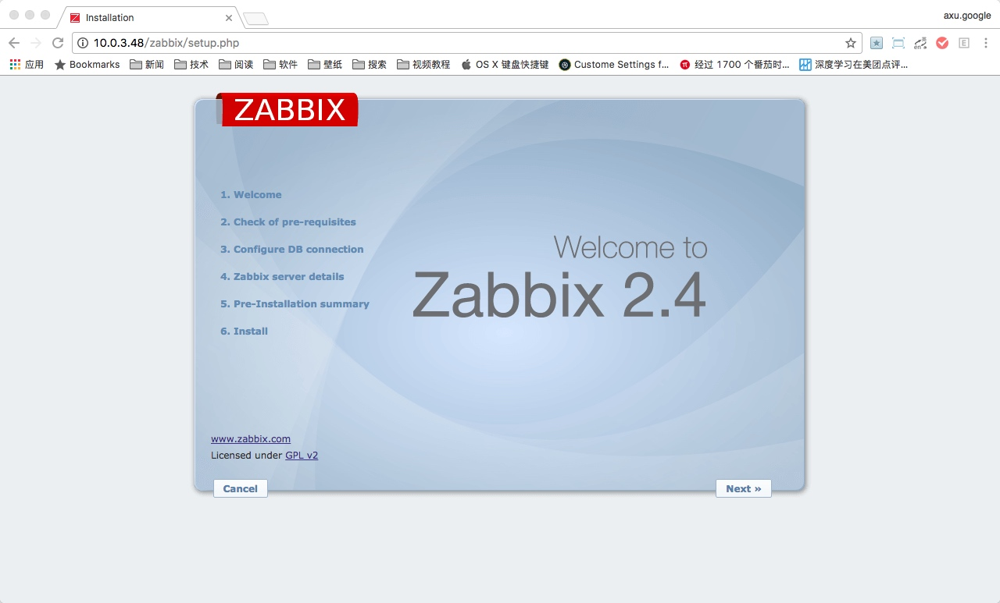

---

> 检查`PHP`是否配置正确，若发现有错误，解决后点击`Retry`直到所有都通过 

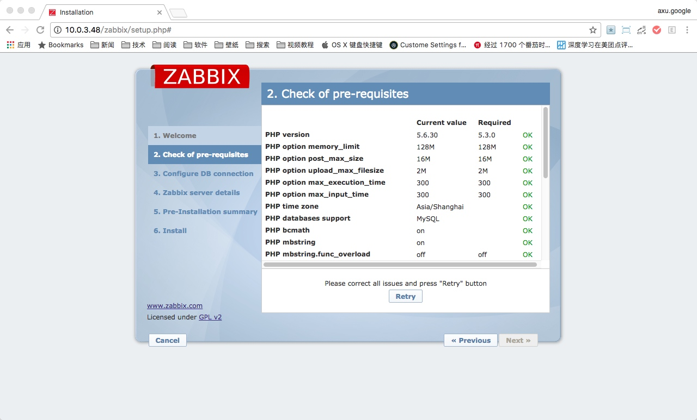

> 解决`PHP always_populate_raw_post_data`问题

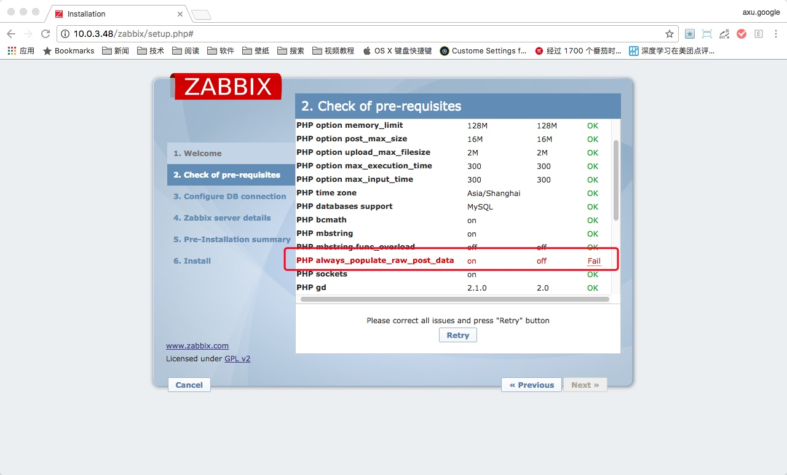

```bash
# 登陆到主节点服务器（`Zabbix Master Server`）
> su - 
> /sbin/ifconfig 
[...]
          inet addr:10.0.3.48  Bcast:10.0.3.255  Mask:255.255.255.0
[...]

# 备份`PHP`配置文件
> cp -r /etc/php.ini /etc/php.ini.raw 
> ll /etc/php.ini*
-rw-r--r-- 1 root root 65404 Jan 20 06:56 /etc/php.ini
-rw-r--r-- 1 root root 65404 Feb 24 12:46 /etc/php.ini.raw

# 修改`PHP`配置文件
# 在第706行，添加配置 `always_populate_raw_post_data = -1`
> vim /etc/php.ini

# 对比修改后文件内容
> git diff /etc/php.ini.raw /etc/php.ini
diff --git a/etc/php.ini.raw b/etc/php.ini
index 315e7f0..6e2ae06 100644
--- a/etc/php.ini.raw
+++ b/etc/php.ini
@@ -703,6 +703,7 @@ default_charset = "UTF-8"
 ; $HTTP_RAW_POST_DATA is *NOT* populated.
 ; http://php.net/always-populate-raw-post-data
 ;always_populate_raw_post_data = -1
+always_populate_raw_post_data = -1
 
 ;;;;;;;;;;;;;;;;;;;;;;;;;
 ; Paths and Directories ;
 
# 重启`httpd`服务
> service httpd restart                 
Stopping httpd:                                            [  OK  ]
Starting httpd: httpd: Could not reliably determine the servers fully qualified domain name, using 10.0.3.48 for ServerName
                                                           [  OK  ]
```

> 刷新页面并再次查看


> 如果这里点击`Next`按钮又回到了第一步，则执行如下命令

```bash
# 设置`/var/lib/php/session/`目录`777`权限
> su -
> chmod -R 777 /var/lib/php/session/
> ll -d /var/lib/php/session/       
drwxrwxrwx 2 root apache 4096 Jan 20 06:56 /var/lib/php/session/
```
---

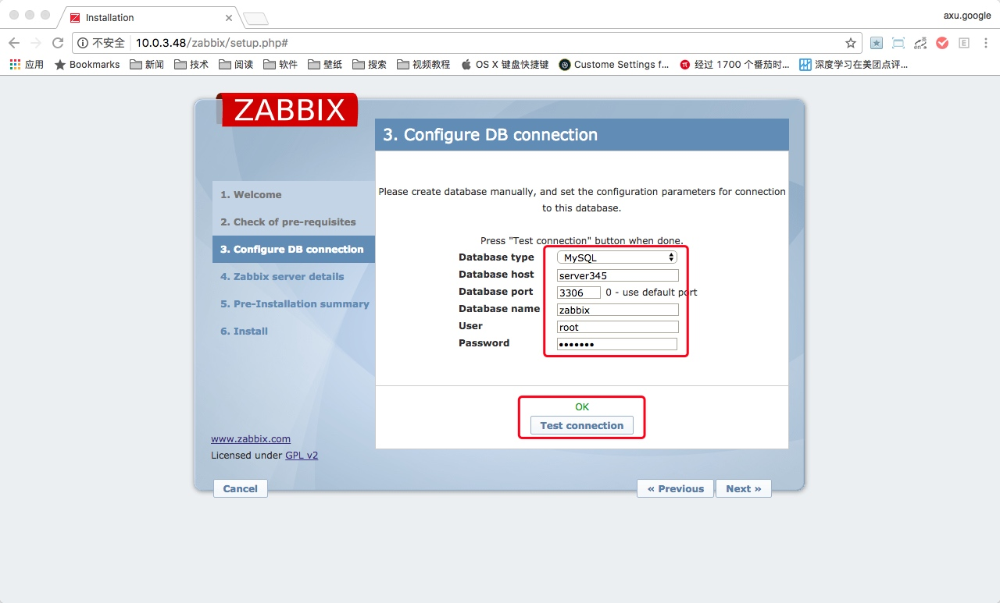

---


---


---


---

> Username/Password -> Admin/zabbix
> **注意字母大小写**


---

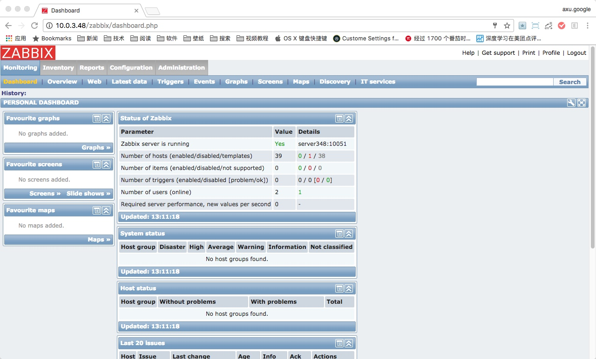

#### 安装代理节点服务器（`Zabbix Agent Server`）

> **注意：下面步骤是在代理节点服务器（`Zabbix Agent Server`）上执行**
> **因为会有许多代理节点服务器（`Zabbix Agent Server`）节点，在这里只举一个列子，其它代理服务器安装相同。**

```bash
# 再次确认是否已经登陆到代理节点服务器（`Zabbix Agent Server`）上
> su - 
> /sbin/ifconfig
[...] 
          inet addr:10.0.3.50  Bcast:10.0.3.255  Mask:255.255.255.0
[...]

# 下载`zabbix.repo`文件
> cd /etc/yum.repos.d/
> wget http://archive.centrin.com.cn/Zabbix/zabbix.repo
--2017-02-24 13:23:13--  http://archive.centrin.com.cn/Zabbix/zabbix.repo
Resolving archive.centrin.com.cn... 10.0.3.45
Connecting to archive.centrin.com.cn|10.0.3.45|:80... connected.
HTTP request sent, awaiting response... 200 OK
Length: 448 [text/plain]
Saving to: “zabbix.repo”

100%[=========================================================================================================>] 448         --.-K/s   in 0s      

2017-02-24 13:23:13 (59.9 MB/s) - “zabbix.repo” saved [448/448]

# 检查
> ll zabbix.repo
-rw-r--r-- 1 root root 448 Feb 24 11:00 zabbix.repo

# 通过`yum`检查
> yum clean all
[...]

#!# 注意`Zabbix`最后已经导入`97`个软件包
#!# 注意`zabbix-non-supported`最后已经导入`15`个软件包
> yum repolist
[...]
Zabbix                                                          Zabbix Official Repository - x86_64                                             97
[...]
zabbix-non-supported                                     Zabbix Official Repository non-supported - x86_64                                      15
[...]

# 安装`zabbix-agent`软件包
> yum -y install zabbix-agent

# 备份配置文件
> cp /etc/zabbix/zabbix_agentd.conf /etc/zabbix/zabbix_agentd.conf.raw
> ll /etc/zabbix/zabbix_agentd.conf*
-rw-r--r-- 1 root root 7904 Feb 25  2015 /etc/zabbix/zabbix_agentd.conf
-rw-r--r-- 1 root root 7904 Feb 24 13:31 /etc/zabbix/zabbix_agentd.conf.raw

# 修改配置文件
# 修改第85行，`Server`，修改为 `Server=server348`
> vim /etc/zabbix/zabbix_agentd.conf

# 对比修改后文件内容
> git diff /etc/zabbix/zabbix_agentd.conf.raw /etc/zabbix/zabbix_agentd.conf
diff --git a/etc/zabbix/zabbix_agentd.conf.raw b/etc/zabbix/zabbix_agentd.conf
index 72b6e30..5f9d409 100644
--- a/etc/zabbix/zabbix_agentd.conf.raw
+++ b/etc/zabbix/zabbix_agentd.conf
@@ -82,7 +82,7 @@ LogFileSize=0
 # Default:
 # Server=
 
-Server=127.0.0.1
+Server=server348
 
 ### Option: ListenPort
 #      Agent will listen on this port for connections from the server.
 
# 启动`zabbix-agent`服务
> service zabbix-agent start
Starting Zabbix agent:                                     [  OK  ]
```

### 配置

#### 配置`Zabbix-Server`

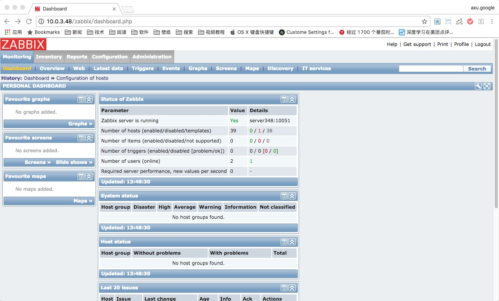

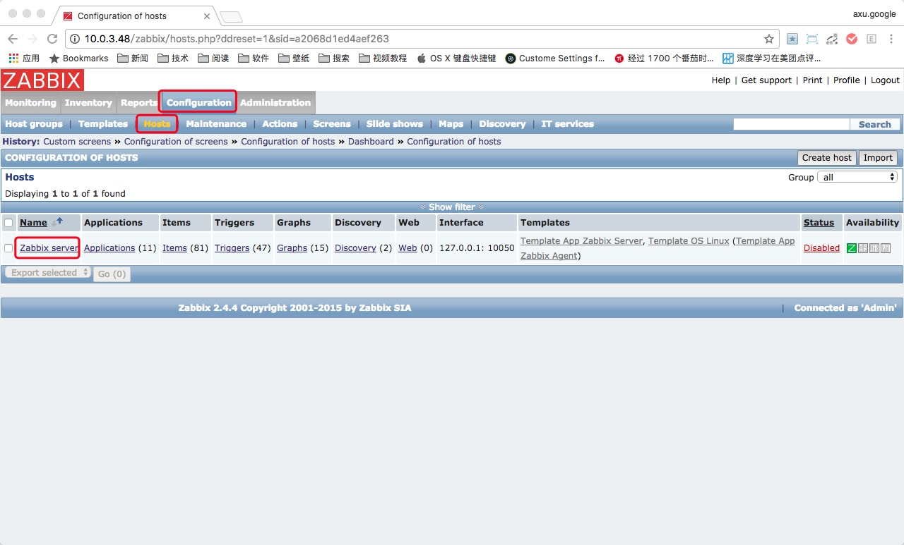


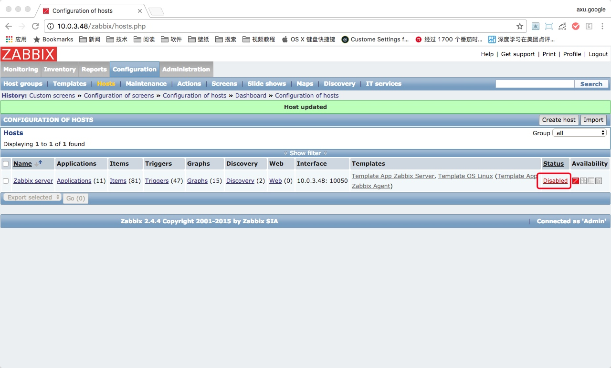

> 等待一会

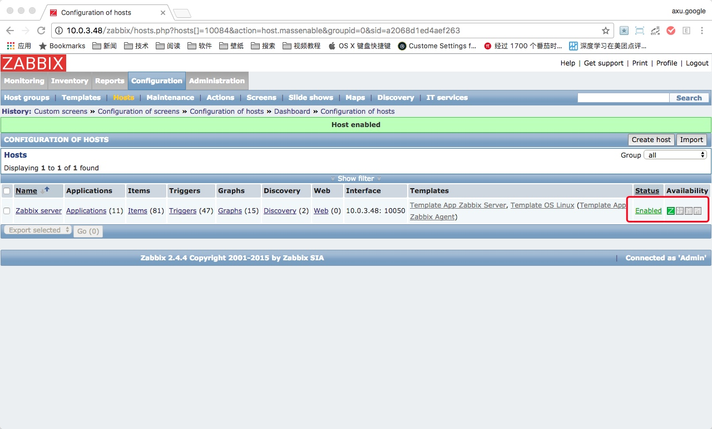

#### 配置`Zabbix-Agent`

> 这里只配置一台代理服务器，其他的代理服务器操作步骤相同

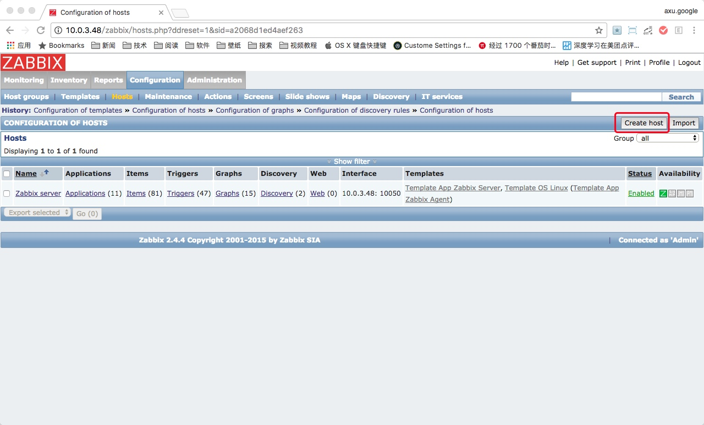


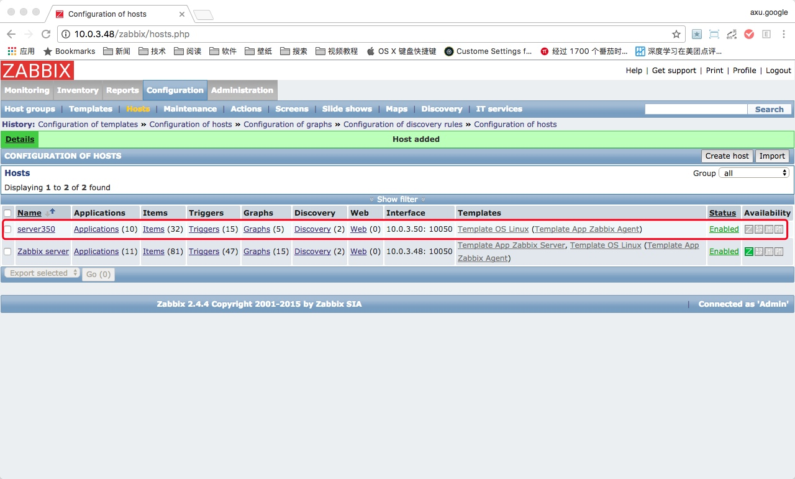

> 等一会


> `Z`变成`绿色`证明没有问题

#### `Screens`


> 点击`左下角`的`+`号，添加一行
> 同理，点击`右上角`的`+`号，添加一列

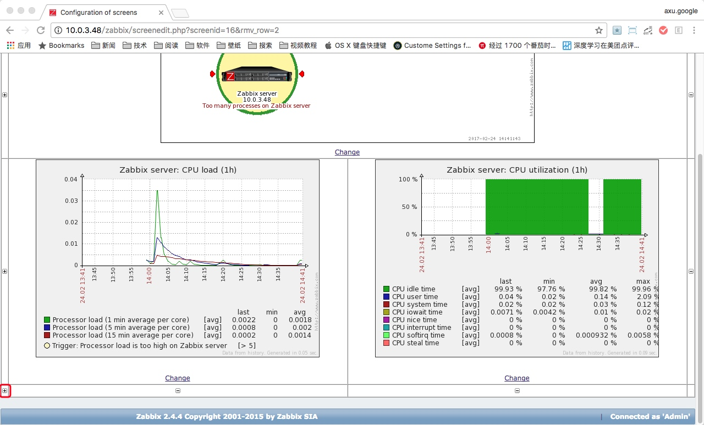


> 添加监控`CPU jumps`图形


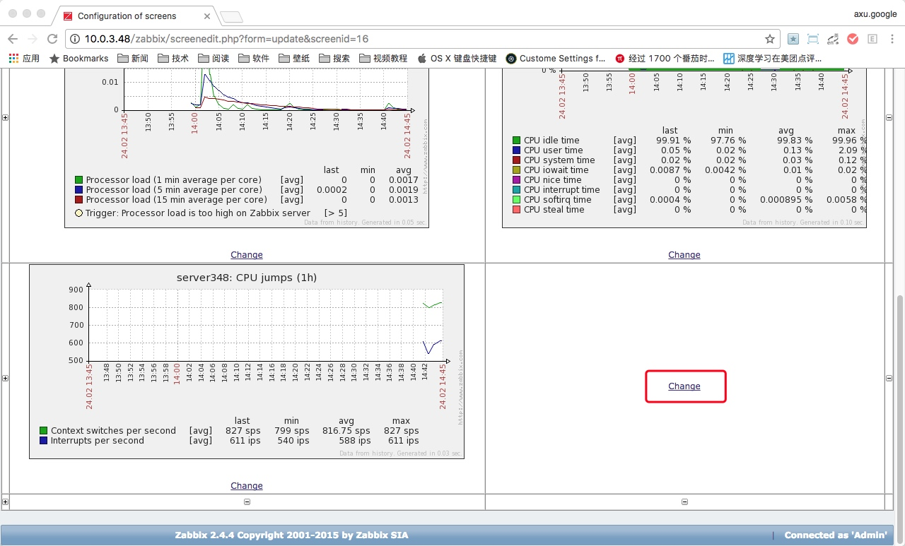

> 同理，添加监控`Memory usage`图形


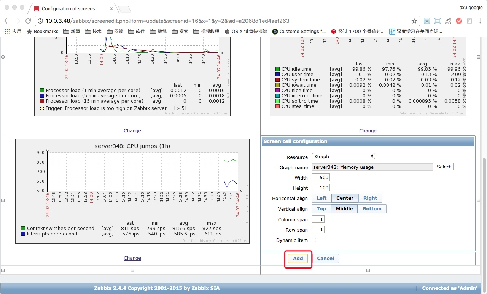

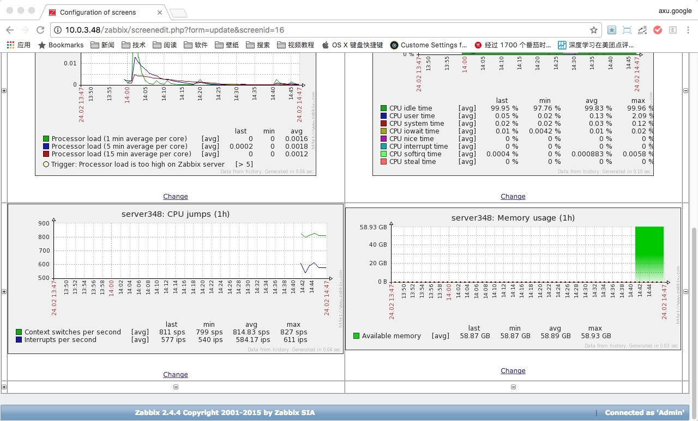

> 将全部添加完成后，到`Monitoring`的`Screens`查看


