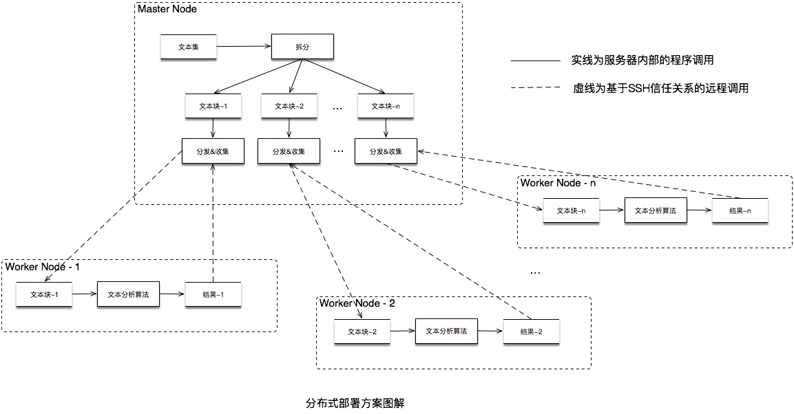

# 分布式部署方案

## 适用条件

- 操作系统：Linux

## 使用技术

项目的分布式处理方案主要基于`SSH信任关系`完成对于本文的分布式处理。

### SSH信任关系

SSH信任关系，是指一台服务器上的一个用户信任客户端的一个用户，允许这个用户不输入密码登录，另一个说法叫做public_key_auth。实际上就是证书信任。

像FTP、POP和Telnet在本质上是不安全的，因为它们在网络中传输数据的时候是用的是明文传送口令和数据，一些人就会就会截取其中的口令和数据。“中间人”的攻击方式是指，“中间人”冒充真正的服务器接收你发给服务器的数据，然后冒充你，把数据发给服务器。

SSH，即Secure Shell，它是把所有传输的数据都进行了加密。它有两个版本，即1.x和2.x，其中只有Open SSH是免费的。从客户端来看，SSH有两种级别的安全验证，一是口令验证（只要你知道账户和密码，就能登录，并且所传输的数据都是加密的），二是密匙验证（自己为自己创建一对密匙，然后把公用密匙放到服务器上；如果你连接服务器的时候，客户端首先发送一个请求，里面包括公用密匙，请求服务器进行验证；服务器接收到请求之后，就会在自己的家目录下寻找你的密匙，与你发送过来的密匙进行比较，如果相同，服务器就会把自己的“质询”信息进行加密，发送给客户端；客户端接收到“质询”信息之后，就会用自己的私人密匙进行解密，然后把它发送给服务器）。

## 实现

整个 **分布式系统** 通过 **主节点（`Master Node`）** 将大量的本文集进行拆分成小文本集，并通过 **进程（线程）池** 基于 **SSH信任关系** 并发远程调用 **工作节点（`Worker Node`）** 上的执行程序完成并发处理。从而提高整体的处理效率，同时可以保证性能可以随着增加 **工作节点（`Worker Node`）** 得到线性增长。

### 图解

### 说明

可以从**"分布式部署方案图解"**中看出，整个系统主要分为 `Master节点` 和 多个`Worker节点`，其中`Master节点`已经和所有的`Worker节点`创建好基于`SSH信任关系`，并可以无密码远程调用`Worker节点`的程序。

#### Master Node

`Master节点`的主要工作是将`文本集`拆分成多个可以供`Worker节点`处理的`文本块`，并`分发`给已经注册的`Worker节点`进行处理。

#### Worker Node

`Worker节点`的主要工作是针对`Master节点`分发过来的`文本块`进行实际处理，并将处理结果返回给`Master节点`。

