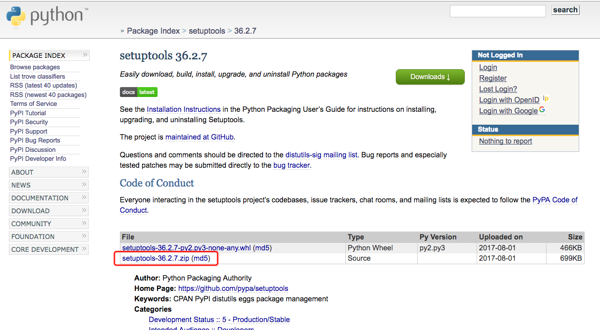
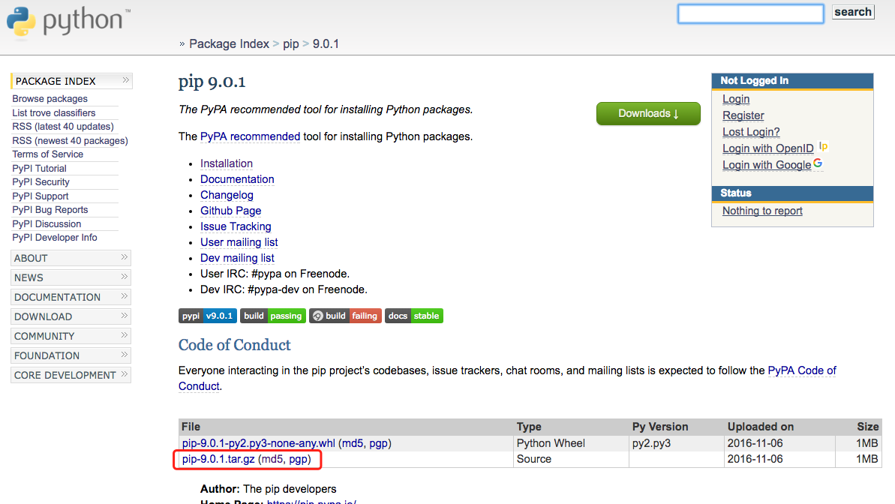
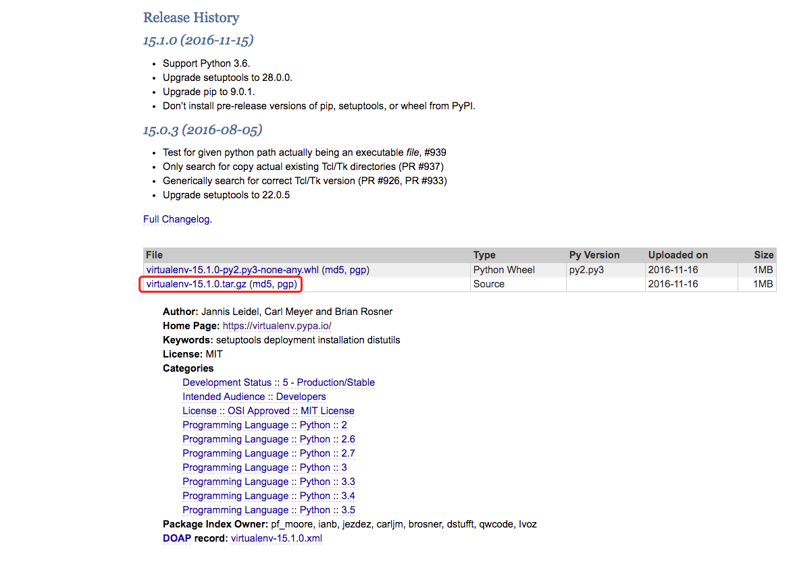

## 离线下载和安装组件

### 离线安装 `pip`

#### 安装 `setuptools`

> 安装 `pip` 需要依赖安装 `setuptools`。

##### 下载 `setuptools`

> 访问 https://pypi.python.org/pypi/setuptools ，下载最新版本的源代码（.zip）文件。



##### 安装 `setuptools`

```bash
# 切换目录
> cd /opt/
> pwd
/opt

# 下载最新版本的源代码（.zip）文件
> wget --no-check-certificate https://pypi.python.org/packages/07/a0/11d3d76df54b9701c0f7bf23ea9b00c61c5e14eb7962bb29aed866a5844e/setuptools-36.2.7.zip#md5=b9e6c049617bac0f9e908a41ab4a29ac
--2017-08-25 14:40:13--  https://pypi.python.org/packages/07/a0/11d3d76df54b9701c0f7bf23ea9b00c61c5e14eb7962bb29aed866a5844e/setuptools-36.2.7.zip
Resolving pypi.python.org... 151.101.72.223, 2a04:4e42:11::223
Connecting to pypi.python.org|151.101.72.223|:443... connected.
WARNING: certificate common name “www.python.org” doesn’t match requested host name “pypi.python.org”.
HTTP request sent, awaiting response... 200 OK
Length: 716382 (700K) [binary/octet-stream]
Saving to: “setuptools-36.2.7.zip”
100%[+++++++++++++++++++++++++++++++++++++++++++++++++++++++++++++++==>] 716,382     --.-K/s   in 0.1s    

2017-08-25 15:06:47 (184 KB/s) - “setuptools-36.2.7.zip” saved [716382/716382]

# 检查
> ll setuptools-36.2.7.zip
-rw-r--r-- 1 root root 716382 Aug  2 06:41 setuptools-36.2.7.zip

# 解压源代码
> unzip setuptools-36.2.7.zip
Archive:  setuptools-36.2.7.zip
  inflating: setuptools-36.2.7/CHANGES.rst  
  inflating: setuptools-36.2.7/LICENSE  
  inflating: setuptools-36.2.7/MANIFEST.in  
  inflating: setuptools-36.2.7/README.rst  
  inflating: setuptools-36.2.7/bootstrap.py  
  inflating: setuptools-36.2.7/conftest.py
  [...]
  inflating: setuptools-36.2.7/tests/manual_test.py  
  inflating: setuptools-36.2.7/tests/test_pypi.py

# 检查
> ll setuptools-36.2.7
total 196
-rw-r--r-- 1 root root   1669 Aug  1 22:40 bootstrap.py
-rw-r--r-- 1 root root 107485 Aug  1 22:40 CHANGES.rst
-rw-r--r-- 1 root root    223 Aug  1 22:40 conftest.py
drwxr-xr-x 4 root root   4096 Aug 25 15:09 docs
-rwxr-xr-x 1 root root    126 Aug  1 22:40 easy_install.py
-rwxr-xr-x 1 root root  10317 Aug  1 22:40 launcher.c
-rw-r--r-- 1 root root   1078 Aug  1 22:40 LICENSE
-rw-r--r-- 1 root root    430 Aug  1 22:40 MANIFEST.in
-rw-r--r-- 1 root root   1640 Aug  1 22:40 msvc-build-launcher.cmd
-rw-r--r-- 1 root root    902 Aug  1 22:40 pavement.py
-rw-r--r-- 1 root root   2295 Aug  1 22:41 PKG-INFO
drwxr-xr-x 5 root root   4096 Aug 25 15:09 pkg_resources
-rwxr-xr-x 1 root root    493 Aug  1 22:40 pytest.ini
-rwxr-xr-x 1 root root    899 Aug  1 22:40 README.rst
-rwxr-xr-x 1 root root    393 Aug  1 22:41 setup.cfg
-rwxr-xr-x 1 root root   7187 Aug  1 22:40 setup.py
drwxr-xr-x 5 root root   4096 Aug 25 15:09 setuptools
drwxr-xr-x 2 root root   4096 Aug 25 15:09 setuptools.egg-info
drwxr-xr-x 2 root root   4096 Aug 25 15:09 tests
-rw-r--r-- 1 root root    341 Aug  1 22:40 tox.ini

# 切换目录
> cd setuptools-36.2.7
> pwd
/opt/setuptools-36.2.7

# 执行安装命令
> python setup.py install
running install
running bdist_egg
running egg_info
[...]
Installing easy_install script to /usr/bin
Installing easy_install-2.6 script to /usr/bin

Installed /usr/lib/python2.6/site-packages/setuptools-36.2.7-py2.6.egg
Processing dependencies for setuptools==36.2.7
Finished processing dependencies for setuptools==36.2.7
```

#### 安装 `pip`

##### 下载 `pip`

> 访问 https://pypi.python.org/pypi/pip ，下载最新版本的源代码（.tar.gz）文件。



##### 安装 `pip`

```bash
# 切换目录
> cd /opt/
> pwd
/opt

# 下载最新版本的源代码（.tar.gz）文件
> wget --no-check-certificate https://pypi.python.org/packages/11/b6/abcb525026a4be042b486df43905d6893fb04f05aac21c32c638e939e447/pip-9.0.1.tar.gz#md5=35f01da33009719497f01a4ba69d63c9
--2017-08-25 15:08:39--  https://pypi.python.org/packages/11/b6/abcb525026a4be042b486df43905d6893fb04f05aac21c32c638e939e447/pip-9.0.1.tar.gz
Resolving pypi.python.org... 151.101.72.223, 2a04:4e42:11::223
Connecting to pypi.python.org|151.101.72.223|:443... connected.
WARNING: certificate common name “www.python.org” doesn’t match requested host name “pypi.python.org”.
HTTP request sent, awaiting response... 200 OK
Length: 1197370 (1.1M) [binary/octet-stream]
Saving to: “pip-9.0.1.tar.gz”

100%[++++++++++++++++++++++++++++++++++++++++++++++++++===============>] 1,197,370   12.6K/s   in 83s     

2017-08-25 15:23:03 (3.40 KB/s) - “pip-9.0.1.tar.gz” saved [1197370/1197370]

# 检查
> ll pip-9.0.1.tar.gz
-rw-r--r-- 1 root root 1197370 Nov  7  2016 pip-9.0.1.tar.gz

# 解压
> tar -zxvf pip-9.0.1.tar.gz
pip-9.0.1/
pip-9.0.1/AUTHORS.txt
pip-9.0.1/CHANGES.txt
pip-9.0.1/docs/
pip-9.0.1/docs/__init__.py
pip-9.0.1/docs/conf.py
pip-9.0.1/docs/configuration.rst
pip-9.0.1/docs/cookbook.rst
pip-9.0.1/docs/development.rst
[...]
pip-9.0.1/pip.egg-info/top_level.txt
pip-9.0.1/PKG-INFO
pip-9.0.1/README.rst
pip-9.0.1/setup.cfg
pip-9.0.1/setup.py

# 检查
> ll pip-9.0.1
total 116
-rw-r--r--  1 501 games 12340 Nov  7  2016 AUTHORS.txt
-rw-r--r--  1 501 games 63075 Nov  7  2016 CHANGES.txt
drwxr-xr-x  3 501 games  4096 Nov  7  2016 docs
-rw-r--r--  1 501 games  1090 Nov  7  2016 LICENSE.txt
-rw-r--r--  1 501 games   488 Nov  7  2016 MANIFEST.in
drwxr-xr-x 10 501 games  4096 Nov  7  2016 pip
drwxr-xr-x  2 501 games  4096 Nov  7  2016 pip.egg-info
-rw-r--r--  1 501 games  2578 Nov  7  2016 PKG-INFO
-rw-r--r--  1 501 games  1285 Nov  7  2016 README.rst
-rw-r--r--  1 501 games   156 Nov  7  2016 setup.cfg
-rw-r--r--  1 501 games  2934 Nov  7  2016 setup.py

# 切换目录
> cd pip-9.0.1
> pwd
/opt/pip-9.0.1

# 执行安装命令
> python setup.py install
running install
running bdist_egg
running egg_info
[...]
creating /usr/lib/python2.6/site-packages/pip-9.0.1-py2.6.egg
Extracting pip-9.0.1-py2.6.egg to /usr/lib/python2.6/site-packages
Adding pip 9.0.1 to easy-install.pth file
Installing pip script to /usr/bin
Installing pip2.6 script to /usr/bin
Installing pip2 script to /usr/bin

Installed /usr/lib/python2.6/site-packages/pip-9.0.1-py2.6.egg
Processing dependencies for pip==9.0.1
Finished processing dependencies for pip==9.0.1

# 检查
> pip -V
pip 9.0.1 from /usr/lib/python2.6/site-packages (python 2.6)
```

### 安装 `virtualenv`

#### 下载 `virtualenv` 源码



#### 安装 `virtualenv`

```bash
# 切换目录
> pwd
/opt

# 下载源代码
> wget https://pypi.python.org/packages/d4/0c/9840c08189e030873387a73b90ada981885010dd9aea134d6de30cd24cb8/virtualenv-15.1.0.tar.gz#md5=44e19f4134906fe2d75124427dc9b716
--2017-08-30 09:12:38--  https://pypi.python.org/packages/d4/0c/9840c08189e030873387a73b90ada981885010dd9aea134d6de30cd24cb8/virtualenv-15.1.0.tar.gz
Resolving pypi.python.org... 151.101.72.223, 2a04:4e42:11::223
Connecting to pypi.python.org|151.101.72.223|:443... connected.
HTTP request sent, awaiting response... 200 OK
Length: 1863951 (1.8M) [binary/octet-stream]
Saving to: “virtualenv-15.1.0.tar.gz”

100%[++++++++++++++++++++++++++++++++++++++++++++++++++++++++++++++++++++++++++++++++++===>] 1,863,951   7.20K/s   in 10s     

2017-08-30 10:07:15 (7.20 KB/s) - “virtualenv-15.1.0.tar.gz” saved [1863951/1863951]

# 检查
> ll /opt/virtualenv-15.1.0.tar.gz
-rw-r--r-- 1 root root 1863951 Nov 16  2016 /opt/virtualenv-15.1.0.tar.gz

# 解压
> tar -zxvf virtualenv-15.1.0.tar.gz
[...]

# 切换目录
> cd /opt/virtualenv-15.1.0
> ll
total 156
-rw-r--r-- 1 501 games  1224 Nov 16  2016 AUTHORS.txt
drwxr-xr-x 2 501 games  4096 Nov 16  2016 bin
drwxr-xr-x 2 501 games  4096 Nov 16  2016 docs
-rw-r--r-- 1 501 games  1180 Nov 16  2016 LICENSE.txt
-rw-r--r-- 1 501 games   345 Nov 16  2016 MANIFEST.in
-rw-r--r-- 1 501 games  3383 Nov 16  2016 PKG-INFO
-rw-r--r-- 1 501 games  1135 Nov 16  2016 README.rst
drwxr-xr-x 2 501 games  4096 Nov 16  2016 scripts
-rw-r--r-- 1 501 games    88 Nov 16  2016 setup.cfg
-rw-r--r-- 1 501 games  4043 Nov 16  2016 setup.py
drwxr-xr-x 2 501 games  4096 Nov 16  2016 tests
drwxr-xr-x 2 501 games  4096 Nov 16  2016 virtualenv.egg-info
drwxr-xr-x 2 501 games  4096 Nov 16  2016 virtualenv_embedded
-rwxr-xr-x 1 501 games 99021 Nov 16  2016 virtualenv.py
drwxr-xr-x 2 501 games  4096 Nov 16  2016 virtualenv_support

# 执行安装
> python setup.py install
running install
running bdist_egg
running egg_info
[...]
virtualenv 15.1.0 is already the active version in easy-install.pth
Installing virtualenv script to /usr/local/bin

Installed /usr/local/lib/python2.7/site-packages/virtualenv-15.1.0-py2.7.egg
Processing dependencies for virtualenv==15.1.0
Finished processing dependencies for virtualenv==15.1.0

# 检查
> virtualenv --version
15.1.0
```

### 根据 `pip freeze` （`requirements.txt`） 的结果自动下载操作系统需要的组件

> **特别注意：执行自动下载命令时，一定要在和目标操作系统完全一致的操作系统上执行。（因为它会根据当前操作系统版本下的组件包）**

#### 下载组件

```bash
> pwd
/tmp/learn_solrcloud_python_client

> mkdir -p /tmp/learn_solrcloud_python_client/packages
> ll /tmp/learn_solrcloud_python_client/
total 20
drwxr-xr-x 2 root root 4096 Aug 18 16:39 packages
-rw-r--r-- 1 root root  581 Aug 18 16:28 requirements.txt
-rw-r--r-- 1 root root  470 Aug 18 16:28 solr_actions.py
-rw-r--r-- 1 root root 1027 Aug 18 16:28 solr_actions.pyc
-rw-r--r-- 1 root root 1128 Aug 18 16:28 solrcloud_maintenances.py

# 执行自定下载组件命令
# 注：如果网络不好的情况下会出现 `Time Out` 错误，不需要担心该命令可以重复执行。
# 直到所有包都下载完毕为止。
> pip install --download packages -r requirements.txt
[...]
Downloading appnope-0.1.0-py2.py3-none-any.whl
  Saved ./packages/appnope-0.1.0-py2.py3-none-any.whl
Collecting asn1crypto==0.22.0 (from -r requirements.txt (line 2))
  Downloading asn1crypto-0.22.0-py2.py3-none-any.whl (97kB)
    100% |████████████████████████████████| 102kB 24kB/s
  Saved ./packages/asn1crypto-0.22.0-py2.py3-none-any.whl
[...]
Saved ./packages/setuptools-36.2.7-py2.py3-none-any.whl
Successfully downloaded appnope asn1crypto backports.shutil-get-terminal-size bcrypt certifi cffi chardet cryptography decorator enum34 Fabric idna ipaddress ipython ipython-genutils paramiko pathlib2 pexpect pickleshare prompt-toolkit ptyprocess pyasn1 pycparser Pygments PyNaCl requests scandir semver simplegeneric six solrcloudpy traitlets urllib3 wcwidth setuptools

# 查看已下载组件
# 注意：该些组件是针对当前操作系统版本下载的，若目标服务器和当前服务器操作系统不一致，则无法保证可以正确安装
> ll packages/
total 9692
-rw-r--r-- 1 root root    3993 Aug 18 16:40 appnope-0.1.0-py2.py3-none-any.whl
-rw-r--r-- 1 root root   97896 Aug 18 16:40 asn1crypto-0.22.0-py2.py3-none-any.whl
[...]
-rw-r--r-- 1 root root  132332 Aug 22 11:00 urllib3-1.22-py2.py3-none-any.whl
-rw-r--r-- 1 root root   21014 Aug 22 11:00 wcwidth-0.1.7-py2.py3-none-any.whl
```

#### 安装组件

```bash
# 查看当前组件列表
> pip list
DEPRECATION: Python 2.6 is no longer supported by the Python core team, please upgrade your Python. A future version of pip will drop support for Python 2.6
DEPRECATION: The default format will switch to columns in the future. You can use --format=(legacy|columns) (or define a format=(legacy|columns) in your pip.conf under the [list] section) to disable this warning.
argparse (1.4.0)
pip (9.0.1)
setuptools (36.2.7)
wheel (0.29.0)

# 离线安装已经下载好的组件
> cd /tmp/learn_solrcloud_python_client
> pwd
/tmp/learn_solrcloud_python_client

> ll
total 20
drwxr-xr-x 2 root root 4096 Aug 22 11:00 packages
-rw-r--r-- 1 root root  581 Aug 18 16:28 requirements.txt
-rw-r--r-- 1 root root  470 Aug 18 16:28 solr_actions.py
-rw-r--r-- 1 root root 1027 Aug 18 16:28 solr_actions.pyc
-rw-r--r-- 1 root root 1128 Aug 18 16:28 solrcloud_maintenances.py

# 执行离线安装命令
> pip install --no-index --find-links=packages/ -r requirements.txt
DEPRECATION: Python 2.6 is no longer supported by the Python core team, please upgrade your Python. A future version of pip will drop support for Python 2.6
Collecting appnope==0.1.0 (from -r requirements.txt (line 1))
Collecting asn1crypto==0.22.0 (from -r requirements.txt (line 2))
Collecting backports.shutil-get-terminal-size==1.0.0 (from -r requirements.txt (line 3))
Collecting bcrypt==3.1.3 (from -r requirements.txt (line 4))
Collecting certifi==2017.7.27.1 (from -r requirements.txt (line 5))
[...]
Collecting solrcloudpy==2.4.1 (from -r requirements.txt (line 31))
Collecting traitlets==4.3.2 (from -r requirements.txt (line 32))
Collecting urllib3==1.22 (from -r requirements.txt (line 33))
Collecting wcwidth==0.1.7 (from -r requirements.txt (line 34))
Requirement already satisfied: setuptools>=18.5 in /root/virtualenv/learn_solrcloud_python_client/lib/python2.6/site-packages (from ipython==5.4.1->-r requirements.txt (line 14))
Building wheels for collected packages: pycparser, PyNaCl, scandir, semver, simplegeneric, solrcloudpy
  Running setup.py bdist_wheel for pycparser ... done
  Stored in directory: /root/.cache/pip/wheels/94/58/41/2524045dffff5f2c26f90774ef02a271fe3156f6beca121a74
  Running setup.py bdist_wheel for PyNaCl ... done
  Stored in directory: /root/.cache/pip/wheels/c4/29/ab/a325fc1e89f96f6eb519d50f83b8576fa6647faebbab12f0bc
  Running setup.py bdist_wheel for scandir ... done
  Stored in directory: /root/.cache/pip/wheels/ed/5e/f7/7256ef3879d106cc88b32f3d3998bb7b2b5754a4e0a801c838
  Running setup.py bdist_wheel for semver ... done
  Stored in directory: /root/.cache/pip/wheels/6a/58/1e/e129df302ba5d2fbf6774ed27f9f50d99372202b4015ad3403
  Running setup.py bdist_wheel for simplegeneric ... done
  Stored in directory: /root/.cache/pip/wheels/b5/60/33/05fa5d3d6b11828fcff3d06a0d562d33e95521ca6c919c8703
  Running setup.py bdist_wheel for solrcloudpy ... done
  Stored in directory: /root/.cache/pip/wheels/a7/42/50/7e6734be07b88bf1c198458ead2432de3efc6630a5c91a52ec
Successfully built pycparser PyNaCl scandir semver simplegeneric solrcloudpy
Installing collected packages: appnope, asn1crypto, backports.shutil-get-terminal-size, six, pycparser, cffi, bcrypt, certifi, chardet, idna, ipaddress, enum34, cryptography, decorator, pyasn1, PyNaCl, paramiko, Fabric, Pygments, ipython-genutils, traitlets, simplegeneric, scandir, pathlib2, pickleshare, wcwidth, prompt-toolkit, ptyprocess, pexpect, ipython, urllib3, requests, semver, solrcloudpy
Successfully installed Fabric-1.13.2 PyNaCl-1.1.2 Pygments-2.2.0 appnope-0.1.0 asn1crypto-0.22.0 backports.shutil-get-terminal-size-1.0.0 bcrypt-3.1.3 certifi-2017.7.27.1 cffi-1.10.0 chardet-3.0.4 cryptography-2.0.3 decorator-4.1.2 enum34-1.1.6 idna-2.6 ipaddress-1.0.18 ipython-5.4.1 ipython-genutils-0.2.0 paramiko-2.2.1 pathlib2-2.3.0 pexpect-4.2.1 pickleshare-0.7.4 prompt-toolkit-1.0.15 ptyprocess-0.5.2 pyasn1-0.3.2 pycparser-2.18 requests-2.18.4 scandir-1.5 semver-2.7.7 simplegeneric-0.8.1 six-1.10.0 solrcloudpy-2.4.1 traitlets-4.3.2 urllib3-1.22 wcwidth-0.1.7

# 检查
> pip list
DEPRECATION: Python 2.6 is no longer supported by the Python core team, please upgrade your Python. A future version of pip will drop support for Python 2.6
DEPRECATION: The default format will switch to columns in the future. You can use --format=(legacy|columns) (or define a format=(legacy|columns) in your pip.conf under the [list] section) to disable this warning.
appnope (0.1.0)
argparse (1.4.0)
asn1crypto (0.22.0)
backports.shutil-get-terminal-size (1.0.0)
bcrypt (3.1.3)
certifi (2017.7.27.1)
cffi (1.10.0)
chardet (3.0.4)
cryptography (2.0.3)
decorator (4.1.2)
enum34 (1.1.6)
Fabric (1.13.2)
idna (2.6)
ipaddress (1.0.18)
ipython (5.4.1)
ipython-genutils (0.2.0)
paramiko (2.2.1)
pathlib2 (2.3.0)
pexpect (4.2.1)
pickleshare (0.7.4)
pip (9.0.1)
prompt-toolkit (1.0.15)
ptyprocess (0.5.2)
pyasn1 (0.3.2)
pycparser (2.18)
Pygments (2.2.0)
PyNaCl (1.1.2)
requests (2.18.4)
scandir (1.5)
semver (2.7.7)
setuptools (36.2.7)
simplegeneric (0.8.1)
six (1.10.0)
solrcloudpy (2.4.1)
traitlets (4.3.2)
urllib3 (1.22)
wcwidth (0.1.7)
wheel (0.29.0)
```

## 问题解决

### `error: Setup script exited with error: command ‘gcc’ failed with exit status 1`

**问题**

> 在执行 `pip install --download packages -r requirements.txt` 命令时出现 `error: Setup script exited with error: command ‘gcc’ failed with exit status 1`

**解决方法**

> 系统环境缺少必要组件，执行如下安装命令：
> - `yum -y install gcc`
> - `yum -y install python-devel`
> - `yum install -y zlib-dev openssl-devel sqlite-devel bzip2-devel libxslt-devel libffi-devel`

### `No distribution at all found for xxx==xxx (from -r requirements.txt (line x))`

**问题**

> 在执行 `pip install --no-index --find-links=packages/ -r requirements.txt` 命令时出现 `No distribution at all found for xxx==xxx (from -r requirements.txt (line x))` 错误。

**解决方法**

> 升级 `pip`
> - 若在有网络的环境中直接执行 `pip install --upgrade pip` 即可；
> - 若在没有网络的环境中则按照上文中的 **离线安装 `pip`** 步骤进行升级。
