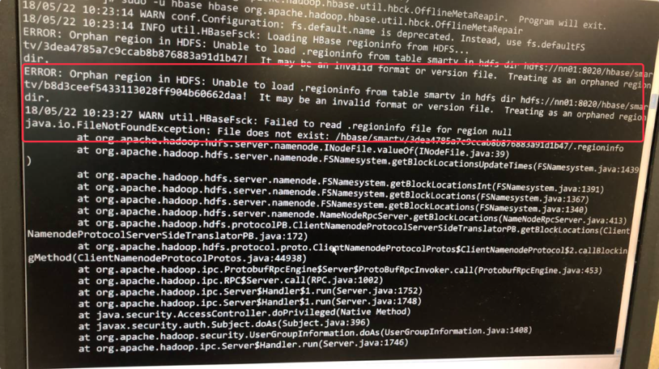
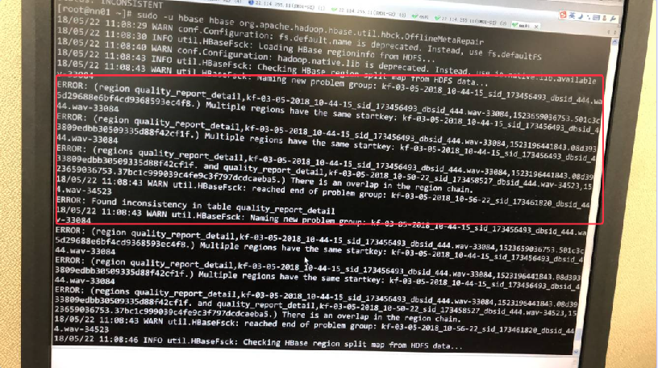
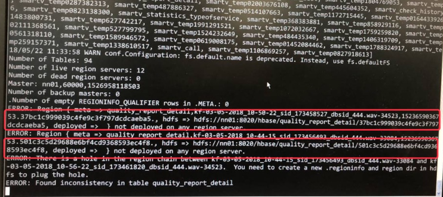
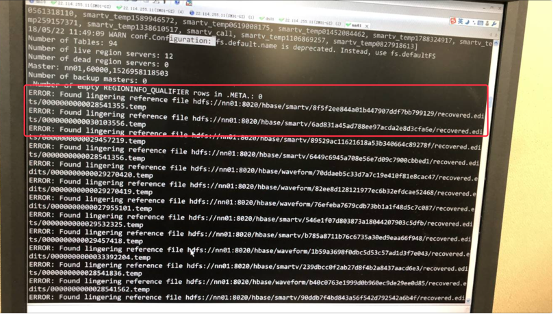
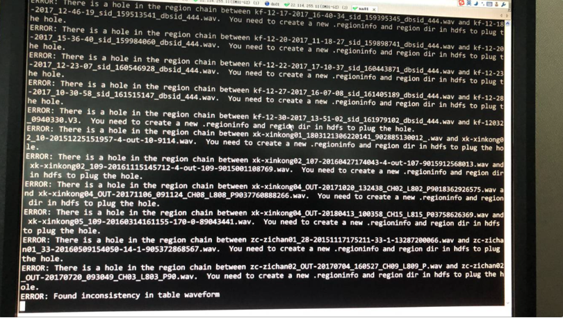

# 记录一次因HBase系统文件错误导致HBaseMaster宕掉的解决过程

主要修复命令

```bash
> sudo -u hbase hbase org.apache.hadoop.hbase.util.hbck.OfflineMetaRepair
```



这里发现 .regioninfo 文件读取失败，而后使用该命令修复

```bash
> sudo -u hbase hbase hbck -fix
```

执行后发现没有问题后重新执行

```bash
> sudo -u hbase hbase org.apache.hadoop.hbase.util.hbck.OfflineMetaRepair
```



而后发现某些表中有冲突数据，而后执行检查命令

```bash
> sudo -u hbase hbase hbck
```



发现了一些错误的删除，使用 `sudo -u hdfs hadoop dfs -rm -r ${path}` 删除，后再次执行

```bash
> sudo -u hbase hbase hbck
```



发现了进一步的错误，根据该错误提示执行

```bash
> sudo -u hbase hbase hbck -fixReferenceFiles
```



根据信息发现一些漏洞错误，进而执行

```bash
> sudo -u hbase hbase hbck -fixHdfsHoles
```

执行后没有发现错误，最后执行最初的修复命令

```bash
> sudo -u hbase hbase org.apache.hadoop.hbase.util.hbck.OfflineMetaRepair
```

执行后发现也没有错误，修复完成

最后可以执行检查命令进行检查

```bash
> sudo -u hbase hbase hbck
```

`-EOF-`
