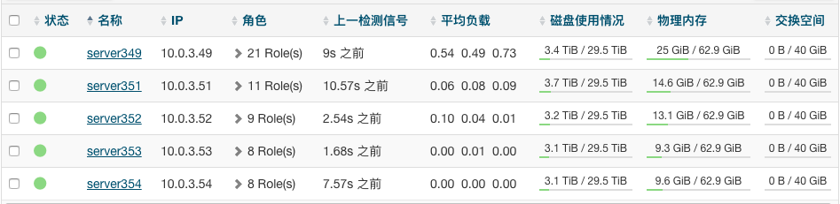
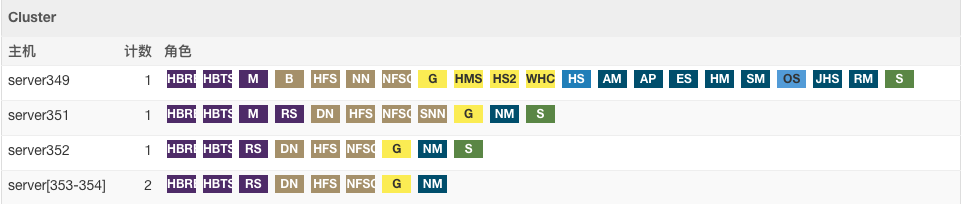
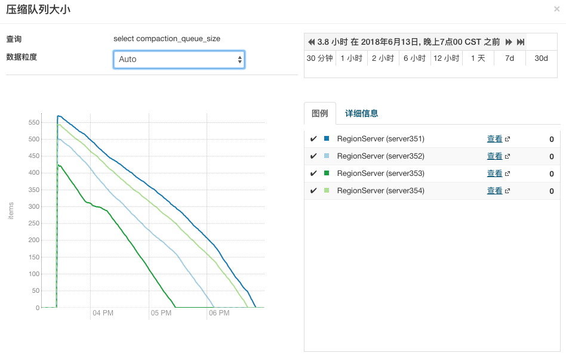
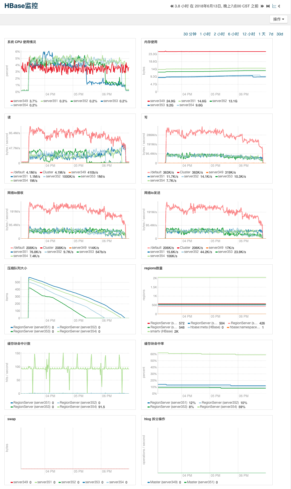

# HBase Majorcompaction 测试报告

## 概述

由于预计 HBase 自动执行 Majorcompaction 操作时间和消耗资源过多并且无法控制。所以在 生产环境 已经停止 HBase 自动执行 Majorcompaction 。本次测试的主要目的就是： **要了解针对 HBase 表手动执行 Majorcompaction 对集群和服务器资源的影响。**

## 环境信息

### 集群环境

#### 服务器资源信息



#### 服务器角色信息



### HBase测试表信息

> **注意：在往测试表灌数据之前就已经将自动执行 Majorcompaction 配置取消，同时设置 HFile 大小为 512 MB。**

- 测试表名：smartv
- 测试表数据条数：136999999
- 测试表数据量大小：1.1 T（在HDFS中，实际存储3.3TB）
- 测试表region数量：2048
- 测试表HFile个数：4140（由于没做过压缩，所以 **数据量大小 != 单个HFile大小 x HFile个数**）

```bash
# 查看现有表数据条数
> hbase org.apache.hadoop.hbase.mapreduce.RowCounter "smartv"
[...]
18/06/13 11:59:56 INFO mapred.JobClient: Job complete: job_local1068608155_0001
18/06/13 11:59:57 INFO mapred.JobClient: Counters: 19
18/06/13 11:59:57 INFO mapred.JobClient:   File System Counters
18/06/13 11:59:57 INFO mapred.JobClient:     FILE: Number of bytes read=64271033583
18/06/13 11:59:57 INFO mapred.JobClient:     FILE: Number of bytes written=52348672000
18/06/13 11:59:57 INFO mapred.JobClient:     FILE: Number of read operations=0
18/06/13 11:59:57 INFO mapred.JobClient:     FILE: Number of large read operations=0
18/06/13 11:59:57 INFO mapred.JobClient:     FILE: Number of write operations=0
18/06/13 11:59:57 INFO mapred.JobClient:     HDFS: Number of bytes read=0
18/06/13 11:59:57 INFO mapred.JobClient:     HDFS: Number of bytes written=0
18/06/13 11:59:57 INFO mapred.JobClient:     HDFS: Number of read operations=0
18/06/13 11:59:57 INFO mapred.JobClient:     HDFS: Number of large read operations=0
18/06/13 11:59:57 INFO mapred.JobClient:     HDFS: Number of write operations=0
18/06/13 11:59:57 INFO mapred.JobClient:   Map-Reduce Framework
18/06/13 11:59:57 INFO mapred.JobClient:     Map input records=136999999
18/06/13 11:59:57 INFO mapred.JobClient:     Map output records=0
18/06/13 11:59:57 INFO mapred.JobClient:     Input split bytes=286158
18/06/13 11:59:57 INFO mapred.JobClient:     Spilled Records=0
18/06/13 11:59:57 INFO mapred.JobClient:     CPU time spent (ms)=0
18/06/13 11:59:57 INFO mapred.JobClient:     Physical memory (bytes) snapshot=0
18/06/13 11:59:57 INFO mapred.JobClient:     Virtual memory (bytes) snapshot=0
18/06/13 11:59:57 INFO mapred.JobClient:     Total committed heap usage (bytes)=531502202880
18/06/13 11:59:57 INFO mapred.JobClient:   org.apache.hadoop.hbase.mapreduce.RowCounter$RowCounterMapper$Counters
18/06/13 11:59:57 INFO mapred.JobClient:     ROWS=136999999

# 查看现有表数据大小
> hdfs dfs -du -s -h /hbase/data/default/smartv
1.1 T  3.3 T  /hbase/data/default/smartv

# 查看现有表 region 数量（实际数量应该是 Found - 2 ，因为有2个系统文件）
> hdfs dfs -ls /hbase/data/default/smartv | more
Found 2050 items
[...]

# 查看 HFile 个数
> hdfs dfs -ls -h /hbase/data/default/smartv/*/cf/* | wc -l
4140
```

## 执行命令

```bash
# 执行发起 HBase Majorcompaction 命令
> echo "major_compact 'smartv'" | hbase shell
[...]
```

> **注意：该命令只是发起 HBase Majorcompaction 操作的命令，所以会很快执行完成。**

## 过程监控

因为启动执行 HBase Majorcompaction 操作后，HBase 会创建很多的 任务 到 压缩队列 中。所以可以根据 压缩队列大小 的变化去确定 HBase Majorcompaction 执行是否完成。



## 执行结果

### 资源使用总览

我们对 **CPU**，**内存**，**磁盘I/O**，**网络I/O**，**压缩队列大小** 以及 **region数量** 等指标进行监控。

监控结果如下图：



### 执行后HBase测试表信息

- 测试表名：smartv（不变）
- 测试表数据量大小：1.1 T（不变）
- 测试表region数量：2048（不变）
- 测试表HFile个数：**2048（压缩后HFile数量因数据合并而减少，最后完成每个HFile约512MB）**

```bash
# 查看现有表数据大小
> hdfs dfs -du -s -h /hbase/data/default/smartv
1.1 T  3.3 T  /hbase/data/default/smartv

# 查看现有表 region 数量（实际数量应该是 Found - 2 ，因为有2个系统文件）
> hdfs dfs -ls /hbase/data/default/smartv | more
Found 2050 items
[...]

# 查看 HFile 个数
> hdfs dfs -ls -h /hbase/data/default/smartv/*/cf/* | wc -l
2048
```

## 总结
